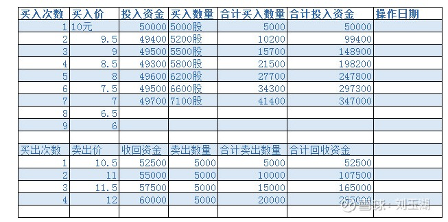

## 组合相关

- [ ] 支持出入金

- [ ] 支持录入历史交易

- [ ] 支持成本价设定

- [ ] 跟踪计算总资产

- [ ] 支持多账户

- [ ] 支持港股、美股

- [ ] 支持记录投资日记，类似于investment_log项目的自动化，再加上评论、关注、分享等社区功能。

- [ ] 用于执行买卖的交易装备，更低的成本、更快的速度等

- [ ] 季报、半年报、年报出来后，机器人重新运行一次，又分为某些股票出来以后、某个行业出来以后、全部出齐了以后等等精细条件

- [ ] 个股研究和个股监控如何联动的问题

- [ ] 买卖计划装备

  

- [ ] 持仓个股公司股东大会、分红配股、增发等关注的事件推送

- [ ] 长期赚差价装备

- [ ] 需要一个低成本交易装备，确定买入某只股票时，能够以某一天的较低的成交价成交，确定卖出是反之。

- [ ] 自动打新

- [ ] 自定义新的因子，具体见房地产研究[整体](投资笔记/行业追踪/房地产/整体.md)

- [ ] 经常需要检查为什么某只股票没有被筛选器选入，筛选器型装备的界面能否可以看到所有的股票数据，就算是被筛掉的也在里头标记出来而已

- [ ] 回测需要增加典型开始时间点、随机开始时间、典型的股票数量和调仓周期进行多次多维度测试

- [ ] 为什么不能支持科创板？

- [ ] 数字化个股和行业检查清单

- [ ] 组合中的组合：有时候一个行业的龙头格局还未完全形成，需要前几名都买的时候，希望能够自动帮助形成一个小组合来管理，对于组合的买、卖、分析都是按照一支股票的形式，实际操作过程中，是按照多只操作。
