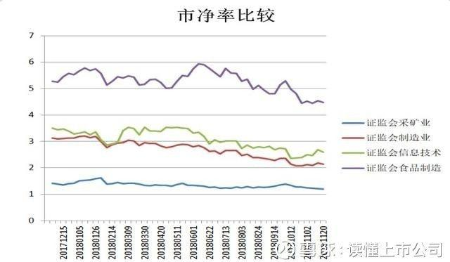
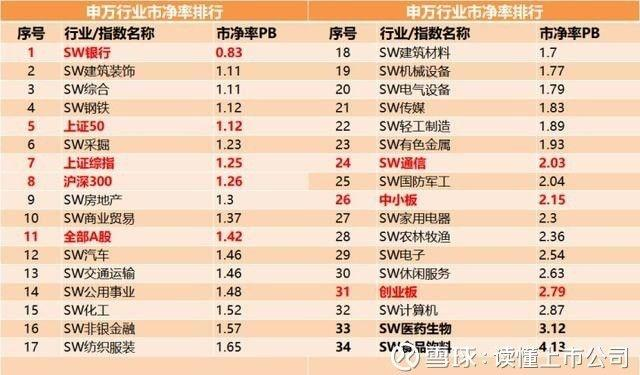

宁愿模糊的正确，不要精准的错误。我们在做股票估值的时候，没必要精确到是19.99还是19.98，只要判断出股票的价格是否处于低位就可以了。

换言之，先定性后定量，定性比定量重要。就像你嫁人的时候，男方要是有前科，吃喝嫖赌抽一样不落，那么他的存款是1千万还是1千零1万，对你来说有区别么？这样的人是不能嫁的。

股票估值方法我梳理了5种，其中市现率是最可靠的那个；很多人都在用DCF折现法，我没用过，这样的指标适合考试用却不实用。另外，牛市用市盈率、熊市用市净率等说法也有合理性。

**现将5种估值方法介绍如下。**

**一、市盈率估值法**

**市盈率＝股价÷每股收益，**根据每股收益选择的数据不同，市盈率可分为三种：静态市盈率；动态市盈率；滚动市盈率。预测股价、对股价估值时一般采用动态市盈率，其计算公式为：

**股价=动态市盈率×每股收益（预测值）**

其中，市盈率一般采用企业所在细分行业的平均市盈率。如果是行业内的龙头企业，市盈率可以提高10%或以上；每股收益选用的是预测的未来这家公司能够保持稳定的每股收益（可选用券商研报中给出的EPS预测值）。

盈率适合对处于成长期的公司进行估值，下图有发展前景和想象空间的行业，它们的估值就比较高。由于市盈率与公司的增长率相关，不同行业的增长率不同，所以不同行业的公司之间的市盈率比较意义不大。

**所以，市盈率的对比，要多和自己比（趋势对比），多跟同行企业比（横向对比）。**

二、PEG估值法

用市盈率估值有其局限性。我们都知道市盈率代表这只股票收回投资成本所需要的时间，市盈率=10表示这只股票的投资回收期是10年。但有的股票的市盈率可达百倍以上，再用市盈率估值就不合适了。

这就需要PEG估值法上场了。也就是将市盈率和公司业绩成长性相对比，即市盈率相对于利润增长的比例。其计算公式为：

**PEG=P/E÷G**

**=市盈率÷未来三年净利润复合增长率（每股收益）**

一般来讲，选择股票时PEG越小越好，越安全。但PEG＞1不代表股票一定被高估了，如果某公司股票的PEG为12，但同行业公司股票的PEG都在15以上，则该公司的PEG虽然已经高于1，但价值仍可能被低估。

**三、市净率估值法**

**市净率指的是每股股价与每股净资产的比率。**

一般来说市净率较低的股票，投资价值较高，相反，则投资价值较低。

计算公式为：

市净率=股价÷最近一期的每股净资产；

股价=市净率×最近一期的每股净资产。

这种估值方法适用于净资产规模大且比较稳定的企业，如钢铁、煤炭、建筑等传统企业可以使用。但IT、咨询等资产规模较小、人力成本占主导的企业就不适用。分析的时候依旧延续“同行比、历史比”的原则，通常市净率越低，表明投资越安全。

**根据证监会行业分类，**

**食品制造业的市净率＞信息技术行业＞制造业＞采矿业。**

**下面是今年10月份申万各行业的市净率排行榜。**银行股的市净率最低；食品饮料行业的市净率最高；65%的企业的市净率在1—2之间。这是否意味着银行股被低估了呢？

未必。因为银行有很多不良资产。这也是市净率估值法的局限性。企业的机械设备、办公用品都是会减值的，但通过历史成本计价的市净率并不能反映这一情况。所以不要以为买了市净率低的股票就是捡到了便宜货，可能它们的实际价值早已低于账面价值。

**四、市现率**

市现率=每股股价/每股自由现金流。市现率越小，表明上市公司的每股现金增加额越多，经营压力越小。换言之：

一只股票的市价除以每股现金流量得到的数字，就代表着你从这只股票上用现金收回投资成本需要多少年。市现率越低，说明你收回成本的时间越短，就越值得投资。

**五、DCF估值法**

DCF，现金流量折现法，Discounted Cash Flow，指的是将未来的现金流、通过折现率、折算到现在的价值。说白了就是把明年的100块钱换算到今天，它会值多少钱？

假定未来3年内，企业每年年末都能收到100元，那么这300元钱折合到现在是多少钱呢？

根据现值计算公式，我们已知得是t=3，CFt=100，假定折现率为10%。套入公式中，结果如下：

第一年的100元折现后＝100/(1+10%)；①

第二年的100元折现后＝100/(1+10%)2,②

第三年的100元折现后＝100/(1+10%)3,③

最后把三年的折现值加在一起，即①+②+③，就是资产预计未来现金流量的现值。

还是那句话，这方法理论上很完美，但不如市现率好用。

**六、总结**

如上就是对5种估值方法的总结。

市盈率是大家最常使用的指标；

PEG估值法是对市盈率估值法的补充，适合给成长性企业估值；

市净率适用于那些净资产比重大且比较稳定的企业；

市现率是最保守靠谱的估值指标，手里有现金比啥都强；

DCF估值法大家计算繁琐，大家可以参考使用。