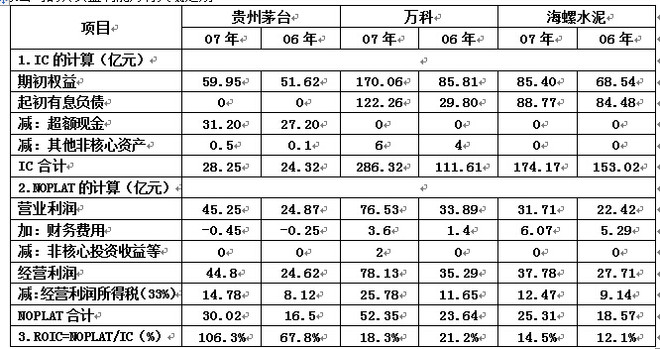
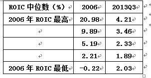
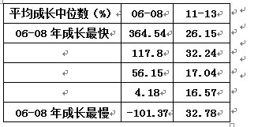

## 详解好企业的价值判断指标ROIC

引言：很多炒股的朋友可能看到过ROIC、WACC之类的指标，看到后有些人就要问ROIC和WACC到底要如何理解，今天我们主要聊聊好企业的价值判断指标ROIC。

### “好公司”之企业内在价值判断指标

一个企业的内在价值的最佳量化指标应该是投资回报率或净资产收益率（ROIC&ROE）。
为什么是ROE和ROIC两个指标呢？现在对企业的估值主要从每股收益增长、净利润增长、营业收入等方面进行评估，但实际上利润的增长跟企业股东的投入是息息相关的。成功的投资应该是投资回报率要大于投资成本要求的回报率。并且单纯的用EPS、PEG等估值方法完全可能是个伪命题，比如，A公司去年赚了1万，今年赚了10万，十倍；B公司去年赚了1亿，今年赚了2亿，两倍。哪一个更好？在现实生活中，谁都知道B公司好。但在资本市场上不是，因为人们总是很短视，只看增速（特别中国市场）。而ROIC和ROE直接反映了公司的投入产出的效果，他告诉我们一个公司到底是创造价值还是毁灭价值。有没有竞争优势，业绩是不是昙花一现式的惊艳，成长的质量如何。

ROE是经典的杜邦分析法，很多投资书籍都有介绍，常见的股票软件基本都有其具体的拆解公式，我就不详细ROE的具体应用了，只提一点，很多“价值投资者”在利用ROE选择股票时，往往会有一个误区，那就是毛利率越高的品种ROE越好。产品的毛利率固然重要，但是销售周转率同样重要。如果某种产品毛利率高，但是销量低，那么实际ROE也会受影响。反过来，如果某种产品利润率低，那是销量高，销售转率高，那么实际ROE也不低。

对于一些零售企业，我们知道其销售毛利润很低，净利润率更低，但是公司的周转非常快，ROE也可能会有30%的回报（不考虑负债杠杆因素）。因此部分企业愿意以较低的利润率换取更高的周转速度，从而提高ROE水平。所以，从ROE的角度看，一家企业，要么选择高利润率低周转率（如奢侈品等产品高附加值的行业），要么选择低利润率高周转率（如快速消费品和零售商）。如果利润率和周转率都不高，那么这家公司恐怕前景堪忧了。不过想要保持高利润率的同时还有很快周转的企业非常罕见，因为这样的情况出现，就意味着行业存在巨大的赢利空间，很快会成为热门行业，随后引发资金大量涌入，形成激烈的竞争，毛利率自然而然的下滑（例如前几年的触摸屏行业，上市公司欧菲光、长信科技毛利率只在高位维持了一年，随后便大幅下滑）。

如果简单地来看，ROIC可以近似理解为ROE，但这一章主要详细介绍一下ROIC这个指标，我个人认为它在大部分时候都比ROE来的好用。为什么说ROIC要比ROE好用呢？因为ROE衡量会计利润与净资产的比值关系，容易受异常财务杠杆的影响，而ROIC衡量的是经营利润率，并且剔除了资本结构变动的影响。ROE的高低并不能直接证明价值创造的能力，高ROE也许说明不了什么，而高ROIC明显是价值的正面因素，差的的公司是“高投入、低（高）产出”，而好的公司则是“低投入、高产出”。比如说地产公司如果光看ROE，问题就出来了：因为地产项目都会用银行借款、债券融资与权益融资，计算出来的EPS及ROE的差异可能会极大。按现在的PE估值法，是很荒谬的，不同的融资方式代表不同的风险水平，高EPS完全可能是以更高的风险水平为代价的。所以有的公司虽然ROE很高，但这是建立在高杠杆、高风险的前提下（所以我们看到地产银行为什么纷纷破净，他们的ROIC其实并不高）。

**先看一下计算公式：ROIC=NOPLAT/IC（其中NOPLAT是指息税前的收益\*（1-税率），IC是指期初的投入资本，包括有息负债、股东权益，扣除非核心经营资产）。**

注意：

1)其中IC指的是期初的投入资本，这包括有息负债、股东权益，还要扣除非核心经营资产；
2)要注意的是,有些优秀的公司有大量的超额现金，因此在计算初期投入资本的时候超额现金要扣除（比如像贵州茅台这样的公司，其货币资金占全部资产的50%，历来存在大量的超额现金，因此超额现金应该视为金融资产而非经营资产）；
3)NOPLAT是指息税前的收益*（1-税率），NOPLAT直接剔除掉了资本结构和非经常性损益的影响，注意尽管应付账款也是公司的一种现金来源，但因其未附带明确的成本而被排除在外。实质上，ROIC是生产经营活动中所有投入资本赚取的收益率，而不论这些投入资本是被称为债务还是权益。
4）因此，计算ROIC的关键是对公司业务能进行快速分解，快速阅读公司资产负债表及报表附注，分解出公司的“核心资产”和“非核心资产”；快速阅读公司的利润表，分解出公司的“核心收益”和“非核心收益”。

这里简单的举个例子（注：该例子来自网络）：以贵州茅台、万科A、海螺水泥07年、06年的ROIC为例，这几家公司的业务结构都比较简单，非核心资产、非核心收益均不多，其中假设贵州茅台的现存现金有70%是超额现金，计算IC时要扣除。

下面是计算结果，尽管不一定特别准确，但应该相差不远。我们会发现，同样是优秀的公司，这3家公司的真实盈利能力有天壤之别：
同样是绩优公司,这3家公司的盈利水准是有差异的，茅台几乎算得上是赚钱机器，而万科和海螺则只能算一般般的“高投入、高产出”的公司。当然，万科和海螺的ROIC已经接近20%的水准(海螺的实际税率只有20%左右，不到33%，此处未考虑这一点)，肯定是远远超出了8-12%左右的WACC水准，绝对算得上是创造价值的公司，但这2家公司赚钱的能力与茅台相比，的确不在一个档次上。

当然我认为ROIC更好，并不意味着他是一个“万精油”指标，什么时候都是最好最正确的。毕竟不同行业之间需要思考各个行业的属性，需要不同的思考分析，比如有些行业能够用很低的资金成本放大杠杆来获得更高的利润，那么ROIC可能就不是很适合，这一点大家在投资的时候千万不能生搬硬套公式指标。

除此之外，WACC（WeightedAverage Cost of Capital加权平均资金成本）也是一个伴随着ROIC的非常重要的指标。注：加权平均资本成本(WACC) 是指企业以各种资本在企业全部资本中所占的比重为权数，对各种长期资金的资本成本加权平均计算出来的资本总成本。加权平均资本成本可用来确定具有平均风险投资项目所要求收益率。因为融资成本被看作是一个逻辑上的价格标签，它过去被很多公司用作一个融资项目的贴现率。WACC反映一个公司通过股权和债务融资的平均成本，项目融资的收益率必须高于这个加权平均资本成本该项目才具有投资价值。因此只有投资回报率大于投资的成本，这样的回报才有意义。

为什么这样说？简单解释一下：

一般而言，当增长率相对固定而投资资本回报率逐渐升高，市盈率也会相应提高。反之，当投资资本回报率相对固定而增长率升高时，情况会较为复杂。当投资资本回报率高于资本成本时，企业增长越快，利润就越高；当投资资本回报率与资本成本持平时，即使增长率较高，也不会创造价值；当投资资本回报率低于资本成本时，增长越快，价值损失越大。因此可以得出一个简单的结论，即只有当投资资本回报率高于资本成本时，快速增长才是一个好事情。

在不同的投资资本回报率水平下，提高企业增长速度将带来不同的意义。假设企业的平均资本成本为9%，当企业投资资本回报率较低时（如11%），收益增长1%带来的价值增长只有4%；但如果投资资本回报率很高（如25%），收益增长1%带来的价值增长将达到9%。这意味着，投资资本回报率越高，企业提高增长速度就越有意义。

上述结论对企业实践具有指导意义。企业的价值在增长率和投资资本回报率的双重作用下，两者间变化产生的各种组合会使企业得出不一样的估值水平和市盈率。那么，企业何时应偏重于发展，何时该偏重于投资资本回报率？

比如医药行业的投资回报率非常高，可以达到40%～50%，因此这些企业更重视的是如何加快发展，它们致力于推出新产品、加大现有产品的市场渗透率，相对而言，成本削减和运营改善方面投入的精力并不太大。

对于那些投资资本回报率较低（如9%）的企业，这恰与资本成本持平，此时如果把投资回报率提高1%，带来的额外价值将高达25%；如果投资资本回报率已经很高（如20%），也能带来一部分价值增长（7%），但幅度小得多。这意味着，提高投资资本回报率将使这样的企业受益匪浅。此时企业应该致力于进一步提高利润，比如说进一步实施精益运营，提高运营效率，削减成本，或者加价，从而提高投资资本回报率，这样对企业自身的附加价值是最大的。

很关键的一点是，企业如何在增长速度和投资资本回报率之间取得平衡。对于不同企业来说这样的平衡点也是不一样的，要考虑企业当前的情况和所处环境，来选择更注重发展还是更注重提高效率。

综上所述，**只有ROIC超出WACC的成长，才是真正有意义的成长；除此以外的成长，大都是不值一提的伪成长。**当然，对于一些小企业，有些项目暂时是亏损的，但长远看能取得不错的回报（从量化的角度看，我们可以允许企业或某个项目在发展初期自由现金流很差，但经营现金流不应该长期为负），这一点投资者不应短视。

注：这里不再介绍WACC要如何计算了，此外ROIC和WACC看似计算时很复杂，但其实现在国内的不少软件如同花顺、wind都会直接给你计算好（近似值），参考起来非常方便，不用单独在去计算了。

题外话说一句，以ROIC的角度看，中国股市大部分股票正在进行价值毁灭。相当多的公司长期以来的ROIC值只能维持在6%以下，ROIC不仅跑不过WACC，甚至还跑不过基本利率，更别说通胀了，这类公司利润基数低，就算是利润突增几倍，又有什么意义呢？这类公司甚至根本不产生真正的利润，都是纸上富贵，或是依靠不断的圈钱，或是大幅度地使用了财务杠杆，表面的高收益对应了经营的高风险，但是，悲哀的是，我国的大部分投资人以业余投资散户为主，很多时候并不会去深入的分析，所以对于那些利润基数很低，但短期业绩能够爆发的公司，往往给出很高的估值，即便它们盈利只是昙花一现。目前国内的券商机构的投研方法确实浮于表面，总是努力去做EPS预测，明知道一时的利润增长根本说明不了什么。投资需要的是理性，需要对公司的业务特性、所处行业的产业结构、公司的竞争优势进行深入分析和根本理解。浮于表面的EPS预测又有什么意义呢？

结论：投资的过程中需要定性分析一个公司的好坏时，ROIC是非常好用的指标，它可以让我们过滤掉一些幻觉，让我们明白同样是赚钱，赚钱的能力是有差异的，有些公司赚钱很轻松，就是赚钱机器,投入少赚得多，而有的公司也赚钱，但需要不断融资。而最糟糕的公司就是那些“高投入、低产出”的公司。不管是价值股还是成长股，我们需要关心的都是公司是不是真正的创造了价值。尽力去找到那种“低投入、高产出”的公司，以合适的价格买到它。我一直坚持认为，如果公司未来的经营是不断毁灭价值，那么再便宜都不是买入的理由。站在好公司的角度上，不论是成长股还是价值股，真正的好公司比洞是低投入高产出，同时拥有优秀的管理层（不至于产生高ROIC但低ROE的结果）。

### 好公司、稳公司、快公司

事实上，不同的投资观决定了每个人对企业价值理解并不只有单纯的ROIC一项。有些人喜欢“快公司”（成长性很高），有些人喜欢“稳公司”（风险很低），而我个人是以寻找ROIC-WACC较高的“好公司”，我选择“好公司”的逻辑上文已经说的很明白了，但要怎么去理解和量化“快公司”和“稳公司”呢？

这里转载一段“时间投资基金”的文章，很好地说明了这个问题：

任何企业都有其内在的价值，不论是好的企业还是坏的企业，只是内在价值多或少的问题。而价值投资的根本逻辑就是在价格低于价值的时候买入，并最好留有一定的安全边际。相信价格会最终反映企业的价值。这点决定了任何的价值投资都必须以估值为基础。离开了估值的任何投资方法和模型都不是价值投资，即使是过去3年越贵越涨的A股也不例外。基础的公司财务知识告诉我们，**企业的内在价值等于其未来的净现金流折现，具体量化公式： Free cash flow（FCF自由现金流）=1/(WACC-growth),进一步可以改写为：firm value(价值)=[NOPLAT \* (1- growth / ROIC)] / (WACC-growth)**

其中：
1.NOPLAT为扣除调整税后的净营业利润
2.ROIC为投入资本回报率=NOPLAT/IC
3.IC为Invested capital(投入资本）
4.WACC为Weighted average cost of capital(加权平均资本成本）

**这个公式可能稍微有点复杂，但这公式是一切企业估值的基础，可以说是价值投资中的“牛顿定律”。我们不分析这个公式也可以明显能看出，企业的价值由且仅由三个因素决定：未来的成长预期(Growth)、预期的风险(WACC)、未来的投入资本回报率（ROIC）。这三个因素很显然地决定了价值投资的要素即：选择快公司（高的未来成长预期）、稳公司（低风险投资）、好公司（高资本回报率），并在价格低于价值时购买（估值水平低）。任何的价值投资都必须基于这个逻辑。**

我们选择2006年的所有A股上市公司，按当年的投入资本回报率(ROIC)由高到低分为五组，由下表可以看出，最高一组公司的ROIC中位数达到了21%。7年之后的2013年，再回头看当年按2006年资本回报率分组的五组公司，却能非常惊讶的发现，虽然ROIC的绝对值已经大幅下降（这也和A股上市公司的整体资本回报率下降有关），但7年前最“好”的公司，在经历了7年的风风雨雨以后，仍然有最高的投入资本回报率，还是最“好”的那一组公司。7年的时间对中国的经济，尤其是资本市场而言已经相当漫长。但在前后长达7年的时间跨度里，以投入资本回报率衡量的企业分组没有什么根本的变化。

相反，再看看下表的企业成长性变化：与资本回报率非常不同，当年的蜗牛公司一组（06～08年成长最慢的一组）居然成为了成长速度的冠军；而当年的最快速成长公司一组到了11～13年则沦为的平庸的中间一组。明显可以看出，企业的成长性是快速回归中值的，没有哪个企业会保持高速的成长很久；今天的“快公司”往往不是7年以后的“快公司”。

通过比较就不难发现，ROIC几乎决定了投资的成功与否。投入资本回报率（ROIC）之所以重要，就在于它实质上相当于巴菲特的“护城河”概念。拥有宽阔的护城河的企业，能抵御来自竞争对手的侵袭和市场状况的波动，持续为股东带来较高的资本回报水平。在时间长河中，当年的“快公司”会迅速归于平庸，被资本市场遗忘；但当年的“好公司”，却仍然是好公司。

上面说过，企业的估值水平取决于“是否好”和“是否快”。比如巴菲特，动辄以十数年为期限长期持有公司股票，既然公司的成长性会快速回归中值，自然选择“好公司”要重要的多，这就是为什么巴老反复强调企业的“护城河”却鲜见谈到企业的成长性，我想这也正是巴菲特一般不投资高科技成长股的原因吧。**投资中，企业“变”的是成长性（如果是“成长预期”则更甚），“不变”的则是护城河所代表的盈利能力和持续资本回报能力。**

当然，以上分析绝不是说企业的成长性不重要。在大起大落的A股，以及对业绩考察恨不得精确到天的中国资本市场，要求一个基金或个人连续持有某些公司的股票7年，确实太过奢侈。上面讨论过，企业的预期成长性是决定其估值的重要因素。那些高速成长的明星企业，投资者往往会在短期内对其未来的前景有着美好的预期，这些公司能在1～2年以内为投资者取得非常好的回报。与巴菲特不同，他有着大量的、长期限、低成本的自有投资资金，这一点大部分中国的投资者，无论是机构还是个人都做不到；所以在这一点上不能完全效仿巴菲特，些许有些无奈吧。

### ROIC指标与ROE指标的关系

ROE指标是从股权投资人的角度出发，而ROIC指标则是从企业投入资本（股权+债权）的角度来看待问题。但是，不管ROE指标还是ROIC指标，都拥有以下共同点：

要想维持较高的ROE或者ROIC指标，企业都必须要有获得超额收益的能力，或者称之为护城河。否则，企业无法长期维持高ROE或者高ROIC.

事实上，ROE指标与ROIC指标存在着近似于如下式子的关系：

根据改进的杜邦分析法：

**权益净利率=净经营资产净利率+(净经营资产净利率-税后利息率)×净财务杠杆**

即：**ROE=ROIC+（ROIC-税后利息率）×净财务杠杆**

净财务杠杆=（有息负债-现金及现金等价物）/ 股东权益

税后利息率=税后利息费用 /（有息负债-现金及现金等价物）

我们把这个公式再化简化简：

**ROE=ROIC×[1+（有息负债-现金及现金等价物）/ 股东权益]--（税后利息/股东权益）**

显然，有息负债越多，或者说财务杠杆越大，ROIC与ROE的差异就越大。

一般来说，稳健的财务结构，应该是：

现金及现金等价物≥有息负债。

所以，我们可以大致分为以下几种情况讨论：

\#稳健财务结构，即有息负债≈现金及现金等价物，这个时候，ROE与ROIC指标数值差距很小。

\#激进财务结构。有息负债远多于现金及现金等价物。这个时候，呈现ROIC远低于ROE的特征。

\#保守财务结构。即账上大量现金，很少的有息负债。这个时候，呈现ROE远低于ROIC的特征。

所以，我们在选择股票的时候，那些较高ROE和较高ROIC的公司，应该是我们的首选。

### 为什么要选择较高ROE和较高ROIC的公司

高ROE自然不必解释，A公司的ROE比B公司ROE高，意味着同样的股东投入，A公司能产生比B公司更高的股东回报。

高ROIC也是一样的。A公司的ROIC比B公司高，意味着同样的资本投入（股权+债务）,A公司的产出比B公司高。

Tim Koller采用40年，5000多家美国非金融企业的ROIC数据进行了实证研究。研究表明：

ROIC在不同企业之间的差别很大，而且单个企业的ROIC随时间的推移不断向中位数9%

回归，而且兼具持久性，ROIC超过20%的公司在10年之后仍旧保持20%的概率在50%以上，

而且ROIC较高的企业一般都是依靠品牌等持续竞争优势的企业，如制药生物技术，软件服务等行业；与公司规模并无太大联系。不同的企业与行业之间，ROIC存在很大的差异而且差异具有持久性。企业的市场价值是企业价值的一个侧面，

Tim Koller对投入资本收益率与股票市场的关系也做了大量的实证研究，以563家北美上市公司为样本，分析了资本市值比与增长和投入资本回报率之间的关系。实证结果显示投入资本回报率与增长对资本市值的解释力度达到46%。较高的投入资本回报率和增长率（投入资本回报率高于资本成本为前提）在资本市场上有较高的估值

## 来源

http://www.utai.com/book/mv7n0rvyn1g0.html

https://xueqiu.com/1700589315/104397723

