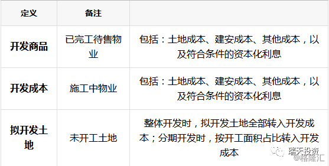
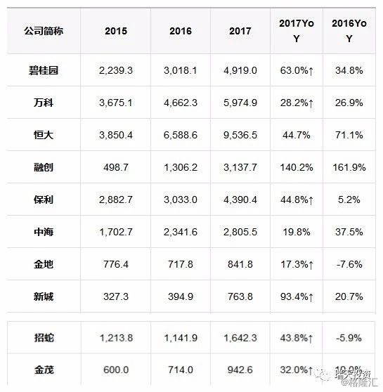
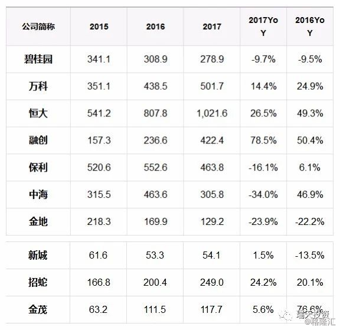
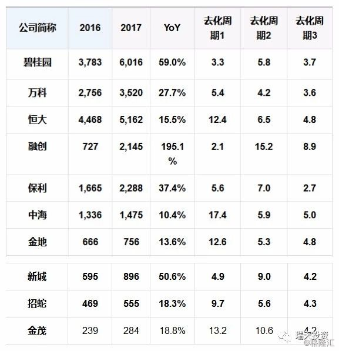
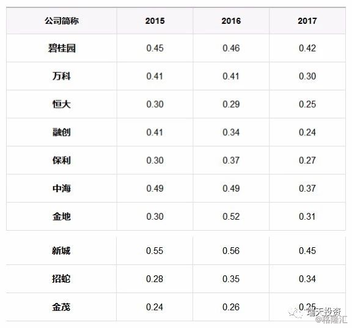
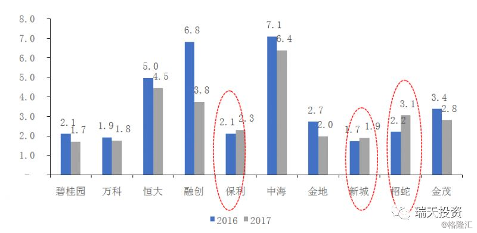
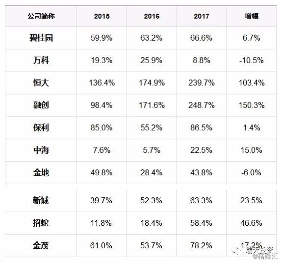
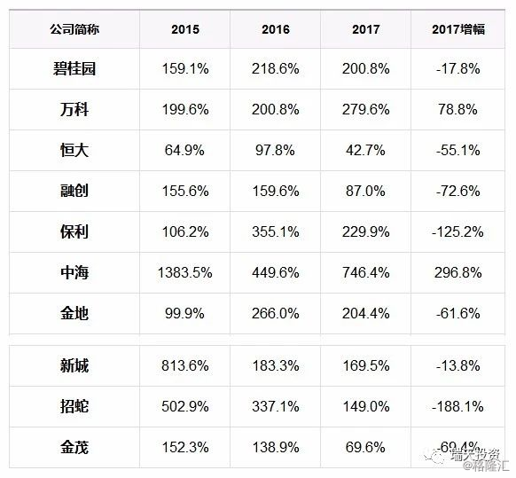
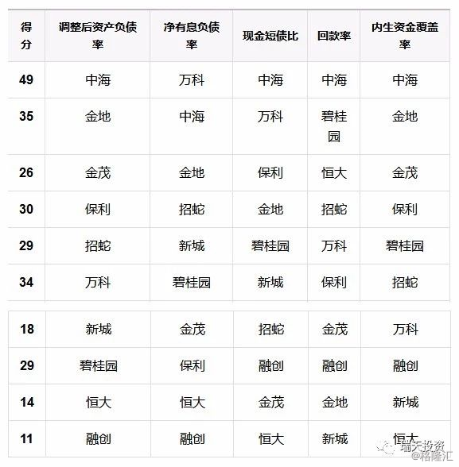

瑞天投资2018年7月11日17时12分

作者：蓝天超

来源：瑞天投资

房地产兼具商品和金融属性，同时受监管政策影响很大，在经营上呈现出开发周期长、前期土地购置投入大、实行预售制度、合作开发普遍等特点，因此，在对房地产企业进行财务分析的时候，在财务和经营指标的选取上与一般工商企业有较大的区别。

首先，由于房企在项目土地获取、开发过程的建安支出及资本化利息全部记入流动资产的“存货”科目，因此房企资产端以流动资产（存货）为主；同时房企项目运营能力的差异和项目定位的高低是决定房企资产周转快慢、销售变现的最主要因素，因此对于房企的财务分析首先要看重其资产负债周转（存货、预收账款）等衡量营运能力的指标；

其次，房地产企业在土地投资、建安成本支付等过程中资金支出压力大，因此房企资金来源多依靠银行、信托贷款、债券等外部融资渠道，从而形成较大规模的有息负债；房企的财务杠杆水平及偿债指标的表现反映了房企资金链安全程度，在未来融资政策趋紧背景下，对财务杠杆水平、偿债能力指标的分析尤为重要；

最后，由于行业普遍的“预售制”影响，房企利润表通常为历史签约销售项目的当期确认，通常会受收入确认时点影响；衡量企业盈利能力的指标仅代表历史销售与当期费用之间的表现，因此在对房企进行财务分析时，对利润表从而盈利能力的考量权重将大幅低于一般工商企业。

## 营运能力

### 存货

#### 账面价值

表：房地产开发企业存货的定义及分类

资料来源：会计准则、上市公司年报、瑞天投资

表2：主要上市房企历年存货规模（亿元）及同比增速

资料来源：公司公告、Wind、瑞天投资

存货作为房地产开发企业资产负债表的核心科目，但其绝对数额并不一定代表企业的资产规模大小。由于存货采用历史成本计量，由于房企获取的每一块土地的面积及楼面均价等计量因素的不同导致直接以存货规模大小来衡量不同房企的规模大小是不合理的。比如新城的存货账面价值一直是列举房企中最低的，但其销售规模倍于金茂，主要原因是项目定位不同导致的城市能级、地段分布劣于金茂，从而楼面均价远低于金茂（2017年新增土地储备均价：新城2634元/㎡vs金茂10,729元/㎡）。

虽然存货规模的可比性弱，但各房地产企业存货规模增速的一致性反映出，在经历了连续两年多的销售快速增长之后，房地产企业拿地、施工方面的投资力度逐步提升，补库存的迹象明显。结合土地储备及销售面积来看，10家企业的存货（销售）去化周期普遍在3年左右，充足的存货（土地储备）成为企业规模持续扩张的基础保障，未来10家房地产企业销售增长的可持续性更多的是受调控政策的干扰。

表：主要上市房企历年存货构成

资料来源：公司公告、瑞天投资

上述10家房企的存货构成中，开发商品占比逐年下降，开发成本占比逐年提升，其中万科、新城、招蛇三家公司由于存货下另有子科目“拟开发土地”，所以开发成本的占比呈现出一种下降的趋势，但考虑拟开发土地部分之后，除已完工待售物业外的其余存货子科目的账面价值占比与其他7家公司相同，开发成本（施工面积*建安成本等）占比均处于上升趋势。开发商品、开发成本占比的此消彼长，某种程度上反映了市场热度、房企对后续市场的预期，就2017年的数据来看，10家房企普遍对后续的销售保持了一种乐观的预期，在建项目占比大幅提升至85%左右。

#### 开发商品

表：主要上市房企开发商品（亿元）及同比增速

资料来源：公司公告、瑞天投资

开发商品是企业已完工待售的物业，10家房企过去两年开发商品同比增速整体上呈现持续下降的趋势，仅3家公司的开发商品的同比增速有所提升。开发商品账面价值的持续下降反映国内房地产市场销售状况的持续火热，企业的库存压力逐步减弱。

#### 开发成本

表：主要上市房企开发成本（亿元）及同比增速

资料来源：公司公告、瑞天投资

开发成本与国家统计局公布的房地产施工面积、开发投资数据有一定的关联性，某种程度上反映了上市公司对房地产行业销售情况的预判。2017年的开发成本同比增速较2016年明显提升的有6家公司，其余4家公司部分由于高基数的影响增速略有回落；2016年开发成本平均增速为44.2%，2017年进一步提升至55.6%，增速的中位数则由20.1%大幅提升44.6%，表明10家公司均处于加速补库存的状态，企业对后续的销售并不悲观。

#### 土地储备

表：主要上市房企历年土地储备（万平米）及同比增速

资料来源：公司公告、瑞天投资

土地储备作为存货的基础，由于剔除了地价因素的扰动，不同房企的土地储备建筑面积可比性强于存货账面价值。土地储备增速方面，碧桂园、融创、新城过去两年仍在加速，2017年同比增速位列前三；销售端，2017年销售面积增速位列前三的同样是这三家房企，融创同比增195.1%、碧桂园同比增59.0%、新城同比增50.6%。上述三家企业在销售快速增长的同时积极补充土地储备，为以后年度销售的快速增长提供持续保障。2017年土地储备增速进一步提升的公司有7家，在销售去化速度保持在较高水平下，10家房企积极扩充土地储备，从土地企业拿地的积极性及开发成本的增速来看，目前房地产行业整体上较乐观，并未表现出见底的迹象。

#### 去化周期

表：主要上市房企销售面积（万平米）及同比增速

备注：资料来源：公司公告、瑞天投资

去化周期1：以2017年底土地储备为终值，2017年销售面积为基数、销售面积增速为复合增速计算得出

去化周期2：土地储备/（2016、2017年销售面积平均值）

去化周期3：土地储备/（2017销售面积*（1+2018年1-5月累计销售增速））

从不同计算方法下的去化周期来看，去化周期3的可比性、真实性较高，但个别公司（融创）的数据存在较大失真，将旧改土地从其土地储备剔除后，去化周期在6年左右

三种不同的计算方法得出的去化周期差异甚大：

去化周期1：以2017年的销售面积增速为复合增速，对于金茂、金地、中海、招蛇等基数与增速双低的企业来说，2018年增速的提升无法反映出来使得去化周期虚高；对于2017年销售面积实现两倍增长的融创，以连续200%的增速增长的可能性极低，所以融创的去化周期1可靠性极低。

去化周期2：以2016、2017年销售面积平均值为基数计算的去化周期，对于某些2017年增速大幅提升的企业如融创、新城、保利等，2016年的低基数导致去化周期被拉长。

去化周期3：按照2018年前5月的销售面积增速推算全年的销售面积进而得出各企业的去化周期，能部分体现某些冲规模企业的增速提升，同时业考虑到了增速进入相对稳定范围内的碧桂园、恒大、万科等龙头，所以可信度高于前两者。

根据去化周期3的数据，主要房企的去化周期基本在4年左右，仅保利的去化周期低于3年；基于此，2018年1-5月保利在土地市场上累计获取832万平米的土地储备，在销售快速增长、三年内冲击Top3的目标下，公司近两年土地投资开始逐步发力，2018年1-5月与去年同期新增土地规划建筑面积均位居行业前三，土地补库存力度加大。表3土地储备数据显示，Top5里仅万科与保利的土地储备面积不足20,000万平米，2018年以来万科、保利加大了在土地市场的投资力度，新增土地储备仅次于碧桂园，分列行业第二、三。

主要房企的土地储备去化周期3年以上表明即使相关企业停止拿地，未来三、四年内的销售有充足的土地保障。但静态去化周期是一个比较严苛的假设，现实中房企并不可能停止拿地，因此从土地储备角度考虑相关企业未来三至五年的销售依然不需要担忧，增速的高低则取决于调控政策及企业自身战略目标。

#### 存货周转

表：主要上市房企存货周转率

资料来源：公司公告、瑞天投资

主要房企过去三年的存货周转率整体上处于下降的趋势，仅招商蛇口的周转率出现了较大幅度的提升，金茂、金地的存货周转率略有上升。

从存货周转率的计算公式出发：

分子：当年结转销售对应的营业成本，由于房地产行业收入、成本结转的滞后性，2016、2017年结转的营业成本很大程度来自2015、2016年的销售，2016年以来的销售的快速增长并未完全反映到利润表端的营业成本上。

分母：期初期末存货平均值，2016年销售的快速增长之后房企相应地加速补充土地储备，主要房企2015-2017年存货的复合增速平均值为43%，最高为融创的151%，最低为金地的4%。存货当期的快速增长与滞后的营业成本结转之间的时间差导致主要房企的存货周转率整体上处于下行趋势。

存货周转率的下行与企业当期销售的快速增长之间的背离，一是表明企业以后年度可结转收入的签约金额（预收款）存量较大，以后年度的收入、利润增长的幅度及确定性高；二是表明企业土地储备（货值）的相对充裕，从而为以后年度的销售增长提供强力支撑。从这个角度考虑，融创未来两三年的收入、利润弹性最大。

### 预收

#### 账面价值

表：主要上市房企历年预收账款账面价值（亿元）及同比增速

资料来源：公司公告、瑞天投资

预收账款（预售房款）是指房地产企业在所售房屋未竣工交付前收取的商品房销售款，该科目是商品房预售制度在财务报表上的体现。

账面价值绝对金额：Top5预收账款全部超过千亿元，其中万科领跑行业；在三四线城市房地产销售火爆的情况下碧桂园预收账款在过去两年实现复合100.5%的增长，预收规模逐步接近万科。预收账款作为营业收入的先导指标，是企业以后年度可用以结转收入的“余粮”，预示着以后年度利润表中收入的规模大小及净利润的规模。

【对于房地产企业，商品房销售满足下列条件则应确认收入：①工程已经竣工，并且验收合格，符合销售合同约定的交付条件。②已通知购房业主接收房屋，并且将结算账单提交业主也取得其认可。实际工作中，有的企业采取发出《交房通知书》即可确认销售收入，有的企业采取“领取钥匙”才可以确认销售收入。】

预收账款增速方面：与土地储备、存货科目类似，融创过去两年的增速最快，复合增速达到290%，且仍处于加速状态。房企的签约销售首先传导至资产负债表中“预收账款”科目，最后再传导至利润表中“营业收入”科目，由于中间各环节的确认存在时间进度上的差异，所以增速并不一定完全相等，但整体趋势应该是一致的。因此，从2017年的预收增速往后推算，未来利润表中的营业收入增长最快的应当是融创。

#### 预收周转

表：主要上市房企历年预收收入保障倍数及结转效率

备注：资料来源：公司公告、瑞天投资

预收收入保障倍数：预收账款/营业收入，衡量下一年度可用于结转收入的预收账款对当前收入的覆盖比率（可简单测算下一年度收入的大致增速）

2016*、2017*为预收结转效率：营业收入/期初期末平均预收账款

预收收入保障倍数的理论意义在于：假定房企当期营业收入全部来自期初预收账款的结转，当期营业收入可以实现的增长速度；由于房地产行业以预售为主，因此实际结转的营业收入增长速度低于该指标的多，但具体收入增速取决于项目竣工、交付进度。理论上讲，该指标越高意味着当年企业可以实现的收入增长速度越高。

过去三年预收收入保障倍数持续提升的公司：碧桂园、万科、融创、新城、金茂；持续提升的预收收入保障倍数为以后年度营业收入（净利润）的持续增长提供支撑。Top5中碧桂园、万科、融创、保利的覆盖倍数在150%以上，即使当年的销售增速下滑，利润表端的营业收入进而净利润的增速也有足够的保障，进一步带动PE估值的回落。

预收周转率衡量企业的预收账款结转效率，由于2016、2017两年销售的快速增长传导至企业资产负债表中的预收账款，施工进度相对滞后于销售的增长，使得结转效率整体上呈现下降的趋势。结转效率更深层反映的是企业存量开发项目的施、竣工节奏快慢，项目的运营、操盘能力，但也有可能是企业当期对利润指标的诉求强烈加快了结转进度；达到预售条件的项目（新开工）建筑面积增速低于存量在建项目建筑面积增速，导致销售增速进而预收账款的增速减缓，但新开工减缓则可能是由于限价导致企业开工、施工意愿相对不强。由于预收周转率的分子很大程度上取决于企业当期的财务诉求，导致该指标的横向比较意义有限。

预收周转率绝对值：该指标越低反映出企业后续年度可用于结转营业收入的签约销售金额越大，与收入保障倍数反映出的意义相近。中海和恒大远大于1的预收周转率意味着预收账款结转收入比较充分，通过预收账款平滑利润表中营业收入与净利润波动的空间减少，一般情况下投资者较为关注的净利润增速将出现回落。Top5中仅恒大一家企业的预收周转率大于1（预收收入保障倍数78.5%），某种程度上也表明恒大在过去两年通过加快预收结转进度、主动释放利润、增厚权益从而降低净负债率。10家上市房企中，万科的过去两年均为行业最低，预收账款对营业收入的覆盖倍数则一直维持在100%以上（保利），其后折射出的是公司稳健的收入结转、项目开发节奏，未来三年内的营业收入、净利润的增长速度可能不及碧桂园及融创（基数低），但仍将位于Top5中中游（依据当前情况推测，可能略高于恒大、保利）。

#### 存货去化

图：存货/平均预收账款

资料来源：公司公告、瑞天投资

存货/期初期末平均预收账款：衡量以本期的预收规模计算剩余货值的出清周期。十家上市房企该指标衡量下的出清周期整体呈现下降的趋势，平均去化周期从3.5年下降至3年，去化周期中位数从3.05年下降至2.55年，反映了国内房地产市场销售热度依然在持续，以上企业的整体库存压力较小、边际上得到缓解。十家房企去化周期普遍集中在2-3年左右，恒大由于行业最大的土地储备规模以及2016、2017年结转收入的快速增长（复合增速50%）使得年末的预收账款余额较小，拉高了该指标下的去化周期；与恒大相似，融创的土地储备（存货）绝对金额大，期初预收账款较低拉低了平均值使得去化周期相对较高。

存货与预收账款均为时点数，当年新增存货反映到销售（预收账款）端存在一定的滞后，再加上期初期末平均摊低了当期预收账款的增长，使得部分公司的存货去化周期更长，但由于2018年以来上述企业销售端的继续快速增长，所以部分企业（恒大、融创、中海等）的实际去化周期可能更短。

### 小结

预收、存货作为房地产企业利润表中营业收入、营业成本的先导科目，期初预收规模很大程度上决定了企业当期的营业收入、净利润及其增速；存货，已完工交付的售出部分的开发成本在交付之后结转为当期的营业成本，在建开发的项目达到预售条件及尚未开发的拟开发土地成为企业签约销售、预收账款、营业收入、净利润增长的来源。

综合存货、预收账款两个指标及其周转率来看，万科、碧桂园、融创、保利由于其充足的土地储备、更高的预收收入保障倍数、更低的预收结转，以及庞大销售规模下仍然保持着领先的销售增速（2018年1-5月销售增速分列Top10中的9/5/1/3，万科存在某些非经营性因素的干扰），依然是地产行业投资研究中最值得关注的标的；恒大由于利润诉求明显，在收入结转方面比其他公司更充分，所以预收款规模低于Top5里的其他公司，结转效率则高于其他公司。其中碧桂园、万科作为综合营运能力最强的两家公司，代表了两种不同的城市能级布局战略；保利、融创作为Top5里的后进者，签约销售、营业收入、净利润的成长性可能会比碧桂园、恒大、万科更高。

## 偿债能力

### 负债率

#### 调整后负债率

表：主要上市房企调整后资产负债率

资料来源：公司公告、瑞天投资

调整后资产负债率=（总负债-预收账款）/（总资产-预收账款），预收账款作为房地产企业负债中占比最大（30%以上）的科目，其实质为营业收入的过渡性科目，将其剔除之后才能真实反映房地产企业的负债水平。

与2015年的负债率水平相比，2017年十家房企的负债率均有不同程度的提升，增幅最大的是碧桂园，最小的是保利；由于地产行业的杠杆属性，杠杆的快速提升往往意味着规模的快速扩大，同期内融创、碧桂园、新城三家公司的销售复合增速位居前三。万科、中海由于原来规模已经较其他几家公司大（2015年销售额分列行业第1、5），高销售额基数导致加杠杆的效应相对弱于融创、碧桂园、新城；同时，由于万科、中海原先的杠杆率较低，即使经过2016、2017年的加杠杆,万科、中海的调整后资产负债率也仅位列第5、第10（中海仍为最低）。高调整后资产负债率，存在两种可能，一是有息负债高，二是经营性负债高；调整后资产负债率高于80%的4家企业中，结合净有息负债率来看，恒大、融创属于高有息负债，碧桂园、新城则属于高经营性负债。高经营性负债对资金链的压力小于高有息负债，因此从调整后资产负债率来看，恒大、融创的杠杆率是10家公司中最高的。

#### 净有息负债率

表：主要上市房企净有息负债率

资料来源：公司公告、瑞天投资

调整后资产负债率虽比资产负债率更能真实反映企业的负债水平，但由于经营性无息负债的存在，仍然会使我们对房企的杠杆水平做出有失偏颇的判断。净有息负债率=（短期借款+一年内到期的长期借款+应付债券+长期借款-货币资金）/股东权益，衡量企业所有者权益对考虑货币资金偿付后的有息债务的保障程度。

与调整后资产负债率存在明显差异的公司是万科，万科的调整后资产负债率在10家公司中排第5，而净有息负债率在10家公司中最低；净有息负债率低的原因主要是股东权益规模更大，中海、万科的股东权益规模分列行业第一、二，主要得益于两家公司一直以来稳健的收入、利润结转战略，中海同时受益于其行业最高的盈利水平，近五年净利率维持在25%左右。由此可见，在规模扩张过程中外部融资的不可或缺，使得净有息负债率降低的方式只能是加快收入、利润的结转，进而增厚股东权益。从“预收周转”的数据来看，可用于做收结算的预收账款空间较大的有融创、碧桂园、万科、金地、保利，其中万科、金地的净有息负债率已经处于较低水平（10家公司中最低、第三低）。从净有息负债率的角度来看，万科、金地的有息负债仍然存在较大的提升空间。

中海的净有息负债率与调整后资产负债率均处于10家公司较低水平（最低、次最低），2017年杠杆率提升明显，某种程度上表明在本轮周期中由于前期的低杠杆导致公司规模增速低于其他持续加杠杆的企业，在不进则退的行业竞争中公司开始有意识地通过提升杠杆以确保公司在激烈的规模竞争中不掉队（保利、金地2017年净有息负债率同比提升明显，也有此种可能）。保利、新城、金茂有明确的销售目标，分别是三年内回到Top3、保十争五、2000亿元销售额，相关目标在2017年的杠杆率方面已有所体现，在当前渐趋激烈的规模竞争中，预计相关企业的净有息负债率难以明显下降。

#### 现金短债比率

表4：主要上市房企货币资金对短期有息负债的覆盖比率

资料来源：公司公告、瑞天投资

货币资金对短期有息负债的覆盖倍数衡量企业短期偿债压力。2017年末，10家房企中有7家在手货币资金对2018年到期的有息负债覆盖倍数在1以上；静态来看，恒大、金茂、融创的在手货币资金不足以完全偿还2018年的到期有息债务。2016年上述10家房企的现金状况普遍较好，基本维持在100%以上，仅恒大一家公司略低于100%。2017年末8家房企的该指标较2016年出现下滑，下滑的主要原因是土地投资的快速增长，披露土地投资额的8家公司（融创、招蛇公司自身并未公布拿地金额）的平均增速为102.8%，增速大于100%的有4家，2017拿地金额同比增速普遍在60%以上，土地投资的大幅增加既会增加有息负债同时又减少货币资金，使得现金对短期负债的覆盖比率有所下降。

就2017年末的时点数据来看，10家房企中恒大、金茂、融创的短期偿债能力存在一定的隐忧，其余公司短期偿债能力处于相对安全的水平内。结合前5个月的销售及拿地情况来看，恒大、金茂、融创（未公布）的拿地占当期销售的比例分别为10.9%、16.5%，较2017年全年分别下降35.4%、127.8%，土地投资速度的回落将大幅缓解企业的资金压力，因此在销售依然高速增长的情况下并不需要对相关企业的短期偿债压力过多担心。

### 现金流

#### 销售回款率

表：销售回款率

资料来源：公司公告、瑞天投资

备注：

港股上市公司的销售回款=期末预收账款-（期初预收账款-当期结转营业收入），此为近似值

A股上市公司的销售回款直接采用现金流量表“销售商品、提供劳务收到的现金”

回款率=销售回款/签约销售额

根据A股现金流量表数据及港股资产负债表、利润表推算的销售回款，计算得出的销售回款率与公司管理层披露的回款率存在差异，其主要原因是随着地价的走高，房企普遍采用合作的方式拿地，导致各个项目之间的权益比差异甚大，而签约销售额采用的是全口径数据，导致10家公司回款率整体上呈现下降的趋势，同时，限价、限签、按揭贷款审批周期拉长导致企业销售回款中占比更大的按揭贷款回款对销售的滞后周期拉长。

过去三年回款率保持相对的稳定是万科和中海，稳定及行业内较高水平的回款率与净有息负债率相互佐证，两家公司稳健的经营战略在财务上的净有息负债率、销售回款率得到印证。回款率保持持续上升的仅有融创一家公司，很大程度上是因为较低的基数，即使经过两年的提升，融创的回款率在10家公司中也仅列第7，由于较高的净有息负债率往往会导致更高的融资成本，销售回款对融创资金链的重要性

10家公司中有4家2017年的回款率较2015年下降30%以上，其中降幅最大的是新城，从2015年的81.3%下降至2017年的44%（10家公司中回款率最低），回款率大幅降低一方面可能是由于合作开发项目增加，另一方面则可能是由于公司追求规模的快速扩张的同时对回款条件有所放松；类似于一般工业企业通过放松信用条件延长付款期达到销售收入快速增长的目的，使得应收账款大幅增加而现金流入增幅与收入增幅出现较大背离。其余3家回款率下降幅度较大的公司诉求与新城类似，均希望通过一定程度的杠杆提升加快规模的快速扩张以实现行业排位的稳固甚至提升；体现在报表端，新城、金茂、保利、招蛇的净有息负债率2017年均有较大幅度的提升，而回款率则出现不同程度的下降。在外部融资受阻的情况下，销售回款率的下降会增加企业的资金压力，因此需密切跟踪企业回款率的变化。

#### 内生性资金

表：经营活动现金流入/（流动负债-预收账款）

备注：港股上市公司现金流量表中无“经营活动现金流入”科目，相关数据来自其境内主体债权融资公布的年度报告资料来源：公司公告、瑞天投资

经营活动现金流入/（流动负债-预收账款）衡量企业内生性资金来源对真实流动负债的覆盖倍数，在融资环境趋紧的背景下，内生性资金来源成为公司拿地、施工、偿还到期债务的资金保障。

Top4龙头及新城经营活动流入对真实流动负债的覆盖倍数常年维持在100%以下，是企业占用上游资金、加快拿地扩张的结果，同时也是合作开发的比例上升导致应付关联方（合营、联营）款项大幅增加所致。比如万科，2016、2017年应付关联方款项同比增速分别达到183%、57%；2017年应付股权款与合作公司往来款及其他同比增速达到82%，金额达928亿元，一方面是合作开发的关联方资金投入，另一方面也可能是明股实债的非标资金流入。

过去三年该指标稳定在100%左右的公司有保利、中海、金地，另外金茂的经营活动现金流入对真实流动负债的覆盖比率稳步上升。与负债率指标相似，过去三年未充分利用杠杆进行扩张的企业，该指标往往好于杠杆快速提升、规模迅速扩张的企业。保利、中海、金地过去三年的经营活动现金流入对真实流动负债的覆盖比率维持在100%之上（中海2016年略低于），但2017年保利、金地的该指标同比出现回落，同期保利、金地的调整后负债率、净有息负债率开始回升，尤其是保利，在公司过去三年销售增速落后于同级别公司、排名不断被新公司超越的情况下，2017年公司净有息负债率大幅提升31.3%，加速扩张步伐的迹象明显。金地状况与保利相似，2017年净有息负债率出现15.4%的提升。

就内生现金流入对真实流动负债的覆盖倍数角度而言，保利、金地、中海、金茂存在进一步提升杠杆率以换取更快速增长的空间。2018年1-5月拿地排行榜中，保利、中海排名较2017年全年各提升1位至第3/5位，2017年拿地金额同比分别增长128%、131.7%，增速分别提升42.7%、109.5%，在2015、2016年土地投资落后于碧桂园、恒大、万科、融创之后，两家公司在2017年开始明显发力土地市场补库存以确保未来销售的持续增长。

### 小结

综合2017年的负债率、现金流指标考虑，根据以上5个指标，负债率由低到高、短债比及现金流指标由高到低排序，第一得10分、第二得9分以此递减；得分前五分别是中海、金地、万科、保利、碧桂园（招蛇并列），国内地产行业曾经的“招保万金”四大巨头虽然规模上的排名发生了很大的变化，但经营、财务的稳健度依然保持在行业前列。其中，万科、中海、金地、招蛇的净有息负债率仍低于10家公司的中位数64.9%的水平，存在进一步提升以加速规模扩张的空间；参考2018年5月29日金地新发公司债的融资成本，三年期5.29%、五年期5.38%，中海、招蛇作为央企子公司的信用加成，万科多年来稳定在行业前三的排名，四家公司或许可以实现较低成本的杠杆提升；由于保利的净有息负债率在2017年已经提升了31.3%，未来杠杆提升的空间取决于当年股东权益增厚的幅度；而中海、万科、金地即使以静态的股东权益衡量，与10家公司的中位数水平相比仍然有较大的提升空间。

表：各指标按优劣排序打分加总，得分对应第一列公司名

资料来源：瑞天投资

## 总结

综合存货、预收、负债率、资金流四个大项指标考虑，原有龙头万科、保利、中海在成长性与财务稳健性两方面表现出了良好的平衡性，尤其是万科，在行业排名维持在前二的情况下，综合财务状况保持稳健。在当前融资环境整体偏紧的情况下，资金面的边际变化往往可能导致股价发生比较大的波动，从安全性的角度考虑，中海、金地、万科（受宝能减持影响，可能波动会更大）稳健的财务表现受资金面趋紧的影响应当会相对弱于其他杠杆率更高的企业。

恒大、融创拥有充足的土地储备，而且杠杆率一直维持在行业高位，所以进一步加杠杆的空间非常有限，更多是进入了业绩释放期，通过逐步结转以前年度的销售，释放净利润增厚股东权益，降低公司的净有息负债率；减缓土地投资的力度，通过销售回流的资金逐步偿还到期债务。

保利除净有息负债率在2017年大幅提升外，其余指标保持稳定，从净有息负债率的角度考虑，进一步利用杠杆加速规模扩张的空间受到股东权益规模的制约。由于公司明确的三年内冲击行业前三的目标，考虑公司与恒大、碧桂园、融创在土地储备上的差异，公司在土地投资的力度将维持在相对高的水平，因此净有息负债率大幅下降的可能性低；由于公司的国企性质，融资渠道相对多元、融资成本也会更低，所以资金链方面的压力也会更弱。

新城、金茂作为10家公司里销售增速前列（第3/1）公司，加速扩张的意图明显，由于当前的融资环境不容乐观，在资金趋紧的负面情绪下，股价容易产生大幅的波动，尤其是作为民企的新城，在融资渠道、成本上劣于金茂。

投资建议：鉴于国内仍处于去杠杆的过程中，资金链安全度成为房地产行业配置的重要关注点，从安全性与成长性的角度考虑，万科应当是首选（不考虑非基本面因素）；其次是保利、金茂；中海、招蛇、金地安全性较高但成长性不足。新城、碧桂园成长性高，2017年的净有息负债率相对较低，但杠杆存在进一步提升的可能，在融资环境偏紧的市场中融资成本很难像前面6家公司那样维持在较低的水平。恒大、融创杠杆、成长性双高，出于资金安全性的考虑，两家公司的配置价值低于其他负债水平更低的公司。若融资环境出现较大改善，新城、融创的配置价值将会大幅提高，其中新城优于融创。

## 参考资料

https://www.gelonghui.com/p/191603