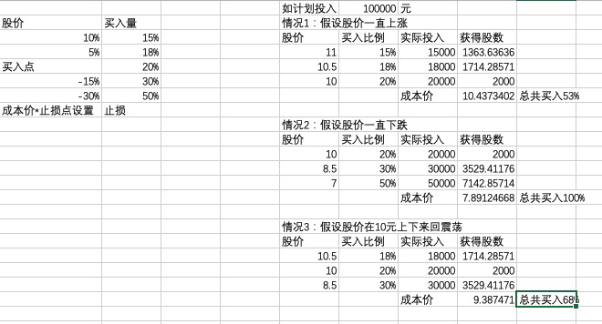

# 马克邱的价值投资原则
v1.2.1  
2021.02.26

## 选股原则

### 总原则

1. 必须对所买的股票做详细的研究，做到对于商业模式和管理团队都认可；
2. 买入一只股票，买入后，必须做好5年内没有合适的价格卖出的心理准备。毕竟股市不是为我们开的。所以 买什么，什么价格买，买多少。就变得要非常谨慎了。毕竟，5年拿在手上，非常不容易，必须有非常充足的理由。

### 成长股选股原则

1. 选择新兴行业中的龙头，在行业竞争格局初步成形后选股，即该公司在行业内成为绝对龙头，比第二名超出很大的市场份额。(此条人工完成)
2. 连续3年营业收入的增长大于20%。
3. 连续3年归母净利润的增长大于20%。
4. 连续3年资产收益率（ROIC）大于加权平均资本成本（WACC）
5. 收入中应收账款占比不能超过50%。
6. 市值不能过大，不超过500亿。
7. 在此基础之上，选择护城河深，自由现金流、净收入、净利润增长高，增长潜力大的股票买入。
8. 股票质押率不超过50%
10. 按照归母净利润率排序
11. 一年（252天）调仓一次，最大5支股票

### 价值股选股原则

1. 不买5年归母净利润率低于15%的企业，且利润率越高越好；
2. ROE稳定，且连续5年大于15%；
3. 收入中应收账款占比不能超过30%，且越低越好。
4. 在此基础之上，选择护城河深，自由现金流、净收入、净利润增长高，分红高的股票买入。
5. 每个季度（如不能实现则每60天调整一次）重新选一次

## 资金分配原则

1. 根据整体市场估值决定仓位高低，仓位在50%-100%之间波动，市场估值越高仓位越低，反之则越高。
2. 总持仓不超过10支(根据资金量设定)，单支持股比例不超过40%
3. 成长股和价值股的比例大约1:1

## 交易原则

### 买入

#### 金字塔法建仓

当价格低估或者股票大幅回调（10%以上）第一笔买入20%，作为基础卖点。

情况1：在此基础上在此下跌15%，再买入30%。再下跌15%，再买入50%。

情况2：当价格上涨时，当上涨到5%，加仓10%，当上涨到10%，加仓8%，当上涨到15%，加仓7%

情况3：股票价格来回震荡，这种情况就采取网格交易的方法，到了某个网格就还是按照这个网格的设置去交易，如果下次再来这个网格，将不会重复交易。

示例表格如下：

[制作上图用的excel](assets/金字塔买入计算表及示例.xlsx)

#### 集中持股

根据基金规模，集中持股。

0-1000万的，数量在3-5只，最多不超过10支。

1000-5000万的，数量在5-10支，不超过15支。

#### 买入时点

1. 当天下跌时才可买入
2. A股在2:30以后再买入
3. 港股3点50以后再买入

### 卖出

1. 原先的买入逻辑变了，不值得长期持有了。
2. 在成本价之上下跌30%止损。

## 风控原则

1. 对于新进资金，应重新考虑估值和买入时点，而不应考虑已有涨幅；
2. 不买市盈率大于100的股票；
3. 不买过去一年中董监高的某个人减持总量超过其总持股数的5%的股票
4. 不买管理团队有道德问题的股票
5. 参照个股风险控制检查点进行逐一检查打分

## 持仓监控原则

1. 对每一只持仓股票，以该股的买入逻辑、风控检查清单为基础编制监控清单，对每只股票的检查清单每日进行监控，发现问题随时报警。

## 历史业绩跟踪

A股：https://xueqiu.com/P/ZH1980102

港股：https://xueqiu.com/P/ZH2213182

美股：https://xueqiu.com/P/ZH2008409

