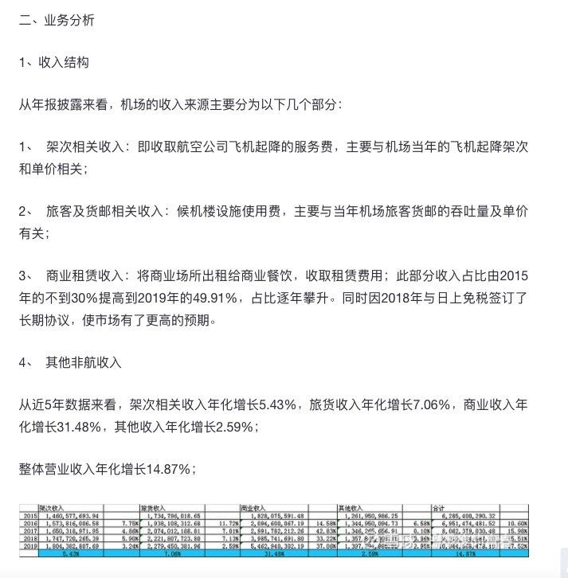
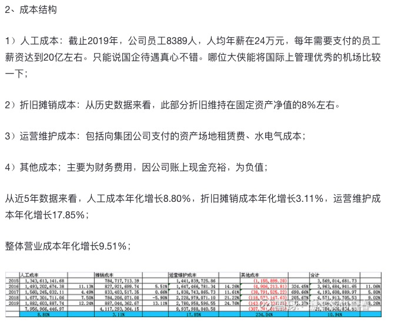

# 分析和整理资料

## 资料分类保存

按照以下分类对资料进行保存。

1. 行业相关
2. 个股相关
3. 投资方法相关
4. 新闻和公告

## 资料模板化

### 什么是资料模板化

资料模板化是一项特殊的资料处理技术，它利用同类资料一般都有固定的模式的特点，将同类资料分拆成两部分：同类资料中相同的部分，同类资料中不同的部分。其中，同类资料中相同的部分可以制作成模板。

举个例子说明：

比如，分析一个行业，总是会遵循如下顺序，行业背景、行业关联（上下游）、行业市场结构与竞争格局、行业生命周期与行业变迁、行业基本问题等，那么通过分析20篇行业分析或者研究的文章，就可以总结出一个模板，再有新的行业分析文章就可以套用这个模板进行解析。

类似的，对个股的分析也是同样道理，而且个股的分析模式更加有规律可循。

### 资料模板化的用途

模板具有以下用途：

1. 一旦某个类型的模板开发成功，计算机就可以帮助处理这类资料。
2. 模板是将资料转化为数据的必备工具。
3. 一旦资料的模板成功建立，则自动更新资料即成为可能。

举个例子。

比如有一篇分析上海机场的文章的业务分析部分，内容如下图：

成本结构部分内容如下图：

同时，我们会发现，很多研究上海机场的人基本都是会按照这个套路来研究，那么，对于所有分析上海机场的文章，我们就可以创建一个模板，第一部分业务分析就包含两个部分：收入结构和成本结构，收入结构和成本结构再细分，不断细分最终到数字和表格。

通过这种方法，就可以把原来计算机很难处理的资料转化成为计算机可以部分处理的模板加数据。总结起来说，资料模板化的用途就是：

**资料  = 模板 + 数据 + 图表**

### 资料中的数据更新

将资料处理为模板+数据+图表后，则可能自动更新资料中的数据和图表。

## 参考文献

https://xueqiu.com/5971133379/164572277