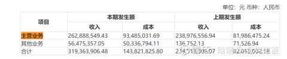

## 产品线

根据公司网站，公司的智能机器人分为如下行业的解决方案：

还有一块是智能运维服务，估计是采用租用机器人的方式进行服务。

## 只查到一个电力巡检的竞争格局

从行业的竞争与发展来看，申昊科技的营收增速根本上取决于我国电网智能化建设的进度与程度。根据[中国电力](https://xueqiu.com/S/02380?from=status_stock_match)行业年度发展报告2019给出的数据，我国电网建设投资额于2018年在5000亿元左右的水平，当期增速略高于零增长。

结合[亿嘉和](https://xueqiu.com/S/SH603666?from=status_stock_match)为代表的电力智能机器人企业业绩增长情况来看，申昊科技所属的行业应当处于一个总量有限但细分领域（智能电网）正取得进展的局面。这样的局面使得市场在情绪最弱势的时候给出了亿嘉和26.57pettm的估价，但实际上这也侧面体现了市场对于电网建设投资总额增长有限的担心。

在智能电网的建设进程中，传统电网的建设是业务开展的基础。而在传统电网建设过程中，全国各地区存在一定的差异，导致智能电网的建设进程也先后不一，通常在经济发展水平较高、用电量大的区域，对输变电监测设备、配电及自动化控制设备的需求量也会较大。

根据申昊科技给出的测算，假设浙江电网每个变电站都按照标准配备相应数量的智能巡检机器人，那么浙江电网对智能巡检机器人饱和需求量为4097台，截至2018年底，国网浙江实际使用智能巡检机器人为994台，智能巡检机器人实际使用渗透率为24.26%。

但是这个数据在上述逻辑上并不能推论到全国，因为浙江电网的需求已经基本代表了全国最优的需求情况。而根据这样的渗透率，申昊科技给出的测算结果为全国变电站室外轮式智能巡检机器人市场容量约为 44.29~70.87 亿元、全国变电站室内导轨巡检机器人市场容量约为 29.59~59.18 亿元、浙江省配电站智能巡检机器人市场容量约为 7.50~13.50 亿元。

对于这样的测算，全国市场规模定要打一定的折扣，因此市场对龙头企业给出26.57的估价是值得参考的。

从目前的同行竞争来看，[亿嘉和](https://xueqiu.com/S/SH603666?from=status_stock_match)毫无疑问为电网智能机器人龙头企业，其2019财年营收为7.24亿元、扣非归母净利润为2.15亿元。第二便是申昊科技，其2019财年营收为4.04亿元、扣非归母净利润为1.07亿元。其余企业譬如朗驰欣创、国网智能、浙江国自由于该业务收入规模较小，因此对行业竞争局面影响不大

## 关于亿嘉和2019年中报毛利润下降

中报显示 毛利率55%，净利率只有26%多，相比之前65%左右的毛利率、35%左右的净利率下降了很多。

亿嘉和的产品和生意特性就是吃高毛利率/净利率、低周转率这碗饭的，一旦这一块出了问题，那就代表1）公司的技术不行了，产品的技术含量不能维持高毛利率；2）竞争加剧，行业格局不清晰了。

原因是啥？

首先看看2019年中报营业收入的分解：主营/其他

主营毛利率：65%

其他业务毛利率：11%

主营业务/业务总收入：82.3%

可以看到，1）机器人业务还是维持高科技含量/高水准；2）亿嘉和上半年干了少部分“不务正业”、“不讨好”的事情，因此大幅拉低了总体的毛、净利率，但总归占比总量还是不大。

同时主营业务收入还是按照亿嘉和业务的季节性特征，大部分营收，超过50%的占比都在下半年确认，尤其是是Q4，只要其他业务不具有可持续性，像个渣男一样快进快出，那么其他业务收入的占比会在下半年总营收中快速稀释掉，毛利率/净利率会有较快速度回升，因此目前来看不用太担心。

## 三季报(20Q3)

三季报没有惊喜，也在预料之中。熟悉亿嘉和的都知道，他的结算大头都集中在四季度，存货2.5亿，去年同期1.7亿，多了8000万，按照国网的结算周期来算的话，那今年的业绩基本是明牌了，全年预测净利润维持3.6～4.2亿不变。现在市场整体杀估值，给亿嘉和这种每年保持30%以上增长的成长股40倍PE不算多吧，那合理市值应在150亿以上，所以公司现在肯定是低估了。那接下来到年报这几个月对亿嘉和来讲重点有两个催化剂事件。1.定增何时落地，刚看了三环的定增，3月报的，10月落地，半年多时间。我估计正常的话亿嘉和的定增应该在明年1、2月份，到时候如果有国网参与的话，反而成了一个好事。2.半年报调研的时候董秘讲带电作业机器人10月左右还有一个大订单，这一点从国电南瑞的调研中也侧面证实了，今年合资公司有9～10亿带电作业机器人的订单。如果接下来11和12月份能拿到订单的话，那就基本证明带电作业机器人技术已经成熟了可以量产了，同时通过国网瑞嘉这个合资公司持续获取订单的模式跑通了。机构质疑亿嘉和的无非就是带电作业机器人今年能交付多少台、能不能量产、能不能持续获取订单，所以上个月我去公司调研的时候，董秘讲了今年200台带电作业机器人肯定交付确认收入，十月底的时候我看到浙江好几个市都在培训和使用了。最后送一个彩蛋，消防机器人今年已经有一个多亿订单，并已经上岗了。

## 参考文献

https://xueqiu.com/3075122481/157377506

https://xueqiu.com/9429007525/164429843