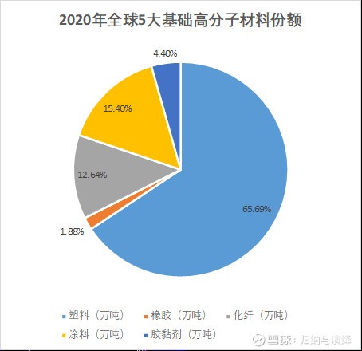

## 化工行业

不同于[半导体](https://xueqiu.com/S/SH512480?from=status_stock_match)行业的日新月异，每年要投入大量的研发，一次技术迭代路线失败可能公司就彻底被打败，化工行业技术进步非常缓慢，现在的化学甚至依旧用着百年前的科学理论。所有的化学原理与方程式都写在教科书里，但材料与材料之间的差异却天壤之别，这背后是长时间的knowhow积累。

从化工设备来看，只要设备维护的好，一次性投入的重资产10年摊销完，他可能还能用10年、20年、甚至100年。这意味着什么？这意味着你现在的固定资产投资，10年以后就是一个印钞机，他甚至能一直印50-100年

回顾百年，BASF、DOW这些国际化工巨头屹立不倒，这么多年依旧没人能挑战他们的全球地位，可以说这个行业先发优势和壁垒非常深厚。同一个产品，别人的参数、配方数量可能是我们的十倍、百倍。

某个电子胶水的业内专家告诉我：我们这个行业不能看发明专利，那个都是申请着玩的。我们这个行业核心专利是一些实用新型专利，甚至很多根本不会去申请专利，核心的配方、核心的工艺流程才是真正的壁垒。

某化学博士告诉我：化工要做得事情是发现材料上宏观的特性，例如黏度、弹性、硬度，然后用化学语言描述宏观特性，也就是探究宏观特性背后的微观分子运动、结构、间隙。再通过调整微观分子关系来影响宏观特性，最后让客户发现——诶，这家厂的产品和别人很不一样，非常好用。

## 精细化工

精细化工是当今化学工业中最具活力的新兴领域之一，是新材料的重要组成部分。精细化工产品种类多、附加值高、用途广、产业关联度大，直接服务于国民经济的诸多行业和高新技术产业的各个领域。大力发展精细化工己成为世界各国调整化学工业结构、提升一化学工业产业能级和扩大经济效益的战略重点。国家适时出台相关政策，构建产学研相结合的新型技术创新组织--国家精细化工产业技术创新战略联盟，以此来促进国家精细化工产业结构优化升级和提升行业整体竞争力。精细化工率(精细化工产值占化工总产值的比例)的高低己经成为衡量一个国家或地区化学工业发达程度和化工科技水平高低的重要标志。

精细化学品这个名词，沿用已久，原指产量小、[纯度](https://baike.baidu.com/item/纯度)高、价格贵的化工产品，如医药、染料、涂料等。但是，这个含义还没有充分揭示精细化学品的本质。近年来，各国专家对精细化学品的定义有了一些新的见解，欧美一些国家把产量小、按不同[化学结构](https://baike.baidu.com/item/化学结构)进行生产和销售的化学物质，称为[精细化学品](https://baike.baidu.com/item/精细化学品/1910521)(fine chemicals)；把产量小、经过加工配制、具有专门功能或最终使用性能的产品,称为[专用化学品](https://baike.baidu.com/item/专用化学品)(specialty chemicals)。中国、日本等则把这两类产品统称为精细化学品。

## 化工制造业为什么更应该关注PB？

因为从商业模式出发，公司赚钱后是通过扩产能，即把现金先转化为在建工程，投产后把在建工程转化为固定资产来生产商品，创造价值。所以固定资产，即产能情况才是对公司价值、盈利能力更合适的判断。某一年的业绩会受到产品价格波动、下游景气度影响，也会收到公司费用端调节等因素影响。但长期来看，固定资产的产量是相对稳定的，若产品价格稳定（过去五年价格水平是比较稳定的），那么一条产线的产值是稳定的。

从19年开始，利安隆的资产规模不断扩产，在建工程和固定资产都在迅速增长，很多产线土地、设备、厂房都已经买好，只是投产因为各种主客观原因有所延后，导致利润释放缓慢，出现了PE与PB的错配。

因此，从PB视角来看，随着疫情后下游复苏，公司其他基地产能不断爬坡，PB估值向中枢修复依旧具有空间。

## 什么是抗氧化剂

利安隆的业务非常简单，就是做**抗老化剂**，这是一种化学助剂，其中包括**抗氧化剂**和**光稳定剂**两种。这两种化学助剂主要应用于**五大高分子材料**，即**塑料、橡胶、涂料、化纤、胶粘剂**。

根据我的测算，5大基础高分子材料中，塑料是最大的一块市场。所以[利安隆](https://xueqiu.com/S/SZ300596?from=status_stock_match)的下游客户呼之欲出，主要是全球各大塑料公司，例如国内塑料龙头[金发科技](https://xueqiu.com/S/SH600143?from=status_stock_match)。

## 什么是抗老化剂

要说化学助剂，就要先说什么是高分子材料。高分子材料包括丝、麻等天然的，但更多是塑料、橡胶这些合成的。其中塑料、橡胶、涂料、化学纤维、胶黏剂这五大属于基础高分子材料。高分子材料与高分子材料之间还能进一步复合，形成更多性能更加优越的超高性能复合材料。

未来不管是飞向太空，还是潜入深海，还是更舒适的生活，都离不开新的材料。而这些新材料，绝大部分都是高分子材料。而高分子材料要想实现各种特殊的性能，满足工业和消费者的诸多需求，既离不开高分子材料里分子的结构、运动、间距，也离不开帮助这些化学材料改善性能的化学助剂。

高分子材料的化学助剂按功能可划分为：**改善加工性能类、改善机械性能类、改善表面性能类、改善老化性能类**等细分品种，其中，能够改善高分子材料的原有性能，并赋予高分子材料抗热氧化、抗光氧化功能等抗老化功能的化学助剂被称为抗老化助剂，主要为**抗氧化剂、光稳定剂**两大类别。

抗氧化剂是为了延缓高聚物受氧化并出现的老化现象。

塑料、橡胶制品在日光或强荧光下，会因紫外线等照射破坏高分子的化学键，使分子链断裂、交联，引发材料自我氧化，使得制品的外观、物理机械性能恶化，这就叫光老化，所以需要光稳定剂光对高分子材料的影响

## 增效复配技术

发达国家化工产品数量与商品数量之比为 1:20 ，我国目前仅为 1 ： 1.5 ，不仅品种数量少，而且质量差。关键的原因之一是增效复配技术落后。

所以加强这方面的应用基础研究及应用技术研究是当务之急，如专门研究表面活性剂的分离方法、洗涤作用、表面改性、微胶囊化、薄膜化及超微粒化技术等。**由于应用对象的特殊性，很难采用单一的化合物来满足用户的要求**，于是配方以及复配技术的研究就成为产品好坏的决定性因素，因而需要大力加强这方面的研究。

## 竞争格局

### 抗氧化剂

中国企业产品单一，竞争格局较为分散

中国抗氧化剂消费结构以受阻酚和有机亚磷酸酯为主，各自占比约 49%和 44%。
中国抗氧剂生产厂家众多，大部分抗氧剂生产企业以生产受阻酚类 抗氧剂为主，产品种类较为单一。
从企业来看，其中金海雅宝、松原百孚、 巴斯夫高桥均是合资企业，具有先进的技术和生产管理经验；
营口风光和 临沂三丰产品主要供应中石化、中石油体系，市场份额较为稳定；
而利安 隆等其他企业凭借灵活的机制和销售渠道不断开拓海外市场，并且逐步切 入塑料、橡胶、涂料市场，实现多元化发展。
伴随着下游烯烃行业的快速 发展，预计未来，有资金优势和技术实力的企业将脱颖而出。

### 光稳定剂

从中国光稳定剂的消费产品来看，受阻胺类（HALS）消费量最大的品种， 占总消费量的 62%，苯并三唑类占总消费量的 21% ，二苯甲酮类占比约 17%。
从产品毛利率来看，苯并三唑类和二苯甲酮类的毛利率高于受阻胺 类。
中国光稳定剂技术多为国内自主研发，但是国内企业产品线单一，多 专注于一类光稳定剂的生产。
从企业来看，其中规模较大的宿迁联盛和振 兴化工主要以受阻胺类为主；
利安隆通过收购常山科润和衡水凯亚进入光 稳定剂行业，产品种类涉及受阻酚和紫外线吸收剂；
而杭州帝盛凭借技术 优势聚焦于高毛利率的紫外线吸收剂生产。

## 结论

近些年增长迅速，主要得益于精细化工行业的快速发展。利安隆虽然在这中间竞争力一般，护城河一般，但是这个精细化工行业正处于一个快速成长期的行业，其中应该可以发掘出金股，应该花时间再进一步挖掘。所以，增加精细化工这个行业的跟踪研究。

## 参考资料

https://xueqiu.com/6621415217/148446969

https://baike.baidu.com/item/%E7%B2%BE%E7%BB%86%E5%8C%96%E5%B7%A5/1911653