## 华住酒店：酒店业的阿里巴巴还有多少增长空间？

本文主要回答两个问题：

第一，为什么华住酒店是酒店业的阿里巴巴？

第二，华住酒店的营收、利润、市值还有多少增长空间？

**一、**为什么华住酒店是酒店业的阿里巴巴？

1、阿里巴巴的商业模式

要回答第一个问题，首先要搞清楚阿里巴巴的商业模式。笔者曾长期重仓持有阿里巴巴，随着阿里的估值回归到接近合理估值的8千亿美金，已逐步清仓。

严格意义来讲，阿里巴巴并不是一个零售企业，而是一个零售基础设施企业或者说一个零售平台企业，其商业模式通俗来说就是线上的商业地产商。具体来讲，阿里巴巴搭建了一个超大规模的电子商务平台，该平台上游连接数百万中小卖家，下游连接数以亿计的消费者，平台存在的价值是服务买卖双方，提高买卖的公平性和人货匹配效率。从这个意义上来说，阿里巴巴和我们平时见到的菜市场、超市或者购物中心并无两样。

在商家端，阿里巴巴为商家的装修店铺、进货、定价、获客、结算、物流、售前售后客服等全流程的运营提供服务。在用户端，阿里巴巴需要帮助用户快捷方便的找到所需产品，提高人货匹配效率和用户体验，并且保障市场的公开透明（主要以评价机制完成）。在这个过程中，阿里巴巴对用户免费，**但是对商家端收取广告推广费与佣金，**这就是阿里巴巴电商业务的主要商业模式。由于商家端和用户端的数量众多而平台只有一个，因此平台对上下游的议价能力极强。因此电商平台的利润率和现金流非常好，阿里巴巴目前每年的经营性净现金流入接近2000亿，不比四大国有银行赚钱少。且由于是抽佣模式，只要平台的GMV保持增长，阿里巴巴的收入就能增长，无论平台的商家是否赚钱。由于中国的社会消费品零售总额随着经济发展保持稳定增长，而线上零售的份额亦逐年提高，阿里巴巴的GMV每年都会保持较快增长。因此可以说，阿里巴巴的商业模式具备极强的稳定性，其财务表现为高利润率，强现金流，高增长性，高天花板，是一门非常好的生意。

或许你会有疑问，这么好的生意难道不会有大量的竞争者，阿里为什么能够稳坐电商龙头宝座呢？答案很简单，因为阿里服务上下游的能力最强，平台、用户、商家端已经形成了良性循环的生态圈，具备极强的规模效应和网络效应。阿里对于商家的服务能力已经衍生出一套完整的商业操作系统，并且衍生出阿里云、蚂蚁金服、菜鸟物流、钉钉等，分别在数据流、资金流、物流、组织能力等方面全方位赋能商家。

这里并不过多讨论阿里巴巴，只是想借助阿里说明龙头互联网平台的商业模式特征及关键能力。**即平台即生态，具备极强的稳定性、规模效应和网络效应，其财务表现为高利润率、强现金流、高增长性、高天花板，是一门非常好的生意，而其关键能力就是服务平台上下游利益相关者的能力。**

**2、****从互联网到产业互联网**

接下来本文要论证，为什么华住是酒店业的阿里巴巴？事实上，如果仔细思考和观察，阿里巴巴的主要现金流业务不过是将零售业运用互联网的力量改造，从而成为了零售业的主要平台型企业。**而上述平台模式，已经逐步扩展到新闻、视频、教育、医疗、交通、餐饮、酒店甚至是制造业等各行各业，即所谓的产业互联网，笔者认为这将是接下来十年最重要的投资机会。**前几日马云演讲说，未来真正的机会是那些用技术、用互联网，去改变自己的传统行业，而不是互联网本身、技术本身，我对此深表认同。而今天要分析的华住酒店，就是一个用互联网技术赋能酒店行业，最有机会成为这个行业里的龙头平台的企业。

**(1)** **华住发展历史**

在详细论证之前，先简单介绍华住酒店。

华住酒店由季琦于2005年先生创办，其主要发展历史如下图所示。

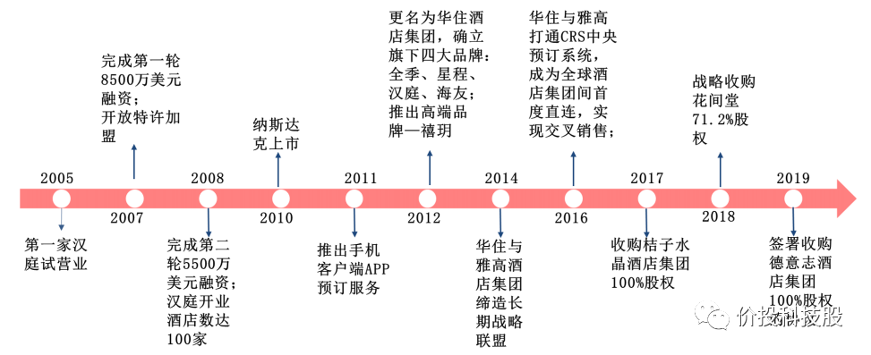

十五年间，公司通过自主设立和外部并购建立起了一个覆盖多元市场的立体化品牌体系。

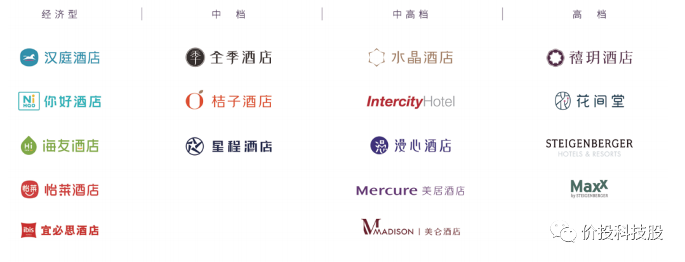

参考盈蝶网《2020 中国酒店业报告》数据， 截至 2020年1月1日，华住酒店客房达 53.69 万间，在国内连锁酒店市场市占率达11.99%，仅次于锦江酒店集团，排名国内第二。从酒店品牌分布来看，旗下核心品牌汉庭系国内酒店品牌第二，经济型酒店品牌第一；全季品牌系国内酒店品牌第七，中端品牌排名第二（均以连锁酒店计）。截止目前，公司在营酒店数量已超过6000家，根据管理层的经营目标指引，公司将在2022年实现1万家酒店的规模。

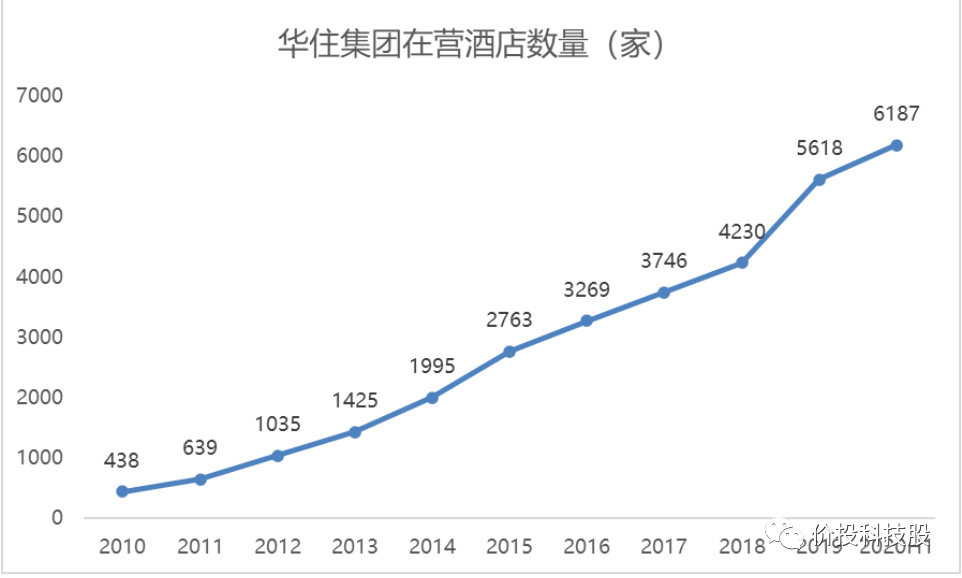

在公司酒店数量不断增长的支撑下，公司营收和利润连续多年持续快速增长。2010年-2019 年，公司营收从17.38 亿元增至112.12 亿元，CAGR为23.02%。2011年-2018 年，公司调整后的归母净利从1.3 亿提升至17.13 亿元，CAGR为44.54%。从盈利能力来看，公司调整后归母净利率由2011年5.78%提升至2018年17.02%。可以看出，随着规模的扩张，盈利能力进一步提升，公司的规模效应很明显。

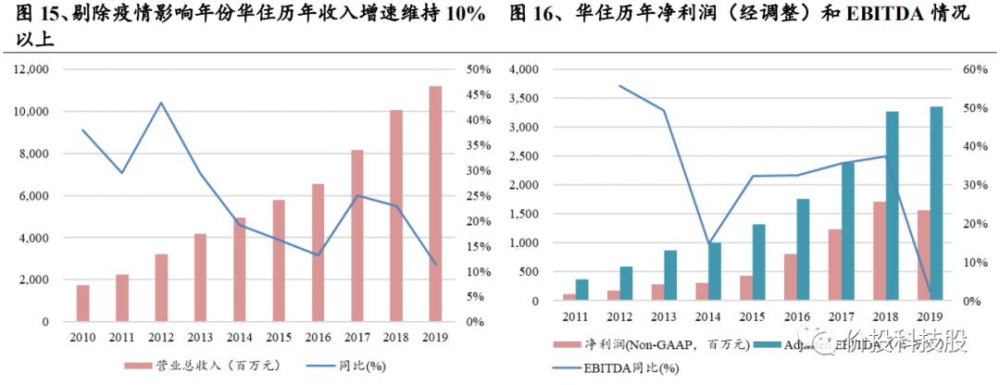

为什么华住酒店能够连续多年取得如此快速的发展，我认为核心因素有两个，一个是其创始人极其优秀，一个是商业模式的升级，接下来分别叙述。

①　季琦其人

你可能没有听过他的名字，但是一定听过携程、如家、汉庭这三个名字，没错，这三家品牌全部都由当前华住的创始人兼CEO季琦创立，可以不夸张的说，季琦以一人之力打下了中国酒店行业的半壁江山。1999年，季琦作为携程四君子之一，与梁建章、范敏、沈南鹏，创立国内第一家面向大众提供旅游服务的电子商务网站——携程旅行网。2002 年，在携程运行过程中，管理团队逐步发现连锁经济型酒店的巨大机遇，其中季琦作为携程先头兵开始探索经济型酒店的盈利模式，之后与首旅集团合作2002年成立如家，并由季琦担任CEO，在其带领下，迅速将如家打造为家喻户晓的经济型连锁酒店品牌。2005年8月，由于在经营策略上的意见不一致（注：首旅为国企），季琦离任如家后创建汉庭（华住前身）并担任董事长，并且成功后来居上再次将汉庭的市场份额做到经济型酒店品牌第一。关于季琦，更多的可以从其两本书中去了解：《创始人手记：一个企业家的思想、工作和生活》、《一辈子的事业：我的创业传奇》。专注、勤奋、博学、兼具战略眼光并且注重细节，这是我对季琦的评价。目前季琦持有华住超过三分之一股份，季琦表示，他要把汉庭作为一辈子的事业来做。

②　华住商业模式

酒店业有两种主要经营模式，一种是直营模式，一种是加盟模式。华住的加盟模式可分为管理加盟（Manachised Hotel）和特许加盟（Franchised Hotel），并以管理加盟为主。截至 2019 年底，公司管理加盟店数量 4519 家，占总门店 80.4%，特许加盟门店 411 家，仅占比 7.3%，其余系直营店。在管理加盟模式中，除了派驻店长，给店长发工资外，华住并不承担酒店的租金、折旧、人工、能耗等费用，但按照加盟商每月流水收取加盟商的管理加盟费，抽佣比例在4%-13%之间。

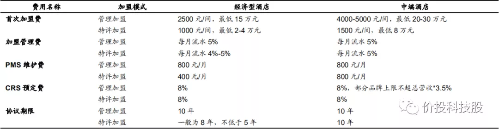

那么，对于酒店管理公司这两种模式的区别是什么？在我看来，两种模式的主要区别在于扩张速度、利润率、风险、周期性的不同。加盟模式是轻资产，公司不需要承担租金、装修、员工开支等费用，扩张速度快、利润率高。加盟模式下，公司按加盟酒店的营收收取佣金，类似阿里巴巴对于商家的抽佣，无论加盟酒店是否赚钱，只要产生收入就要交钱。更重要的是，加盟模式的周期性要远远小于直营模式，使得酒店管理龙头在行业逆境下反而可以加速扩张。

为了说明直营酒店的周期性，我们需要理解几个关键指标。简单来说，酒店的收入水平（每间可售房收入：**RevPAR**）由两个因素影响，第一，入住率（OCC），第二平均房价（**ADR**），即**RevPAR**=入住率（Occupancy）X平均房价（ADR）。当经济处于下行或者增速放缓阶段，旅游和商务出行需求承压会传导到住酒店的需求，入住率和单房价格都会承压，酒店的整体收入下滑，而直营酒店是典型的重资产，租金或者折旧等固定成本占比高，因此利润对于营收的变化非常敏感，导致直营酒店的周期性非常明显。

从下图可以看出，华住直营酒店的利润增速波动远大于加盟酒店，且加盟酒店的营业利润率将近80%，远高于直营店接近20%的水平，除此之外，加盟酒店的利润增速也远高于直营店。

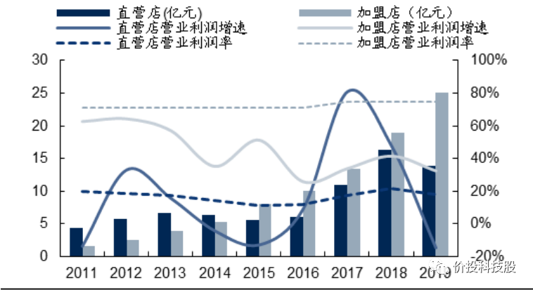

由于华住加盟酒店的快速扩张，加盟店数量已经占总门店88%左右的份额。在华住的营收中，直营酒店的收入已接近30%，利润占比超过60%。

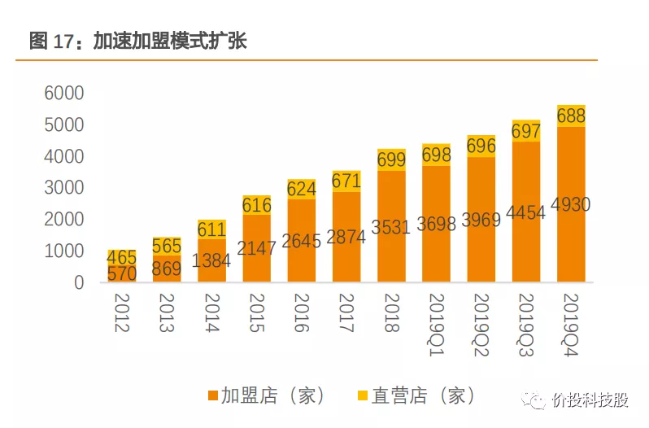

因此可以说，在过去的十年时间内，华住已经完成了一次商业模式的升级，**即从高波动、高风险、低速发展、低利润率的直营模式到低波动、低风险、高速扩张。高利润率的加盟模式，这种模式类似阿里巴巴的平台模式，是我们理解华住商业模式的关键。**

**3、****为什么华住是酒店业的阿里巴巴**

分析至此，我们终于能够开始直接回答为什么华住是酒店业的阿里巴巴这个问题了。但还需要解决一个关键问题：难道加盟模式只有华住可以做？为什么是华住能够成为最后的龙头平台？其他竞争对手就不行吗？

**(1)** **竞争格局分析**

对上述问题，笔者的回答是：一定是华住，因为其最优秀，最懂行业，最能服务好加盟商。如果研究过SAAS（产业互联网）的发展史，会发现那些能够成功转型SaaS模式的公司一定就是传统模式下最优秀的公司。至于华住的优秀，我们可以中国连锁酒店行业的三家主要玩家（华住、锦江、首旅）的几个主要经营指标来看出。

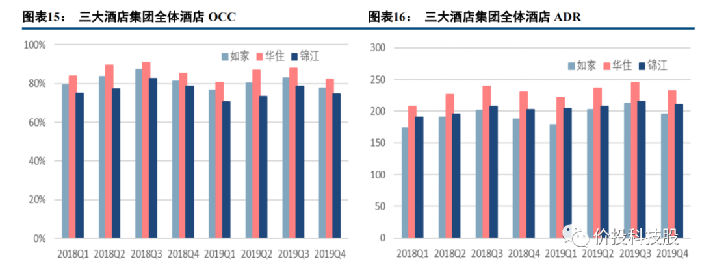

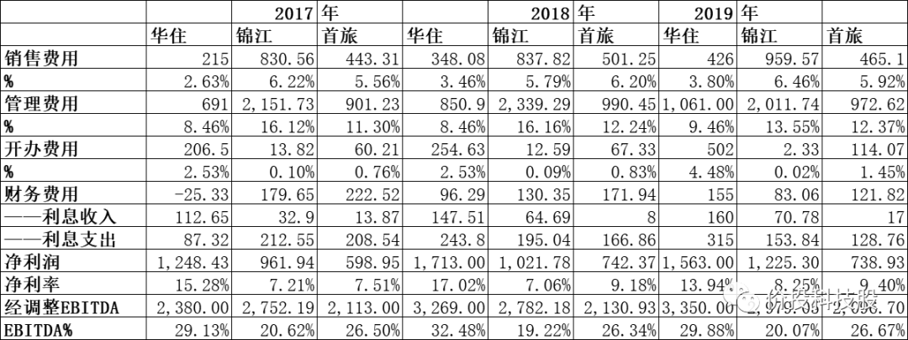

可以看出，**华住目前的入住率和****每间可售房收入****都处于行业领先地位，并且其销售费用率与管理费用率远低于国企体制的锦江酒店与首旅酒店，最终的净利率则遥遥领先其他竞争对手**。

**(2)** **华住商业操作系统**

那么华住到底是如何为加盟商提供服务的，为什么加盟商愿意将加盟费与部分收入流水心甘情愿的交给华住，这里不得不提华住的华住商业操作系统。类似阿里巴巴的商业操作系统，基于华住自身在酒店行业的实践总结与提炼，华住的商业操作系在店铺的选址、采购、人员培训与管理、获客、定价、金融、信息化、智能化等给与加盟商全方位赋能。下面我们从采购、运营、定价、获客等方面分析。

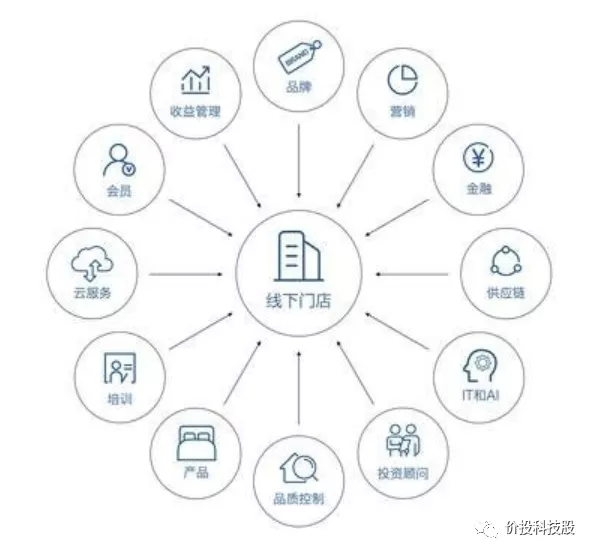

①　采购

华住易购是华住旗下酒店业垂直采购平台，提供酒店营建期和运营期各类目物料，被称为酒店业的“天猫”。数千家门店的潜在采购需求使华住对供应商有着很强的议价能力，例如华住采购的电视机价格只有75折，空调的折扣达到了51折，定制的床垫，只有市场价的13折。高议价能力带来的价格折扣能够使加盟商获 得平台独有的“低价保障”，大幅降低采购成本并且保障采购质量。

②　IT和AI运营

在酒店日常运营管理中，华住通过覆盖从前台入住到后台客房管理全流程的“易酒店”系统，实现流程化、精细化管理，全程操作均通过 APP 和智能设备完成，可以更高效便捷地为客户提供更优质的服务，同时节省运营成本。如华住全品类酒店的 10 余家品牌与云迹科技合作，推出送物机器人服务，住客仅需扫描二维码即可体验机器人送物到房服务，全程无需人工辅助，真正实现阶段性“无人化”服务，助力华住的人房比居于国内乃至全球酒店业的领先水平。据华住数据，1 台云迹酒店机器人平均可以为酒店节约 0.75 人，单店 1 个机器人年送物里程可达 2652 公里。华小二智能前台、华掌柜自助入住以及送物机器人等 AI 系列智能技术的广泛运用，每年为华住和加盟商节约人工成本（纯利润）达到近6亿元。**在经营效率上，华住集团旗下酒店的人房比为0.17（一百间房对应17个人工）为全行业最低**。

③　收益管理智能化

华住充分利用自身强大的信息技术能力，为旗下酒店打造智能化收益管理系统，在增强酒店市场竞争力的同时也增强了华住品牌的加盟吸引力。2018 年，华住就已在全球率先推出 RMS 智能化收益管理系统，成为全球首家可以根据客房供需情况进行精细自动调价的酒店管理集团，解放了酒店店长的工作量，并且提高收益，目前房价自动调价比例已经超过 58%，全业态自动化结算 100%。今年 4 月 28 日，华住集团又推出行业首创的加盟店GOP管理系统，该系统能够帮助华住加盟业主更清晰地了解酒店经营毛利率以及主要经营费用的健康情况，并通过大数据分析和技术测算，清晰地展现酒店运营状况。历史数据显示，酒店行业 GOP 率大多保持在 25-30%之间，而华住酒店平均 GOP 率可达到 60-70%。

注：“GOP” 是“Gross Operating Profit”的简称,即营业毛利,它在利润表中反映为收入减去成本、人工费、营运部门的直接费用、后台部门的间接费用后的余额。反应酒店日常营运过程的成本控制水平。

④　会员体系与获客

酒店经营获客越来越依靠于携程、美团等在线旅游渠道（OTA），仅支付给OTA渠道的费用就可达到营收的20%甚至更高。而酒店管理龙头往往通过自建会员体系和销售渠道有效降低会与OTA的依赖。华住的会员已经积累到1.53亿人，每十个中国人中一个就是华住的会员，2019年华住约76%的间夜来自华住会的个人或企业会员。华住直销渠道占比近九成，获客方式较为多元。**华住直销渠道销售整体占比较高，2011-2019年维持在85%-96%，为行业第一。**其直销由线上和线下渠道构成，线上渠道主要是中央预订系统（如华住会APP、官网、微信小程序），2019年中央预订比例达到55%，线下直销渠道主要通过销售团队梳理当地客户、旅行社、企业客户。自有渠道销售比率的提升可有效增强华住对 OTA 的议价能力，在国内酒店集团中，华住对OTA的获客依赖度最小，这提升了华住品牌对加盟商的导流效果，增强加盟吸引力。

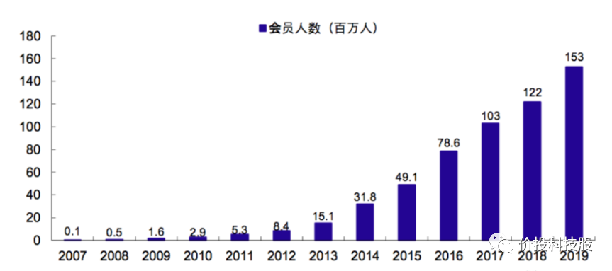

通过华住商业操作系统的全方位赋能，**华住加盟体系实现了"高10%的RevPAR，同样的营造成本，低10%的经营成本"的经营模式，华住赢得了加盟商的信赖。华住的愿意与阿里巴巴让天下没有难做的生意类似，即让天下没有难管的店，通过利用管理创新、技术创新、产品创新等手段不断优化华住商业操作系统，让加盟商拥有业内最高的员工效率、最低的获客成本、最高的利润率，打造加盟商、华住、客户三者共生的繁荣生态系统。**

**
**

至此，我们终于回答完了第一个问题，为什么华住是酒店业的阿里巴巴？因为商业模式类似，行业龙头地位类似。接下来，我们来回答第二个问题，华住还有多少成长空间。

 

**二、****华住营收、利润、市值空间测算**

由于华住目前的增长空间主要来自其加盟商的抽佣，而该收入受整个中国酒店行业规模、连锁化率、华住在连锁酒店的份额、连锁酒店中国高端酒店占比、华住抽佣比例等多重因素影响，我们保守假设中国酒店行业规模与华住抽成比例不变，来分别分析其他几个因素。

**1、****中国酒店连锁化率**

经过二十年的发展，国内连锁酒店行业已经出现了三个规模明显较大的酒店管理集团，分别是锦江酒店、华住酒店、首旅酒店，中国酒店大的行业格局已经基本形成，但这三家最大的酒店管理集团19年分别只占连锁酒店行业的15.1%、11%、8.5%，集中度仍然非常低。

另外，中国连锁酒店渗透率只有24.9%，对比美国是71%，欧洲将近40%，亚太52%，全球平均41%。分城市看，一线/其他省会/其他城镇酒店的连锁化率分别为38%/28%/17%，经济越发达连锁化率越高。如果按照星级计算连锁化率，2019年我国经济型（二星及以下）/中档（三星）/高档（四星）/豪华（五星）

酒店连锁化率估算为20%+/30%+/20%+/40%+，中档酒店和豪华酒店的连锁化率较高。总体来说，中国大量的酒店是独立的酒店，行业呈现非常分散的局面。

**如果以全部酒店的的市占率计算，锦江酒店、华住酒店、首旅酒店仅分别占据占比3.8%、2.7%、2.1%的市场份额。**

**2、****中国酒店连锁化率的空间**

那么，中国酒店业连锁化率的天花板是多少？**我认为至少可以达到介于欧洲和美国之间的水平，达到亚太52%的水平，离目前的水平还至少有一倍的空间。原因有五。**

第一，连锁酒店相对于非连锁品牌在采购、运营效率、获客、品牌、IT和AI系统、用户体验等方面具有碾压优势，导致连锁化率会逐步提升。具体已经在上文的华住商业操作系统中论述，这里不再论述。

第二，中国是统一化大市场，而欧洲虽然有欧盟，但市场的统一性还是不如中国，比如汉庭酒店在国内大江南北都家喻户晓，欧盟就很难诞生在整个欧洲都家喻户晓的国民酒店，即使诞生了，其规模效应也不如中国。过去，全球前十大连锁酒店管理集团公司里，8家来自美国，剩下两家是英国和法国的公司，可见统一大市场对于大型酒店集团的形成会起到重要作用。从这方面来讲，中国更像美国，因此连锁化率最终应更接近美国，但由于中国经济发展程度不如美国，估计中国酒店连锁化率最终介于欧洲和美国之间。

第三，以携程、美团为代表的中国的OTA平台更为发达且愈发强势，导致没有自身会员体系的非连锁酒店需要支付高昂的获客佣金，非连锁酒店的生存空间被进一步挤压。

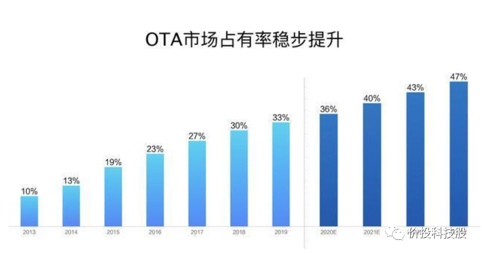

第四，经济发展越好，用户对于品质、品牌的诉求就越高，连锁酒店的品牌吸引力对于加盟商就越大；经济发展越差，非连锁酒店的生存空间就越小；因此无论经济发展好坏，连锁化率一定会逐步提升。

**第五，****疫情实际上会不可逆的加速酒店业连锁化率提升的进程。**连锁化酒店相对非连锁化酒店的优势在行业困境中进一步凸显。且疫情后旅客对卫生、安全重视程度将提升，更倾向于选择具有品牌优势的连锁化酒店，疫情阶段头部管理公司在减费、现金流方面大力支持加盟商，并且连锁酒店在与房东减免租金谈判能力更强，种种因素都会使得非连锁化酒店加速退出市场。疫情对于酒店连锁化率提升的作用将类似猪流感加速中小养殖户退出，推动专业养猪企业的市占率提升的作用类似。另外可以参考非典对于酒店连锁化率的推动，2003年非典期间酒店经营受到较大打击，但品牌连锁酒店在抗风险能力和盈利性方面的相对较优，在疫情过后经济连锁酒店的模式开始广受关注。2003-2005年期间，国内经济连锁酒店迅速扩张，门店增速分别达+74%/+91%/+214%，2005年门店数增至522家，较2002年扩张10余倍。

**3、****华住在连锁酒店的市场份额**

目前华住酒店占连锁酒店的市场份额仅有11%，笔者认为，作为酒店业最优秀的企业，华住在连锁酒店的市场份额也将会进一步提升。从目前的开店数量与签约门店数量来看，锦江酒店与华住酒店已经成为绝对龙头。新签约酒店数量已经占行业8成以上份额，也就是说新增的连锁酒店主要被锦江和华住包揽。而锦江酒店的快速扩张与其国企资质带来的资金实力、品牌背书、物业资源不无关系，也与其前几年的大肆收购有关系，但其除了规模外各方面的经营指标都不如华住。

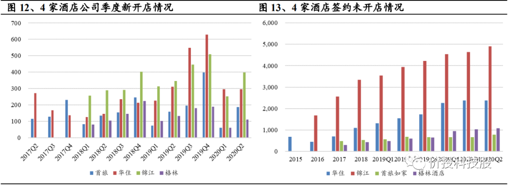

锦江酒店15、16年花费200亿左右资金在酒店行业连续大举收购。

华住酒店新签酒店的数量从16年约为锦江酒店的三分之一作用提升到目前的二分之一左右。由于华住的人房比、OCC、RevPAR、直销比例等关键经营指标均为行业最优，预计华住将继续追赶锦江，逐步成为对加盟商最具吸引力的酒店品牌。19年底，锦江和华住的在连锁酒店的市场份额之和为26%，根据新签店的份额来看，两家的市场份额最终可以提升到70%以上，即使保守估计华住与锦江保持现在的份额占比（即前文提到的11%：15.1%），华住在连锁酒店的份额最终可以做到30%。是现在的3倍左右。

**4、****中高端连锁酒店占比将会提升**

据华住招股书，酒店可就价格范围分为三个分部：经济型、中档（包括中档及中高档）及高档，其中经济型酒店的日均房价于2019年介乎20美元至30美元，中档酒店的日均房价于2019年介乎40美元至70美元，高档酒店的日均房价于2019年介乎80美元至150美元，中档酒店的日均房价几乎是经济型酒店的一倍。2019年我国规模以上连锁酒店中一半以上的房间为经济型，而美国、欧洲和亚太区连锁酒店中的经济型占比分别仅为22%、14%和31%。

根据弗若斯特沙利文数据，过去数年随着人均收入水平的提升，中档酒店在连锁酒店的占比快速提升，预计中国20-24年高档、中档、经济型连锁酒店客房数复合增长率分别为8.8%/18.9%/6.5%，中档酒店在连锁酒店在整个连锁酒店的占比将会继续提升，占比将由26.5%提升到34.2%。

**5、****华住的国内营收、利润空间测算**

至此，我们终于可以对华住酒店的营收和利润空间做一个估算。目前华住的营收中30%由加盟收入贡献，年营收为112亿*0.3=33.6亿，**而华住的加盟收入将受益于整个中国酒店行业规模提升、连锁化率提升、华住在连锁酒店份额提升、连锁酒店中国高端酒店占比提升等多重因素**，为保守估计，我们仅计算连锁化率提升、华住在连锁酒店份额提升的两个因素，那么华住来自加盟酒店营收空间=33.6亿*2（连锁化率翻倍提升到欧洲水平）*3（华住在连锁酒店份额提升）=201.6亿。

而华住来自加盟酒店的利润率可保守参考目前99%的酒店都为加盟酒店的格林豪泰的40%利润率计算，事实上，由于华住各项经营指标的领先，华住加盟酒店的利润率会大幅超越格林豪泰。再加上加盟收入在体量上增长了6倍，华住在会员体系与获客、采购、IT和AI等方面产生的规模效应会进一步提升利润率。我们假设华住来自加盟酒店的利润率可达到50%。那么华住来自加盟酒店的利润空间为201.6亿*0.5=100亿左右，该部分的利润将会极其稳定，几乎全是净现金。事实上，以上估算仅是在华住现有抽佣比例水平下估算，由于华住加盟体系还处于高速发展阶段，目前华住对于加盟商的抽佣比较克制，当华住和锦江真正成为行业双寡头时，二者的对加盟商的抽佣比例会进一步提升，华住的利润还会有更大空间。仍然保守假设利润为100亿左右，给与30倍PE的估值，仅华住加盟酒店部分的估值即可达到3000亿市值，再加上华住自营酒店的估值，华住的整体估值在3000亿以上，大概是其现在市值的3倍。

我并不知道华住会在多久之后实现这样的营收和利润空间，但基于华住的优秀该目标的实现是确定性非常强的事件。过去5年华住加盟酒店的数量复合增长率为28.9%，未来倘若以20%的复合增长率计算，那华住大概需要10年的时间来完成这一目标，而据华住集团创始人季琦透露，华住酒店数量到今年年底能达到7600家，同比上年可增长35%，奔跑正在加速。我们仍然保守估计华住需要十年来完成这一目标，那么以华住现在的市值买入其股票，10年年化收益率大概在13%左右。回报率并不是特别高，原因是因为目前市场给与华住的估值已经比较高，如果能在半年前的价位介入回报率将会提升到20%以上。但考虑到该笔投资的确定性以及大环境下其他可选标的的不确定性，个人还是愿意先买入部分底仓。

事实上，3000亿市值只是华住国内业务的估值部分。当华住成长成为国内的连锁酒店龙头时，按利润水平计算，其也会成为全球连锁酒店龙头。中国庞大而稳定的市场将为华住进军全球市场提供充足的现金流，华住一方面可以借助中国市场提供的现金流在全球进行并购、扩张，一方面可以将华住商业操作系统将在全球复制。如果华住的国际化战略成功，现价买入华住股票的回报率将会更高。因此可以说，13%的年复合收益率只是以现价买入华住股票长期持有的保底收益，但仍然跑赢市面上的绝大部分理财产品甚至未来大部分城市的房价涨幅。当然，我们无法预测股市市场情绪的变化莫测，也就无法预测短期内华住股价与市值的涨跌，但长期来看，华住的市值将会与其公司体量与质量保持强正相关，如果出现不理性的市场下跌，相信会是买入华住的绝佳机会。

## 参考文献

https://mp.weixin.qq.com/s?__biz=Mzg5NTIzNDcyNw==&mid=2247483716&idx=1&sn=e901596cd724c61fd97a61a5a7da49b0&chksm=c012268cf765af9ac91a0c3cb514d0234386d77847e27569d0aa9ae5d4d2a909c8d53a490bc7&scene=21#wechat_redirect