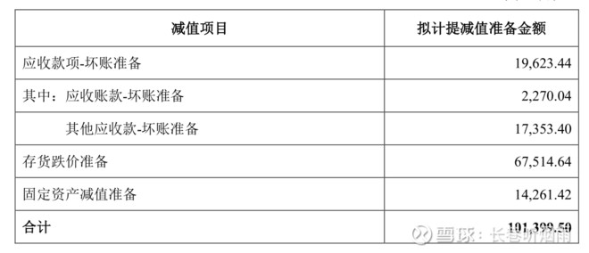

## 宁德时代：坏账损失大幅减少，存货损失压力增大

2017、2018、2019年度及2020Q3，资产减值损失分别为2.4亿、9.7亿、14.3亿、8.2亿，信用减值损失分别为0、0、2.4亿、2亿。信用减值损失主要是其他应收款损失。

2019年报显示，资产减值损失主要是存货跌价损失7.4亿、长期股权投资减值损失3.1亿、固定资产减值损失3.9亿，坏账损失为0（上年度为2.6亿）。

2020Q3的资产减值损失如下：

**对于长期资产减值损失：**

公司的会计政策是这样的：对子公司和联营企业的长期股权投资、固定资产、在建工程、无形资产和商誉的资产减值，资产减值损失一经确认，在以后会计期间不再转回。（2019年报，P128）

**对于坏账损失：**

坏账损失：2018年为2.6亿，2019年为0，2020Q3为0.22亿，坏账准备收回或转回，2018年0，2019年0.89亿元，**说明宁德的产业链地位提升，下游合作电动车企业的资信也较好，坏账损失得到了较好的控制。**

**对于存货损失：**

2018年末，存货跌价损失2.44亿，其中该年度存货转回或转销1.91亿，

2019年末，存货跌价损失9.74亿，其中该年度存货转回或转销 4.56亿。

存货周转天数从2017年的67天提升至2020Q3的122天。

**存货价格波动大，存货积压多，这一块的损失还是较大。**

## 参考文献

https://xueqiu.com/5797867118/161859961

