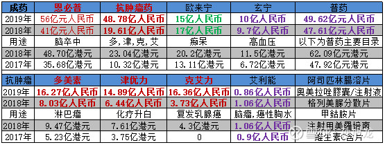
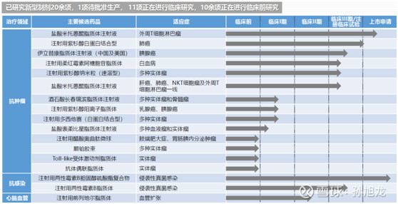

 [石药集团](https://xueqiu.com/S/01093?from=status_stock_match)（1093.HK）是一家鼎鼎有名的医药公司，能够参观这样一家上市公司并参与交流会是十分值得的。

##  固定资产折旧情况

  9月4日上午，我们几位球友在[石药集团](https://xueqiu.com/S/01093?from=status_stock_match)数位高管的接待下，依次参观了恩必普针剂生产车间、欧来宁生产车间、玄宁生产车间等厂房。据高管们介绍，车间内洗瓶、灌装、压盖等设备主要为BOSCH等德式机器，而分拣设备则进口自意大利。

  事先观察财报时我就发现：截至2019年，[石药集团](https://xueqiu.com/S/01093?from=status_stock_match)非流动资产中的“物业、厂房及设备”的金额为84.59亿元，占总资产的比例高达61.76%。如果我们参考可比同行上市公司[恒瑞医药](https://xueqiu.com/S/SH600276?from=status_stock_match)（600276.SH），可推测出石药的机器设备在固定资产中所占的比例大概率也会较高。因此我关心的第一类问题也与此有关，即“折旧年限结束后仅剩余残值的机器设备是否仍能使用？”

  对于该问题，[石药集团](https://xueqiu.com/S/01093?from=status_stock_match)高管在下午的交流会上回复称，厂房设备因为是从博世进口，质量较好，公司仅需日常维护或定期更换部分零部件即可，设备即使超过折旧年限依然可用，如厂区里2003年投产的设备迄今仍在有效使用。由此可见，石药集团对固定资产的折旧政策是比较保守的，这会使其利润更加实在。

## 现有产品销售情况

## 创新药进展

**图2：主要候选新型制剂研发进展**

  [石药集团](https://xueqiu.com/S/01093?from=status_stock_match)高管认为，在众多候选创新药中，销售峰值可达20-30亿元的产品或有十几个之多。其中，上市公司比较看重的两款产品分别为盐酸米托蒽醌脂质体注射液、伊立替康脂质体注射液（中国及美国），前者由石家庄研发中心研制，针对外周T细胞淋巴瘤的有效率在60%以上，年销售峰值未来或在100亿元以上；后者则主要针对胰腺癌，是上市公司唯一转移专利权给美国的新型产品

https://news.futunn.com/stock/15348123?src=2

http://www.wenshannet.com/companyInterpretation/13814.html

https://xueqiu.com/2002048631/150248214

恒瑞与石药的对比：

https://xueqiu.com/1034977224/92923690

 

深度分析：

https://xueqiu.com/8415140265/119907933

 

未来分析：

https://xueqiu.com/8415140265/128468007

 

行业数据：

https://www.gelonghui.com/p/182513

 

风险：

https://xueqiu.com/296

## 参考资料

https://xueqiu.com/9329772913/159157551

https://xueqiu.com/3402405662/158760258