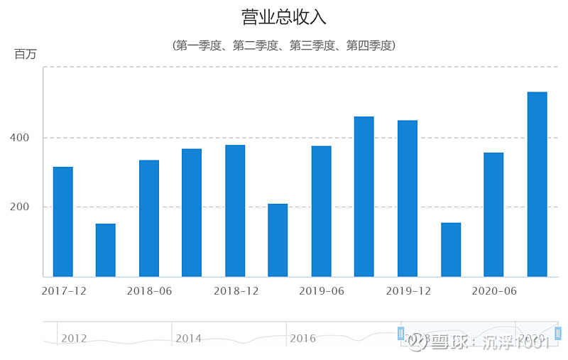
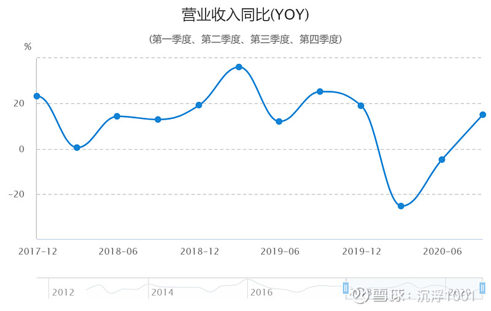
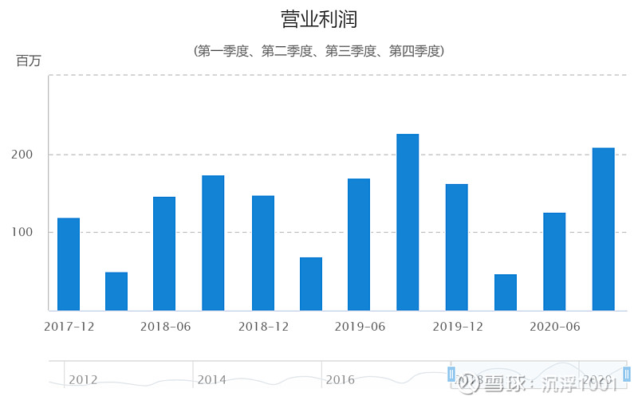
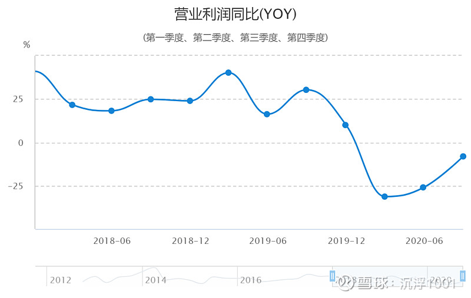
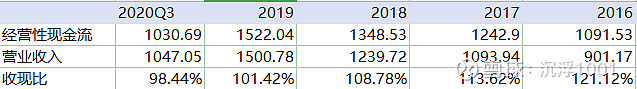

#### 美亚光电2020年三季报分析

10月28日，美亚光电发布三季报，营业收入较2019年同期下降0.27%, 归母扣非净利润下降14.29%，经营性现金流净额下降34.12%。当天股价开盘应声下跌，最低打到跌停板，最终收跌7.2%。

做价值投资或者说长期投资的人应该都有一个最怕的事情，那就是业绩变脸，每次发布季报都是一劫。今天我们来看看美亚光电的三季报。

*本文默认货币单位为百万。*

#### 经营情况

#### 1.经营收入分析

总体而言，疫情对公司的业务影响比较大，一季度业绩同比下降25.5%，营业利润下降31.1%。随着疫情在国内逐步稳定，公司的业绩也逐步恢复，三季度公司的营收已经比去年增加14.98%。然而随着营收的增加，我们发现公司的利润却没有同步。三季度单季营业利润同比下降8.11%。增收不增利，这是一个不好的信号。

拆解公司的营收可以发现，导致增收不增利的原因在于三季度营业总成本比例同比增加了5%，其中营业成本（原材料+生产成本）上升了1.58%，财务费用增加了3.5%。而财报中也说明财务费用上升是因为本期汇兑损失导致。

#### 2.应收款情况(关注)

截止三季度，应收账款余额343.72，较年初227.46增加了51.11%， 其他应收款从6.97上升到14.85,增加了112.9%。实际上这与经营收入有一定的联系，因市场环境恶化，公司的收付制度更加宽松，导致应收款大幅增加，现金流恶化。总体而言，应收款存在恶化的情况，需要在后续着重观察。

#### 3.应付款情况

截止三季度，应付票据从47.26增加到88.60， 应付账款从173.89增加到261.39，两者增加约1.2亿，与应收款增加金额相当。总体而言，公司在供应链上的话语权还挺强，可以将下游的资金占用转嫁给上游，以避免影响自身的运营。

#### 4.现金流情况（关注）

截止三季度，公司销售商品、提供劳务收到的现金为1030.69，较去年同期减少110。从上表可以看出，公司在前面几年收现比都超过1，说明公司在产业链上的地位比较高，产品比较受欢迎，基本上都能收到现金。而今年的收现比小于1，需要持续关注。

#### 5.存货情况

截止三季度，公司存货从年初的145.96大幅增加到239.97，**补充原因**。拆解2020年存货周转率（次），三个季度单季分别为0.44，0.84，1.07，虽然较2019年1.33还有差距，但整体向好。

#### 财务状况

**公司的财务状况相对健康，账面上有货币资金657.50，但没有有息负债，长期短期都没有。**

#### 总结

从公司的财务指标可以看出，疫情影响仍未过去，叠加美元全球量化宽松，公司在营业成本和财务费用方面影响较大，**且上下游的应收款和应付款都增加不少(需要关注)**，存货周转率（次）还未恢复疫情前水平。总体而言虽短期影响还未过去，但企业的经营情况并没有像股价走势那么不堪（8月至今跌了30%）。另外根据研报可知，9月公司在上海CDS展和华南国际口腔展拿到671台的订单，在手订单充足。且Q3 公司合同负债为 0.79 亿元，同比上年预收账款增长 59.89%。

另外，公司进一步丰富医疗影像领域产品，横向上口内扫描仪医疗器械注册证在2020年7月获批，纵向上口腔系统解决方案2.0+超脑AI影像系统推出，引领口腔医疗数字化。

所以我将继续持有，并考虑在股价企稳后加仓

## 参考资料

http://www.xcf.cn/article/ac5d7d9d715a11e9bf6f7cd30ac30fda.html

https://xueqiu.com/4674199418/162761424

https://xueqiu.com/7034313232/162223347