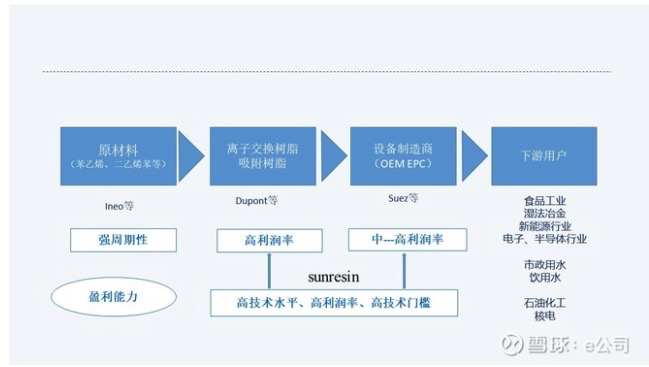
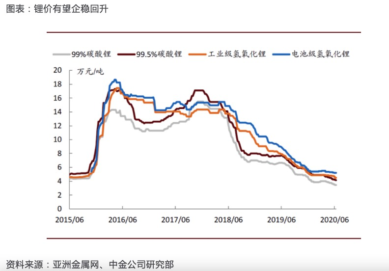
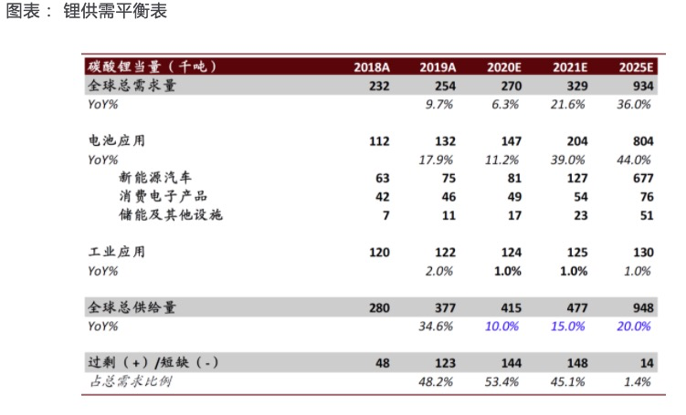

## 投资要点

### 吸附分离技术引领者，一站式应用方案供应商

公司业务定位于特殊 领域用吸附分离树脂，不断实现分离树脂在新领域的产业化，带动公 司业绩增长。公司以强大持续的创新研发能力作为核心竞争力，借助 吸附材料制造技术、市场应用技术、系统集成的长产业链技术修筑起 极深的护城河。公司注重人才培养和引进，近年来实施两次股权激励， 有利于增强凝聚力和员工信心。 

### 项目投产打破产能瓶颈，提锂业绩兑现助力高增长

公司树脂产能常 年超负荷运转。据公告，高陵项目 2.5 万吨树脂已进入试生产，蒲城项 目 1.5 万吨树脂也进入试水阶段，新项目建成投产后将打破产能瓶颈， 并拥有行业最全的生产线品类。公司与藏格锂业签订 5.78 亿元盐湖卤 水提锂装臵设备购销合同，与锦泰锂业签署 10.92 亿元的碳酸锂生产线 合同，均已逐步产出合格产品，盐湖提锂业绩逐步兑现助力高增长。 

### 金属提取和超纯水空间大，有望打造下一个爆发点

公司持续推进种 子式发展，低品位红土镍矿提镍技术已具备中试技术，镍需求受益于 三元材料镍需求释放。水处理向高端领域电子级超纯水拓展。据 Technavio 数据，2017 年全球半导体用电子级超纯水市场 28.4 亿美元， 预计到 2022 年复合年增长率超 8％，增长至 41.7 亿，市场技术壁垒高， 被跨国公司寡头垄断。公司吸附分离技术积累深厚，有望以自主知识 产权突破顶端吸附分离材料的底层关键技术，实现进口替代。

## 重点研发盐湖提锂技术

Roskil 统计数据显示，全球锂资源的 76%集中分布在盐湖中，锂业 巨头 SQM 盐湖提锂生产 1t 碳酸锂成本低至 2000 美元，而矿石提锂仅加工成本就在 3000 美元左右，盐湖提锂成本优势巨大，2016 年全球卤水提锂产量约 11.8 万吨碳酸锂，占全球 锂产品总产量的 63.6%；中国盐湖储锂量占国内已探明锂储量的 70%，主要分布在青海、西 藏等地，但国内盐湖资源镁锂比高、锂浓度低，受限于技术水平，国内卤水锂开发程度较低。 目前国内盐湖提锂相对成熟的技术是吸附法和电渗析膜法。吸附法具有工艺简单、提取效率 高、环境友好、和整体成本较低的优势，适合产业化。公司凭借在金属提取领域雄厚的技术 储备，从 2009 年即开始盐湖卤水提锂的吸附材料和工艺开发，目前已经积累了包括核心材 料、工艺和设备在内的一系列拥有自主知识产权的工艺技术，并成功应用于盐湖卤水资源综 合利用，成长为我国吸附法提锂技术龙头。

## 盐湖提锂,盐湖提锂项目进展

回答：藏格盐湖提锂项目总金额5.78亿元，截止目前公司已经完成安装，8条线完成验收，并确认收入，其余进行持续调试过程，藏格已向公司支付4.05亿元，与合同约定进度一致。锦泰项目一期已经完成全线安装和联合调试，正在逐步达产进行碳酸锂性能达标调试。公司根据实际工况增加了除硼单元、母液回收单元等，试验运行效果较好，对碳酸锂品质控制、产率提升明显。五矿项目已完成安装和调试，运行数据良好，实现了多路阀技术在盐湖提锂方面的首次应用，获得客户认可

## 产业链

## 竞争对手

[久吾高科](http://www.jiuwu.com/index.html)

## 锂价格

## 锂需求预测

## 研究报告

[研报1](assets/SXlsJsuU5pY9Bxcb5Kcc.pdf)

[研报2](assets/zC1I3IQcz1547jtYBsuC.pdf)

## 参考资料

https://www.sunresin.com/single/417

https://xueqiu.com/5505231030/150637365

https://xueqiu.com/3765289427/160253328

https://xueqiu.com/8676306971/161074036

https://baike.baidu.com/item/%E9%94%82%E7%9F%BF

https://baike.baidu.com/item/%E4%B9%8C%E5%B0%A4%E5%B0%BC%E7%9B%90%E6%B2%BC

https://xueqiu.com/2137758205/137815691

https://xueqiu.com/6918741882/161448466

