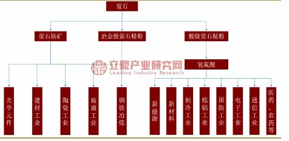
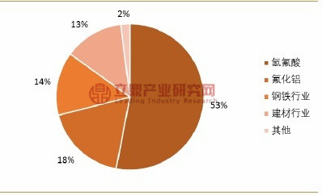

## 萤石简介

萤石，又称氟石，是一种不可再生资源，其主要成分是氟化钙，是现代工业的重要矿物原料。萤石在冶金、化工、建材、光学等传统领域应用广泛，并且其应用也逐渐拓展到新能源、新材料等领域。萤石是一种稀缺性资源，在2016 年被列入我国“战略性矿产目录”。萤石的主要产品形式包括酸级萤石精粉、冶金级萤石精粉、高品位萤石精粉和普通原矿四类。其中酸级萤石精粉主要用作氟化工产业链的原料，在氟化工行业中有不可替代的地位。

萤石矿床按其共生组合、构造与围岩特征以及加工性能，可分为“伴（共）生型”萤石矿床和“单一型”萤石矿床两类。伴（共）生型萤石矿床主要矿物为铅锌硫化物、钨锡多金属硫化物、稀土磁铁和方解石，萤石作为脉石分布其中，随主矿开采而被综合回收利用，主要用于生产冶金级萤石精粉。单一型萤石矿床的矿石组成以萤石、石英为主，有少量的方解石、重晶石、高岭石、黄铁矿、钾长石以及微量的金属硫化物和含磷矿物。这种类型的矿石生产的酸级萤石精粉除了应用于传统化工领域外，还在新能源、新材料等战略性新兴产业中得到广泛应用。

萤石主要产品形式

| 产品名称       | 氟化钙含量 | 主要用途                                                     |
| -------------- | ---------- | ------------------------------------------------------------ |
| 酸级萤石精粉   | ≥97%       | 主要作为氟化工产业链的原料                                   |
| 冶金级萤石精粉 | ≥75%       | 主要用于制造球团，替代高品位萤石块矿，作为助溶剂、排渣剂，用于钢铁等金属的冶炼 |
| 高品位萤石精粉 | ≥65%       | 主要用于钢铁等金属的冶炼，及陶瓷、泥的生产                   |
| 普通萤石原矿   | ≥30%       | 主要用于生产萤石精粉                                         |

资料来源：公开资料

## 萤石的主要应用

萤石及其下游产品在冶金、化工、建材、光学等传统领域应用广泛。近几年来，随着新能源、新材料等战略性新兴产业的异军突起，这些领域使用的含氟材料有望成为氟化学工业的新支柱。

（1）萤石的直接应用天然的高品质萤石晶莹剔透，并因结晶习性和化学组分的不同，而呈现多种多样的形态及颜色，是值得收藏和鉴赏的宝石。

在光学工业中，由于高纯度萤石具有低折射率和对紫外线、红外线的高滤光性特性，因而在光学物镜、光谱仪棱镜、防辐射紫外线及红外线窗口器件等高质量光学元件制作中不可或缺。

在冶金工业中，高品位的萤石块矿或冶金级萤石精粉则可作为助熔剂，被广泛应用于钢铁等金属的冶炼。在钢铁冶炼中，萤石具有降低难熔物质熔点、促进炉渣流动、充分实现渣与金属分离的作用。随着钢铁精炼次数的增加，萤石的需求量也相应增大。

在建材工业中，萤石可作为硅酸盐水泥的辅助原料，氟能够破坏硅质矿物，加速固相反应，缩短烧成时间，使熟料松脆，易于研磨，节能效果显著。

在陶瓷工业中，萤石可作为陶瓷配料，降低烧成温度和熔体粘度，改善坯体。

（2）萤石的间接应用

萤石是现代化学工业中氟元素的主要来源。工业上常用浓硫酸与酸级萤石精粉反应生产氢氟酸来提取氟元素，并由此形成了门类众多、规模庞大的氟化学工业。氟化工主要包括氟烷烃、含氟聚合物、无机氟化物及含氟精细化学品四大类产品。氟化工是化工新材料产业的重要分支，同时也是发展新能源等其它战略性新兴产业所需的配套材料，对促进我国制造业结构调整和产品升级起着十分重要。

在新能源工业中，含氟材料发挥着不可或缺的作用，主要产品包括锂电池材料六氟磷酸锂、镀铝硼氢氟酸电解液、各项性能优良的含氟太阳能电池背膜、太阳能面板清洗及玻璃雕刻用高纯氢氟酸等。

在新材料工业中，有机氟材料由于具有其他合成材料无法比拟的耐化学性、热稳定性、介电性、不燃不粘性，以及极小的摩擦系数，而有着广泛的应用。

在制冷工业中，含氟化合物仍然是不可替代的制冷剂。

在炼铝工业中，氟化铝可以降低熔点和提高电解质的导电率，从而大大降低生产成本，是电解铝生产的重要辅助材料。氟化铝生产中所需的氢氟酸，约有30%来自氢氟酸生产企业，其余由氟化铝生产企业自行生产。

在国防工业中，氟主要应用于铀浓缩和提纯，液态氟可用作火箭燃料的氧化剂，还可用作尖端战机喷气推进剂的关键元素。

在电子工业中，高纯氢氟酸为强酸性清洗、腐蚀剂，应用于集成电路和超大规模集成电路芯片的清洗和腐蚀，是微电子行业发展的关键性基础化工材料之一。

在通信工业中，氟化物玻璃在光导纤维技术中发挥着奇特的作用，其原因是氟化物光导纤维在远距离通讯，尤其在海底通讯中，损耗极小，可在数千公里范围内免除中继站。

此外，在医药、农药工业中，有机氟化物品种众多，也有着非常重要的应用。

萤石的主要用途

资料来源：公开资料

目前，氢氟酸是萤石最主要的下游产品，在萤石需求中占比高达53%，其次是氟化铝，占比18%。传统的钢铁和建材行业分别占比14%、13%。

萤石下游需求结构

资料来源：公开资料

## 总结

603505两市为数不多财务简单明了无法造假的公司、萤石矿全部属于浅矿或露天矿、采矿无风险技术门槛又低、由专业采矿工程公司承包采矿、每吨矿都有保险、采矿量与销售量是两家两套财务分离、是境外投资者首选标的股！露天矿业无矿难之忧生产安全、采矿工程队与金石公司两套财务独立无造假之忧、财务安全！矿难由保险理赔！长期持有舒心！国内萤石价格行情是公开的、只需注意看住萤石需求量。比如：包括工资、运输、税收所有成本公司每吨成本800至900左右、淡旺一季度出货5万吨至6万吨左右、不包括选炼精石、承包商采矿公司或者几家化工企业客户也可查出采矿量与销量、非常容易判断出公司每季度利润、公司财务造假机率是零、是新手与伞户投资者最佳选择！
19年一季度营业额增长33％、利润4100万同比增长 103％！毛利率61％、净利率32％！非常健康！
萤石是叠加氢燃料电池与锂电池概念的原料：现今新能源车政基本确定纯电动电池车与氢能源燃料电池两路并进政策！六氟磷酸锂主要用作锂离子电池电解质材料，用于锂离子电池制造。氢氟酸主要用于制冷剂以及作为新能源、氢燃料新材料、国防、航天航空、制药等领域的含氟聚合物、含氟中间体和电子级氢氟酸等。从萤石中提取的氟，可用于生产锂电池的电解质六氟磷酸锂及氟石墨电极，氢燃料电池的质子交换膜而燃料电池的核心用的是全氟离子膜！萤石另一重要用途是生产氢氟酸。它是生产各种有机和无机氟化物和氟元素的关键原料！

## 公司最大的优势是什么？

对我们来说最大的优势，就是早些年，用比较低的价格，储备了大量的资源。

我们现在八个子公司、六个矿山，反正基本上都是大型的矿山，还有几个探矿权，我们的这块可利用的资源储量比较大，我们现在有2700万吨的资源储量，最主要是这一块。就是资源拿到了。

现在新的准入门槛又提高了。

拿矿这些东西，现在都要招牌挂，价格也高；第二个现在还要交全矿产资源权益金（《矿产资源权益金制度改革方案》于2017年4月13日，国务院发布。改革方案明确提出四项改革措施：在矿业权出让环节建立矿业权出让收益制度；在矿业权占有环节建立矿业权占用费制度；在矿产开采环节，继续征收资源税；在矿山环境治理恢复环节建立矿山环境治理恢复基金制度——格菲注），影响会比较大。

这以后会越来越难拿，价格也越来越高，再加上现在环保等方面的影响，很多小的矿山都要关掉。对我们自己也有压力，各方面要求也高。

总的来说，对行业龙头企业还是利好，这一年涨价应该跟这个关系还是比较大。

## 价格波动规律

所以为什么每年的二季度会比较旺，因为它是为六七八月份备货。每年正月的时候也是会比较旺，为什么呢？因为北方天气比较冷，它生产不了，生产不了的话价格就会涨，带动上游这边。他们厂家会为明年开春做一些准备。

## 公司市场份额大约能占多少？

A: 现在市场份额应该是很低的，这个没有统计，因为我们的资源储量占了很大。目前我们已探明的可利用资源储量居全国首位，占全国1/4。

目前我国单一型萤石矿的可利用资源仅为6000-7000万吨左右。因为我们统计的时候可能量很大，全球几亿吨，但是像我们国内，尤其是湖南那边，基本上是伴(共)生矿了。伴(共)生矿现在开采起来暂时来说可能成本很高，技术也很大。但是我们浙江的矿基本上是单一矿，单一的萤石矿。

从储量上来说，我们肯定是绝对垄断了，后期再拿，第一个我们有优势去增加储量；第二个，第二名跟我们差距非常大，要赶超我们储量的话，不太现实。

但是市场的份额还是很低的。

一、数字很难统计。因为我们这个行业就是小、散、乱、差，除了我们是上市公司相对大一点，行业内没有大的国企在里面的，全是我们周边的这种很小的、几万吨的小矿山。

二、很分散。如果说不是现在环保各方面很严，它开采的难度也不大，几个人就能开采。现在是因为环保这些东西严了，它没有污水处理或者没有尾矿库，它就做不了，是因为这个原因。但是它的矿产本身是很小的，所以以前那种小作坊也能做。

市场份额方面，其实我们的产能还没有都用出来。我们虽然有储量，但是我们有一些都是探矿权，现在也没有开采。

## 第二名跟公司差距多大？

A: 都没有统计，第二名肯定是个位数。没有什么可比性。

Q: 是否可以理解成公司一家独大？

A: 对。

从单个来说，肯定是没法跟我们比，除非人家其他所有储量放在一起来比。

（格菲心语：综合来看，国家的产业政策将有利于行业内优势企业的发展，具备先进技术水平、环保达标、规范经营的优势企业有望进一步扩大竞争优势，在行业整合的过程中进一步做大做强。

同时，也可以看出，公司所处行业，有些具备“小行业、大公司”的特征。）

## 莹石精粉卖给下游企业后，多长时间回款？

  A: 两三个月，最长的也就三个月左右。

像我们有些客户，我们现在都要求他们全部先付款了，因为本来就不多。有些很大的、也是长期合作的企业，可能两三个月付款，但最长也就三个月。

## 结论

涨主要是因为萤石资源变为国家战略资源，因为具有稀缺性而导致价格上涨。萤石是氟的主要提取来源。

考虑到担心价格上涨后出现其他的氟的提取方法替代。需要继续研究替代方法的可行性再做决定。

## 参考资料

[研报1](assets/H3_AP202004161378064995_1.pdf)

[研报2](assets/07865e35-819c-4f42-a3e4-7bad7360fd05.pdf)

https://zhuanlan.zhihu.com/p/65019743

http://www.leadingir.com/trend/view/1916.html

http://caifuhao.eastmoney.com/news/20181204102542254292960