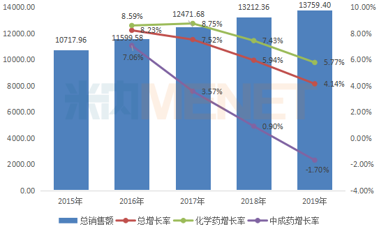
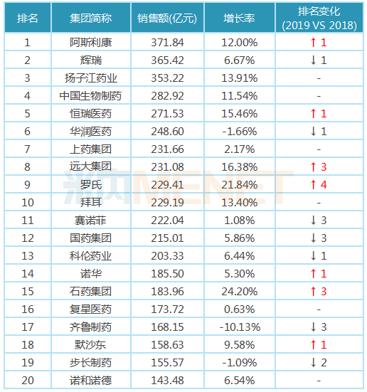
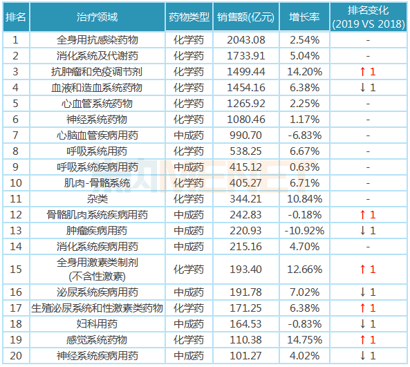
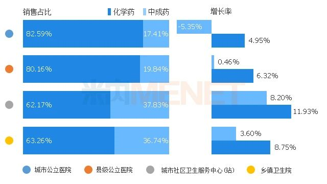

## 精彩内容

米内网最新数据显示，2019年中国公立医疗机构终端药品销售额13759.4亿元，同比增长4.14%，增速持续放缓。TOP20医药集团名单不变，但排名出现不小变化；公立医疗机构以危、急、重症用药类别为主，化学药为“主力军”，抗肿瘤化药增速显著；TOP20品牌“大换血”，名单及排名均有变化；基层市场逐渐受重视，虽然药品销售规模相对较小，但增速快于公立医院。

## 中国公立医疗机构终端药品市场概览

2019年中国城市公立医院、县级公立医院、城市社区中心以及乡镇卫生院（简称中国公立医疗机构）终端药品销售额为13759.4亿元，同比增长4.14%，市场逐年扩容，但增速持续放缓。其中化学药销售额10929.22亿元，同比增长5.77%；中成药销售额2830.18亿元，同比下滑1.7%。

图1：2015-2019年中国公立医疗机构终端总体销售情况（单位：亿元）

来源：米内网终端格局数据库，以平均零售价统计

自2015年开始，系列利好创新药发展政策出台，为创新药放量创造有利条件，然而由于创新药总体规模在整个公立医疗机构用药数据占比还很小，据米内网数据显示，单抗和蛋白激酶抑制剂（主要是替尼类抗肿瘤药）总额仅400亿元左右，再加上近二十年审批的各类新药（不含已过专利期原研药）合计不足1000亿元，只占到公立医疗机构药品终端总销售额13759.4亿元的7.3%左右，因此贡献增速有限，而占据主流的仿制药受带量采购、重点监控目录等政策影响，增速下滑明显，使得整个化药市场增速持续放缓。

近年来受医保政策调整、医院合理用药政策逐步细化等影响，口服中成药市场增速持续放缓，中药注射剂市场下滑明显，整个中成药市场在2019年首次出现负增长。

## 中国公立医疗机构终端药品市场解析

\>>>>TOP20医药集团

在系列政策及并购行为作用下，中国公立医疗机构终端药品市场集中度持续提升，龙头企业强者恒强。2019年销售额超过百亿元的医药集团合计销售规模超过5400亿元，同比增长7.11%，占中国公立医疗机构终端总销售额的39.35%。

表1：2019年中国公立医疗机构终端TOP20集团

来源：米内网终端格局数据库，以平均零售价统计

2019年销售额TOP20医药集团合计销售额超过4500亿元，其中跨国药企占8席，国内药企占12席。8家跨国药企销售额均呈现不同程度的增长，罗氏、拜耳、阿斯利康3家药企增长率均超10%；12家国内本土企业中，3家药企销售额出现下滑，石药集团增速明显，达24.2%。

与2018年相比，2019年销售额TOP20医药集团名单不变，但排名出现不小变化。阿斯利康反超辉瑞，以371.83亿元的销售额排位第一；曲妥珠单抗、利妥昔单抗、贝伐珠单抗放量明显，罗氏凭借这“三驾马车”上升4个名次至第9位；远大集团、石药集团均上升3个名次，分别排在第8位、第15位。

\>>>>TOP20治疗类别

米内网数据显示，中国公立医疗机构终端中，化学药分为14个治疗大类，90个治疗亚类，5100多个通用名品种；中成药分为13个治疗大类，74个治疗亚类，6000多个通用名品种。

表2：2019年中国公立医疗机构终端TOP20类别

来源：米内网终端格局数据库，以平均零售价统计

中国公立医疗机构终端以危、急、重症用药类别为主，且化学药为“主力军”。TOP20治疗大类中有12个化学药，8个中成药。排位前三的治疗大类分别为全身用抗感染药物、消化系统及代谢药、抗肿瘤和免疫调节剂，均属于化学药。中成药重在调理，因此在心脑血管疾病等慢性病及呼吸系统疾病等常见多发病方面表现较佳。

12个化学药治疗大类销售额均有不同程度的增长，抗肿瘤和免疫调节剂增速明显，达14.20%，这主要得益于近几年来获批上市新品多，及抗癌药医保谈判提高药品的可及性；与之形成鲜明对比的是：8个中成药治疗大类有多个出现负增长，肿瘤疾病用药下滑明显，泌尿系统疾病用药、五官科用药、儿科用药等增速较快。

\>>>>TOP20品牌

受国家带量采购、重点监控、限抗限输等政策影响，2019年中国公立医疗机构终端TOP20品牌名单及排名均出现变化。东阳光药的可威（奥司他韦）、长春金赛药业的赛增（重组人生长激素）、拜耳的拜新同（硝苯地平）跻身2019年TOP20品牌，2018年上榜的山东丹红制药的丹红注射液、辉瑞的络活喜（氨氯地平）、信立泰的泰嘉（氯吡格雷）则出局。

表3：2019年中国公立医疗机构终端TOP20品牌

来源：米内网终端格局数据库，以平均零售价统计

TOP20品牌合计销售额超过1000亿元，主要集中在降血脂、降血糖、降血压等慢病用药及抗肿瘤、抗感染等用药领域。阿斯利康的普米克令舒、辉瑞的立普妥、诺和诺德的诺和锐位列前三。

受4+7集采、重点监控及医保受限等政策影响，辉瑞的立普妥及络活喜、赛诺菲的波立维、正大天晴的润众、梧州制药的血栓通、上海绿谷制药的丹参多酚酸盐等品牌销售额下滑，排名也跟着下降。

在鼓励创新及抗癌药医保谈判作用下，罗氏的赫赛汀、美罗华及安维汀、石药的恩必普、扬子江的加罗宁等放量明显；由于流感频发，东阳光药的可威增速迅猛，增长率高达124.13%，排名由2018年的61位上升至2019年的第10位。

\>>>>终端分析

中国公立医疗机构终端含公立医院（城市公立医院市场、县级公立医院市场）及公立基层医疗（城市社区卫生服务中心/站市场、乡镇卫生院市场）两大终端四大市场。

图2：2017-2019年中国公立医疗机构终端四大市场销售情况（单位：亿元）

来源：米内网终端格局数据库，以平均零售价统计

随着分级诊疗制度推进及企业逐渐重视基层市场，公立基层医疗终端药品销售额增速较快，其中城市社区卫生服务中心/站市场规模相对较小，但药品销售额增速明显快于其他三个市场。

图3：2019年中国公立医疗机构终端四大市场化学药及中成药销售占比

来源：米内网终端格局数据库，以平均零售价统计

化学药在四大市场占比较高且呈逐年递增的态势，2019年在城市公立医院市场、县级公立医院市场占比均高达80%以上；中成药增长乏力，在四大市场的增速均低于化学药，且在公立医院市场增速出现下滑。

来源： https://www.menet.com.cn/info/202005/20200511110040040_139978.shtml