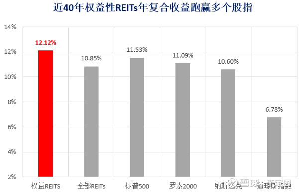
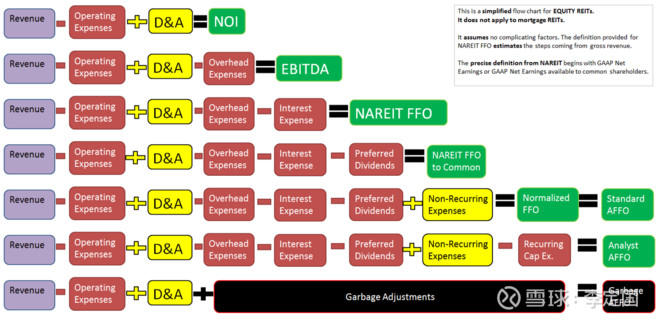

## 概述

一个偶然的机会接触到REITs的概念，在疫情之下，房地产的REITs受到了打击，普遍变得具有吸引力了。

REITS简单来说就是原来的物业持有人把有稳定收入的物业整体出售进行上市，然后认购20%以上的上市股份。可以理解为资产IPO，然后这些物业的收入的90%以上用于分红。物业资产交由专业团队管理，资产的份额持有人就像一个个小包租公，每半年收租一次。

以目前来看，写字楼收租股的风险回报率会较零售为好。所以，业务主要分为写字楼收租和零售收租两大类。

 **第一部分 美国REITs简介（熟悉可跳过）**

**1、什么是REITs**

[房地产投资信托基金](https://xueqiu.com/S/CTRE?from=status_stock_match)（REITs，Real Estate Investment Trusts）是一种通过发行股份或者收益凭证汇集多数投资者的资金，交由专门投资机构进行不动产投资经营管理，并将投资综合收益，按比例分配给投资者的一种信托基金。

REITs本质上是一个公司，通常情况下运营和管理商业不动产，例如酒店、购物中心、办公楼和厂房等，并以此获取租赁收入。或者说，只要是能够产生固定租金收益的物业，不管它是住宅、办公楼还是电影院或监狱，就可以打包REITs上市实现资产证券化，使不动产投资化整为零，让普通人都能投资分享物业的租金和增值收益，让不动产变动产。

美国REITs与其他公司的一个核心优势是免税，并且规定，每年90%以上的收益要返还给股东，因此有高分红的属性。投资人可以获得股票升值以及分红双重回报。

总结来说REITs就是一家从事租赁、翻修、管理、拆除、重建和从头开发的[房地产](https://xueqiu.com/S/SZ160628?from=status_stock_match)业务营运公司。在符合一定条件下，公司可以享受税收的优惠。REITs的份额既可以上市公开发行，也可以私人持有。通过上市份额获得流动性，提高了REITs的吸引力和竞争力。

美国的REITs又可以划分为权益型、抵押型和混合型。其中，权益型REITs占了总量的90%以上。权益型REITs直接经营具有收益性[房地产](https://xueqiu.com/S/SZ160628?from=status_stock_match)的投资组合，主要收入来自租金，或买卖房地产的交易利润。其投资组合可以有很大不同，常见的包括购物中心、公寓、医疗中心、写字楼、工业区、酒店、游乐区等等。另外，按照投资标的的类型划分，REITs还可以划分为公寓、商业办公楼、医疗地产等REITs。

我们一般所说的REITs指的都是股权REITs，因为股权类在所有REITs中占比最大。根据市场指标之一的FTSENareit数据统计，截至2019年12月31日，所有REITs的股票市值为1.329万亿美元，而所有股权类REITs的股票市值为1.239万亿美元，占比93%，如下图所示。本文所讨论的投资标的便是权益类REITs，并且是商业地产REITs。

**2、权益类REITs的投资特点**

**高股息：**与普通股权资产相似，股权REITs的总收益包括资本增值和股息两部分。但是，相比于一般股权投资的股息，股权REITs的股息高且稳定，因为股权REITs要求必须至少将其收入的90％以股息的形式分配给股东。1972年至2019年期间，FTSENareit所有股权REITs的平均每年总收益为13.33%，其中股息收益率平均每年有7.51%。由此可见，股权REITs总收益中有超过一半来自股息。因此，股权REITs非常适合寻求股息收益的投资者，特别是寻求股息加资本增值的长期投资者。从历史上看，商业[房地产](https://xueqiu.com/S/SZ160628?from=status_stock_match)的投资总收益要高于共同基金或公司债券等其他投资。REITs也是如此。股权REITs的股息收益率高于标准[普尔](https://xueqiu.com/S/POOL?from=status_stock_match)500指数的平均收益率，比如1972年至2019年，FTSE Nareit所有股权REITs的平均每年股息收益率有7.51%，同一时期标准普尔500指数的年均股息收益率只有3.24%。
 **税收优势：**通常公司在派息前就已经交了公司税，加上投资人自己在拿到股息后上缴的个人税，股票投资人需要被征收两层税。REITs投资则不同。得益于2017年签署的税收法案，REITs有税收抵扣优惠，即公司层面不征税。投资者仅需在个人收益层面缴纳个人所得税，所以避免了重复征税。

**高回报**：收益率长期看，美国各类型REITs物业年资产回报率稳定在7%-12%之间。

高回报意味着更多的再投资机会，投资者的投资参与度提高；另外即使在熊市中，投资者也能收获比较稳定的收益（金融危机等极端情况除外）。

以1962-2016年为例，过去40年REITs产品的年复合增长率为12.12%左右，远高于10年定期国债收益率，跑赢多项股指，S&P500指数总回报11.53%，罗素2000为11.09%，[纳斯达克综合指数](https://xueqiu.com/S/.IXIC?from=status_stock_match)为10.6%，[道琼斯指数](https://xueqiu.com/S/.DJI?from=status_stock_match)8.78%。

**低风险：**REITs虽然有来自消费者习惯改变或是就业下降等等导致供需改变所带来的风险，然而其收入、成本、租约的稳定性仍然较强，相应风险较低，反应了REITs的债券化特性。

**相关性低：**REITs和股市相关性较低，即当股票大幅下跌时，REITs表现不会受太大影响。美国国家[房地产](https://xueqiu.com/S/SZ160628?from=status_stock_match)投资信托协会（Nareit）研究发现，从1992年初到2016年底的25年期间，大盘股和小盘股的总收益相关系数为83％，而大盘股和上市股权REITs的相关系数仅有56％；同时近25年与巴克莱综合债券指数相关系数仅为0.29。因此，股权类投资者同时投资REITs，可使得投资组合更多元化，更好分散非系统风险。

**投资分散性：**地产本身极具风险分散的投资优势，比如REITs地产组合中的标的分布在不同地域，或者投资了同一类型中的不同子类型，都是可以分散投资风险的。要知道，即使是同一个小区的两栋楼，也是不完全相同的。虽然大部分的REITs只投资某一类的地产标的，但标的本身的特性增加了REITs的风险分散能力。值得注意的是，有一种多元化REITs，会同时购买或经营多个标的，所以比一般REITs分散风险的能力更强。

**高流动性：**股权REITs不仅具有一般地产投资的高分散、抗通胀等优势，还具有高流动性等股票投资才具有的特点。[房地产](https://xueqiu.com/S/SZ160628?from=status_stock_match)作为一种非流动性资产，投资初始成本较高，一旦投入锁定期较长，当市场不利时无法及时转手。但是，在证券交易所上市的股权REITs，其流动性显而易见，而且较低的初始投入即可买到地产股权的一部分，享受股权拥有带来的收益。

**透明度高：**REITs通常参与经营，因而公司管理层多持股，治理与股东利益保持一致，且REITs大都上市交易，审计报告定期跟进，相关规定也相对透明；

**风险敞口：**与其他股票一样，股权REITs的价格会受市场状况的影响而上下波动。尽管[房地产](https://xueqiu.com/S/SZ160628?from=status_stock_match)市场周期与其他股票的市场周期不同，但商业房地产仍然是周期性业务。

**3、权益类REITs的核心指标及估值**

一般来说，净利润是衡量一个公司经营状况的重要指标，在计算过程中，成本的计算要扣除折旧和到期的递延费用。而REITs标的为不动产，其价值不会像一般固定资产一样随着时间贬值，甚至有可能因为通货膨胀等因素而增值。因此，从净利润的角度来衡量REITs的盈利能力不太准确。美国国家[房地产](https://xueqiu.com/S/SZ160628?from=status_stock_match)投资信托协会（Nareit）制定了“营运现金流（FFO，FundfromOperations）”的行业指标，来取代纯利润。因此，FFO已成为被广泛接受的衡量和相互比较REITs表现的重要指标。并且在此基础上演化出的各种变体及与价格组成的比值或倍数。

**1）营运现金流，FFO**

FFO不是GAAP会计指标，是由NAREIT（美国[房地产](https://xueqiu.com/S/SZ160628?from=status_stock_match)信托投资协会，）于1991年10月定义，2003年1月美国证监会通过法案允许REITs在财务报表中使用这一统一指标。REITS是基于FFO进行分红，即FFOPayoutRatio；因此FFO是一非会计类的重要指标。可简单认为FFO=GAAP净收入-从房地产出售中的资本利得+房地产折旧费用。

*FFO=净利润+折旧摊销（符合标准的）-物业买卖收益*

*+非重大资产减值-资产控制权变更收益（比如权益比例下降）*

**2）调整后营运现金流，AFFO**

AFFO（Adjusted Funds From Operation）。AFFO也叫利润可分配基金(Fund savaila befor distribution，FAD)，是指可以作为股息分配的现金，是在FFO基础上，减去固定资产开支（如房屋维护费Cap Ex）、出租成本、非现金租金调整（租金的straight-lining，即租约合同与实际支付的租金差额）等后的余额。

常用的基于FFO/AFFO的指标有每股FFO（AFFO/share）、AFFO收益（每股AFFO／每股价格）、FFO价格倍数（每股价格／每股FFO）、FFO支付比率（年化股息／AFFO）。

单用FFO不能很好对比不同性质的REITs。比如，商业办公楼REITs和公寓REITs的比较，由于两者的房屋维护费用等开支不同，最后能分配的股息也会有很大不同。换句话说，与FFO相比，AFFO是一个更加精确衡量自由现金流和股利支付能力的有效工具。

但是一般RETIs报告都不披露AFFO。这是因为AFFO缺乏一个普遍认可的行业内标准定义。即使是披露了AFFO值，各家REITs的计算方式也不尽相同。因此FFO尽管不如AFFO有效，使用却更加普遍。

a)、所有收入（包括资本利得）减去运营费用、核减、折旧、摊销、利息支出及一般的管理费用=**净收入**。

b)、净收入减去从[房地产](https://xueqiu.com/S/SZ160628?from=status_stock_match)出售中的资本利得以及其他损益，加上房地产折旧费用=**FFO**。

c)、FFO减去正常的及经常发生的资本支出、租客改善和租赁佣金的摊销，再去除租金的straight-lining，以及对提前偿还的债务的利得或损失进行调整=AFFO。

**3）FFO Payout Ratio和股息率**

REITs一般是季度分红甚至按月分红，因此年化分红/股价×100%，这个是你按现价买入能够获得的分红收益率。

FFO Payout Ratio=Dividend/AFFO，指的是REITs每年的AFFO有多少用于分红。一般来说，在同一行业同等股息率的情况下，优先选择FFO Payout Ratio小的，因为这个比率较小说明有更多的资金留存下来支持业务增长或降杠杆，并且未来还有提升空间从而保持股息的增长。

**4）利息覆盖倍数**

利息覆盖倍数=EBITDA/Interests，利息覆盖倍数如果小于3倍，则需要小心，表明利息偿还压力比较大，一本最好超过4倍。

**5）债务杠杆倍数**

债务杠杆倍数=Net Debt/EBITDA（或NOI），一般不要超过7倍会比较稳健。如果杠杆倍数过高的话，则可能存在现金风险，另外也没办法再通过提高杠杆倍数来增加收益了。当然具体情况具体分析，对于REITs来说，需要了解其债务结构及到期年份。

**6）怎么估值**

对于REITs股票估值，目前有三种方式：NAV模型、P/FFO或P/AFFO模型以及现金流折现和分红增长模型。所有的模型都有其长处和局限。其中NAV模型和新晋留着先和股息增长模型我们已经熟悉，重点介绍一下REITs最为常用的P/FFO或P/AFFO模型。

REITs采用P/FFO或P/AFFO模型，FF0等同于利润，P/FF0对REITs而言意义等同于我们常说的市盈率。下图为美国权益类REITs的估值，总体来看，金融危机后美国权益类REITS的平均PFFO在15-19倍，但不同业态会存在差异。一般说来办公类REITs估值会略高于商业类REITs。

**PFFO与FFO增速、FFO稳定性以及国债收益率具有相关性。**

1）FFO增速与PFFO正相关，FFO增速越高、则估值越高。从SPG、BXP和REG来看，其FFO增速和PFFO具有强正相关性，在1997-2007年的高速扩张期，期间FFO增速也较高，其PFFO也从较低估值提升至12-15倍不等。
 2）FFO增速即使不高，但存在穿越周期的相对稳定性，其估值波动也会越小。最典型的例子是O。一方面，O按月度分红，1997年至今FFOPayoutRatio稳定在85%左右，优于行业平均；另一方面，O2013年至今同店平均增速仅1.2%，2015年至今FFO平均增速13%，但是金融危机期间FFO增速最低点也仅是-2.7%；其PFFO一路从1997年的3倍上升至目前的24倍，稳定的业绩增速给公司带来较强估值溢价。
 3）**PFFO与10年期国债收益率呈强负相关。**REITS具有股债双重属性，并且固收属性很重要，是很多保险资金，养老资金的重点投资对象，因此与**国债利率呈非常强的负相关特性**。类固收的性质导致其在无风险利率下降、流动性宽松的背景下，估值能够明显提升。

4）各类业态REITS龙头在金融危机后较板块估值溢价20%~60%。其中BXP较板块估值具有60%左右溢价、SPG30%左右、REG35%左右、O20%。

**5) Cap rate资本化率**

在商业不动产的交易中，通常采用NOI/Caprate估值法测算商业物业资产价值。在商业不动产的交易中，资本化率（Caprate）体现了物业运营净收入（NOI）与资产价值之间的关系，也就是Caprate=NOI/Market Value，或者Market Value=NOI/Caprate，衡量的是投资者对于租金收益回报的要求，可以将1/Caprate理解为某宗商业地产的资产的估值，体现了市场愿意花多少倍的净收入去买一个不动产资产。Cap rate越低表明估值倍数越高，资产质地越好，反之亦然。我国一二线城市办公/零售物业Cap rate区间分别为4.0-6.5%/4.4-6.7%，对应的P/NOI为15-25倍/15-23倍。

除了价格倍数外，还可以结合指标间的比较。比如AFFO收益率（AFFO/P）和市场资本化率caprate（即市场愿意花多少钱买同一标的）相比，若前者更高，则这家REITs有值得投资的可能，因为与市场Cap相比，公司目前价格偏低

## 挑选出的好公司

但是一个看似雷同的概念，仔细研究了一番发现，玩家之多、玩法之多令人瞠目结舌，里面金矿真不少，而且都是几十年的老企业，惊叹于自己原来的无知啊！

### Realty Income

看人家名字下面的slogan就屌炸天，上图：

怎么样，”每月分红的公司“，厉不厉害？

看了公司的网站，这家公司从资产管理、租户组合（Tenants Potifolio）、行业分散、地理分散、资产类型组合、组合占用率(portfolio occupancy)这几个方面运作管理自己的信托。

看看前20的租户都是谁吧？

第一名才占5.8%，后面的都不超过5%，可见租户组合分散之极。

Realty Income这家公司人如其名，通过他的各种维度下的分散，在疫情下表现出强劲的抗风险能力。

看一下主营构成就知道行业分散做的也不错。

### Federal Realty Trust(FRT信托)

Federal Realty Investment Trust成立于1962年，是美国历史最悠久的房地产投资信托基金之一。专注于高品质零售地产的所有权、运营和开发——从杂货店为主的购物中心到大型的多功能社区。直接看它的网站宣传吧。

半个世纪以来，通过分散风险度过了一次又一次的危机。

### 西蒙地产

西蒙房地产集团是一家自我管理和自我管理的房地产投资信托公司。 它拥有,开发和管理零售房地产,主要由区域购物中心,高级商店和工厂组成。 西蒙房地产集团专门从事创收零售房地产资产的所有权,开发,管理,租赁,收购和扩展。 该公司由Fred Simon,Herbert Simon和Melvin Simon于1993年12月成立,总部位于印第安纳州印第安纳波利斯。

## 参考资料

https://xueqiu.com/8950748023/159359235

https://xueqiu.com/6155470785/162949238

https://xueqiu.com/4718449033/158491542