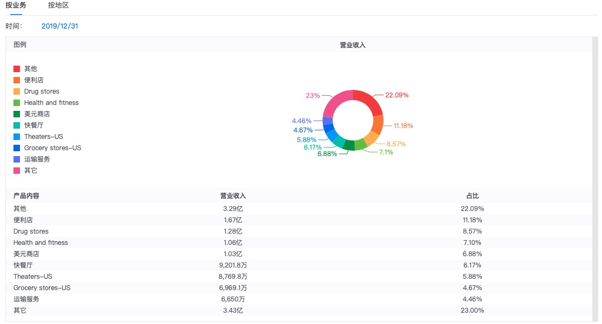

## 概述

一个偶然的机会接触到REITs的概念，在疫情之下，房地产的REITs受到了打击，普遍变得具有吸引了了。

REITS简单来说就是原来的物业持有人把有稳定收入的物业整体出售进行上市，然后认购20%以上的上市股份。可以理解为资产IPO，然后这些物业的收入的90%以上用于分红。物业资产交由专业团队管理，资产的份额持有人就像一个个小包租公，每半年收租一次。

## 挑选出的好公司

但是一个看似雷同的概念，仔细研究了一番发现，玩家之多、玩法之多令人瞠目结舌，里面金矿真不少，而且都是几十年的老企业，惊叹于自己原来的无知啊！

### Realty Income

看人家名字下面的slogan就屌炸天，上图：

怎么样，”每月分红的公司“，厉不厉害？

看了公司的网站，这家公司从资产管理、租户组合（Tenants Potifolio）、行业分散、地理分散、资产类型组合、组合占用率(portfolio occupancy)这几个方面运作管理自己的信托。

看看前20的租户都是谁吧？

第一名才占5.8%，后面的都不超过5%，可见租户组合分散之极。

Realty Income这家公司人如其名，通过他的各种维度下的分散，在疫情下表现出强劲的抗风险能力。

看一下主营构成就知道行业分散做的也不错。

## Federal Realty Trust(FRT信托)

Federal Realty Investment Trust成立于1962年，是美国历史最悠久的房地产投资信托基金之一。专注于高品质零售地产的所有权、运营和开发——从杂货店为主的购物中心到大型的多功能社区。直接看它的网站宣传吧。

半个世纪以来，通过分散风险度过了一次又一次的危机。

## 西蒙地产

西蒙房地产集团是一家自我管理和自我管理的房地产投资信托公司。 它拥有,开发和管理零售房地产,主要由区域购物中心,高级商店和工厂组成。 西蒙房地产集团专门从事创收零售房地产资产的所有权,开发,管理,租赁,收购和扩展。 该公司由Fred Simon,Herbert Simon和Melvin Simon于1993年12月成立,总部位于印第安纳州印第安纳波利斯。

## 参考资料

https://xueqiu.com/8950748023/159359235

https://xueqiu.com/6155470785/162949238