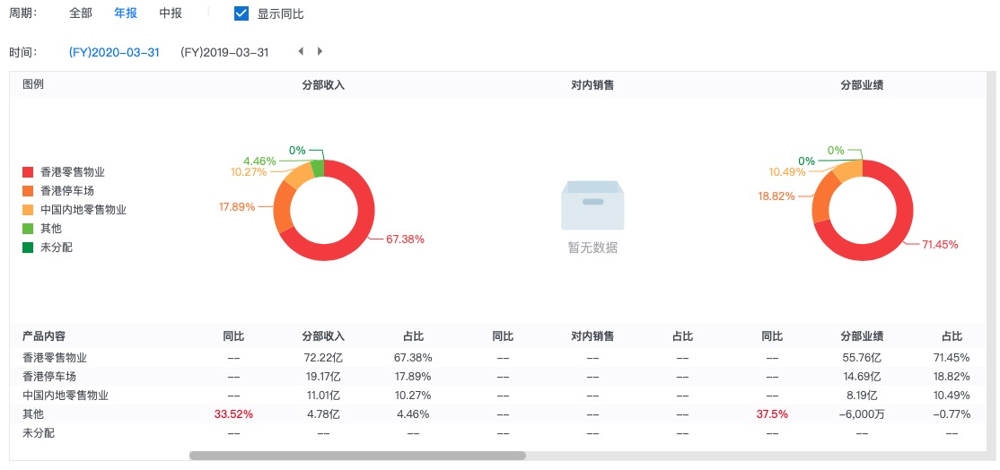

## 公司简介

领展房地产投资信托基金(「领展」)是首家香港上市及以市值计现时亚洲地区最大型的房地产投资信托基金,亦是全球以零售为主最大的房地产投资信托基金之一。自2005年11月25日于香港联合交易所有限公司(「香港联交所」)上市(股份代号:823),并完全由私人和机构投资者持有,公众持股量达100%。领展为恒生指数成份股。  领展物业组合遍及香港、北京、上海和广州,包括于香港有约900万平方呎零售物业、约61,000个泊车位,以及一个发展中项目,并于中国内地有约300万平方呎零售及办公室物业*。物业组合的零售物业主要为我们的顾客提供日常所需,办公室物业支持企业租户发展业务,而停车场设施则主要为使用物业的租户、顾客及邻近居民提供服务。

其投资目标是为基金单位持有人提供持续增长及缔造长远价值。其投资于位于香港、北京及上海的零售商铺、街市、停车场及办公室物业组合。其投资物业包括香港都会商场、香港汇坊商场、北京欧美汇购物中心及上海企业天地等。该基金由领展资产管理有限公司管理。

股票代号：00823

股息率：4.5%

每股股息：$2.87

市值：$1300亿

业务类别：地产业

领展为一只房地产投资信托基金，而根据信托契约，领展需确保每个财政年度、向基金单位持有人派付之分派总额不少于可分派收入总额之90%，另亦可加管理人酌情决定为可供分派之任何其他额外款项

## 主营构成

### 疫情影响

从季报上来看，2019-2020年这么折腾，收入没有怎么受到影响，反映出抗风险能力很强。

## 发展前景

发展方面，近年持续加强投资欧美国家，最近一宗交易为收购位于伦敦金丝雀码头的商厦The Cabot。早前领汇开始收购上海企业天地及澳洲写字楼物业，加上在香港發展的海滨汇已经入伙。在疫情下更显先见之明。因为疫情下零售成为重灾区，领展主打的民生商舖同样受不同程度损害，反而在全球佈局的商厦租务具有抗疫性。

疫情之下世道艰难，领展被打折售卖这是正常的事情。不过我相信世界会逐渐变好的，街道会恢复往日的繁华的，领展也会回到它应有的位置上。不过要耐心一点。

## 结论

买入

## 参考资料

https://xueqiu.com/5286273569/160440548

https://xueqiu.com/3362681613/157727053