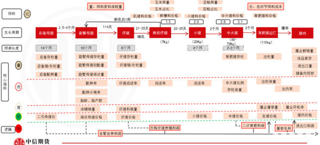

## 产业链

## 猪场的有效评估管理

### PSY

　　1、PSY：是指每头母猪每年所能提供的断奶仔猪头数，是衡量猪场效益和母猪繁殖成绩的重要指标。

　　2、养猪场PSY的计算方法：PSY=母猪年产胎次×母猪平均窝产活仔数×哺乳仔猪成活率。

　　3、事实上影响猪场PSY的主要因素有一下几点：1)胎次; 2)遗传因素;3)排卵率和胚胎死亡率; 4)营养因素;5)配种管理; 6)公猪效应;7)管理水平; 8)繁殖疾病。

　　4、提高猪场提高猪场PSY的方法：主要从胎次、遗传因素、排卵率和胚胎死亡、营养因素、配种管理、公猪效应、管理水平、繁殖疾病等几个方面入手。

　　母猪胎次与生产性能关系

　　母猪胎产活仔数：从1-3胎增加，3-6胎达高峰，通常在6胎后下降；

　　母猪产死胎数：随着胎数增加而增加，5-6胎后增长迅速；

　　仔猪初生重：2-5胎稳定，此后下降；

　　母猪带仔能力：2-4胎高峰，此后下降；

　　母猪死亡率：青年母猪最高；

　　母猪繁殖失败和非生产天数：青年母猪最高；

　　母猪分娩率：2-6胎高峰，此后下降。

　　1、胎次
　　母猪的胎次影响母猪的产仔数。其中三至六胎产仔数较高，应将猪群中三至六胎的比例维持在45%以上的水平，平均胎次保持在大约2.5到3.0之间，这样可以达到最佳繁殖性能，但具体的最佳胎次分布还和品种、管理和设施有关。

　　2、遗传因素
　　不同品种、基因型的猪群之间在产仔数方面差异很大。但是，窝产仔数的遗传力较低(10～15%)，因此在群内对窝产仔数进行选育的效果很差。对瘦肉率和生长率的选育并未影响对窝产仔数。

　　3、排卵率和胚胎死亡
　　排卵率决定了窝产仔数的上限。然而对排卵率进行的选育并没有能够增加窝产仔数，原因是随着排卵率的增加，胚胎死亡率也会增加，二者的作用抵消了。

　　4、营养因素
　　将能量和营养供给胚胎发育，不过这部分养分的需要量很少。因此，在正常条件下，妊娠期的营养水平不会影响到窝产仔数。研究还显示，在采用正常日粮的母猪群中即使将维生素的供应提到很高的水平也不会增加窝产仔数。艾尔博特大学的几项试验证明，在泌乳期当中任何一周，如果对母猪强烈限饲，将会影响到下一胎的排卵数和胚胎死亡率。

　　5、饲养管理
　　为了母猪每窝高产和缩短周转率，要求母猪断奶后尽量早的发情，每胎排卵数和受精率要高。为此要保证母猪泌乳期结束后的膘情，为了这个目的，要对母猪整个繁殖周期的饲喂量有个整体控制，必须保证母猪泌乳期高的采食量，除了泌乳期饲料质量的保证外，要在妊娠期控制母猪的采食量，因为妊娠期高的采食量，会导致泌乳期采食量降低。尤其母猪分娩前三天，要限制母猪采食量直到最后一天基本不吃，这样分娩后母猪采食量会迅速上升，从而保证良好的乳汁质量和充足的泌乳能力。同时保证断奶后母猪的膘情。另外，妊娠期饲料控制也有讲究，基本原则是妊娠前期严格控制采食量，后期(84-114天)适当增加采食量，目的是为了保证胎儿的出生重和较高的泌乳能力。第二条措施，就是母猪在断奶后要给以高能量饲料和充足的采食量，来刺激母猪早发情。

### MSY　　

相比PSY，规模猪场更应关注MSY(每年每头母猪出栏肥猪头数)

　　MSY:为每年每头母猪出栏肥猪头数。MSY=PSY×育肥猪成活率

　　养猪业已成为对行情高度敏感的行业，关于猪场效益的探讨也相应变成行业的主要议题。

　　“ 效益差源于MSY过低，而料肉比太高。” 某业内专家认为，自繁自养猪场的效益来自于肥猪出栏情况，因此，相比PSY，人们更应该关注MSY(每年每头母猪出栏肥猪头数)，目前国内MSY的平均水平为14.4，优秀的可以达到20，而国外可以达到25，以年出栏万头而言，分别需要母猪700头、500头、400头，相比之下成本和效益迥异。

　　要解决MSY和料肉比的问题，归根结底要从源头做起，让母猪多生养，给仔猪打好健康基础。因此猪场要从细节做起，需要注意一些隐性因素。

　　猪场常常对母猪皮肤粗糙、被毛粗乱、湿疹等司空见惯的现象无视，其实这些现象意味着非特异免疫屏障遭到破坏，肝肾受到损伤、新陈代谢混乱、发烧便秘等，对母猪的繁殖性能影响重大。这些现象背后，母猪患血液原虫病亚临床感染的可能性很大，需要及时治疗。而且病毒性繁殖障碍情况依然严峻，经常造成死胎或带毒母猪所生的仔猪受病毒性腹泻困扰的情况。

　　从生命活动的规律上讲，首先确保免疫、其次是新陈代谢、最末位的才是生殖，因此只有其他机能都正常的时候，生殖活动的潜力才能最大发挥。因此，有专家指出，“消除亚临床感染是提高母猪年生产力的基础”。

### LFY　　

LFY:每年每头母猪产仔窝数(胎指数)

　　每年每头母猪生产窝数（LFY）=(365－非生产天数)/(妊娠期＋泌乳期)

　　非生产天数(NPD)：任何一头生产母猪和超过适配年龄(一般设定在230日龄)的后备猪，没有怀孕、没有哺乳的天数，称为非生产天数(Non-productive　Days，NPD)。其中有3-6天断奶至配种间隔是必需的，在此期间母猪要准备发情，可以叫做必需非生产天数。一些怀孕母猪发生流产或死胎也等于什么也没做，从配种到流产、死胎时的天数也被视做非生产天数。

### RSY　　

相对于PSY或MSY，您不得不知道RSY

　　猪场RSY(Return-on-investment per sow per year)即，单头母猪年投资回报率，是指锁定所有生产成本后母猪产能和效益的数据模型，是猪场生产经营的核心和本质。

　　RSY评估猪场生产经营、种猪品 质、营养标准、兽药疫苗质量、设备投资等各个指标更实效的标准。在整个RSY评估体系中种猪发挥着核心的作用，也是育种体系的核心，在种猪选育方面更考虑 对终端市场的倾斜，选育商品猪PSY/MSY适度，屠宰率高、肉质好，售价高的优质种猪。RSY用百分比表达，取百分数前的数字，如RSY 20、18、25等。

　　在生产实践中，母猪一年的费用可以认为是固定的，它的产能就是行业内公认的PSY，但是在完成PSY指标的过程中母猪的产仔和产能还有一个生产和经营 的合理化指标。母猪年产活仔数可以称之为前PSY，PSY/前PSY行业内称之为产房期育成率，这个数据是评价PSY的附属参考指数，因为这个数据偏低 (高死淘)在蚕食大量的利润，使PSY分摊更多的因为高产仔数带来的出生重偏低的、虚高的、盲目乐观的数据。

　　RSY是简单粗暴但非常有效的

　　对于种猪来说目前中国的生产状况平均窝产健仔数12.5-13头这个范围内是高RSY的合理数据，并且随着商品猪屠宰体重的增加，为商品猪 115-125kg阶段屠宰率和饲料转化率高的品系或者配套系种猪提供了机遇。屠宰体重的增加在经济学原理上是生猪养殖企业的上下游对生猪养殖企业的再一 次利润瓜分，是产业链的利润再分配。因此，养猪企业应该以RSY原理来分析和选择种猪、饲料、动保、固定资产投入以及员工管理模式。

　　猪场 RSY 是场长年度考核或者猪场托管业务更客观的标准。

　　猪场场长考核中有的考核生产指标 (PSY、MSY、料肉比、成活率、药费等等) ，有的考核利润指标(XX 规模猪 场年提供利润多少) ，有的考核成本(肥猪出栏成本 XX 元/斤、断奶一头仔猪 XX 元/斤等) ，还有一起考核。

　　目前来说场长考核中许多指标顾此失彼，生产指标考核可能失去利润或者成本，成本考核中成本计算不准确，利润考 核中受市场价格和原材料成本影响很大， 导致猪场盈利与否与前面的考核指标若 即若离，或者猪场投资者和经营者分离。同时，近年来猪场托管业务也是行业中 的热词，与天津株蓝耳苗、圆环疫苗、畜牧电商、猪场并购号称行业的“五大坊 间新闻” 。托管业务中有关考核、结算等时常会导致投资者与托管者的博弈、不 欢而散或者对簿公堂。 猪场 RSY(Return-on-investment per sow per year)即，单头母猪年投资回报 率，是猪场生产经营的核心和本质。

　　RSY 是评估猪场生产经 营、种猪品质、营养标准、兽药疫苗质量、设备投资等各个指标更实效的标准， RSY 可以作为一个标准进而规范生产管理流程、种猪选育、营养配方、疫苗及 药品研发和投入、猪场设备与人工运用等等，是一种经营的理念和标准，RSY 可以用百分比表示，可正可负，正数越高说明趋向越显著，也可以用推演为单头 母猪的投资回报力，可以直接用人民币的数字来衡量。

　　RSY 是一个数据模型，可以全部涵盖生产经营的指标，也是场长考核/猪场 托管业务中使猪场投资者和经营者理念一致的标准。

　　实施中将猪场所有的固定资 产、流动资产全部锁定标价、定价，年底的盘点中作出资产评估，然后对固定资 产折旧、一般生产物资(饲料、药品、疫苗等)模拟定价、水电费和低值易耗品 定价出栏的仔猪、肥猪统一定价、补充后备猪和淘汰公母猪定价等等。

　　通过年度 的生产经营的投入产出计算模拟的 RSY，这种模拟的 RSY 将是最客观的指标， 与行情无关，真正考验猪场生产经营者的水平和汇报、分红。 其中，有关后备猪的补充可能很大程度上影响 RSY 指标，为了猪场长期发 展作为投资者要进行宏观调控和经济杠杆干预， 积极保持 30%左右的更新， 使生产高效。 后备猪的补充要和淘汰相结合，淘汰母猪的收入基本可以满足后备二元 母猪的采购加上 45 天的培育费用，即后备猪配种前的费用由投资者承担，不计 入承包者/经营者的费用，最大效能上满足猪场最大的产能和 RSY。

## 参考资料

https://card.weibo.com/article/m/show/id/2309404510917730631744?_wb_client_=1

http://m.gdswine.com/a/189058