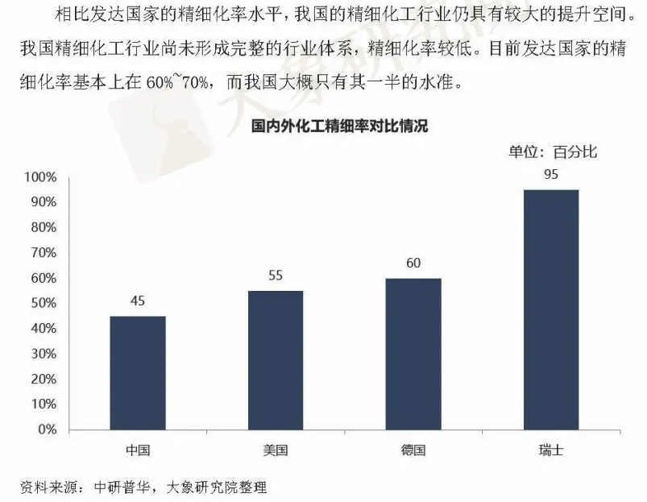
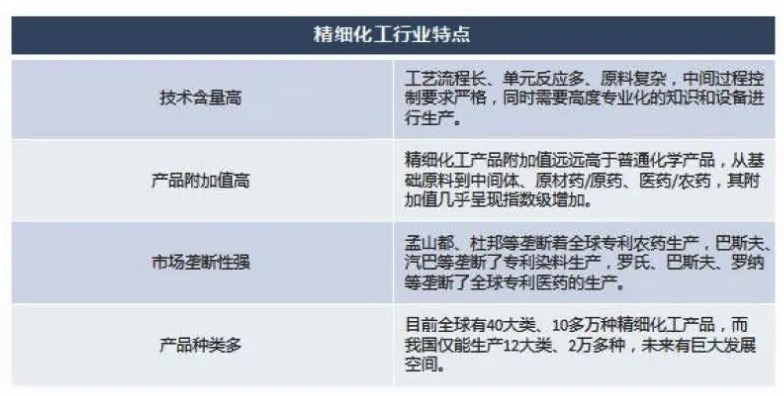
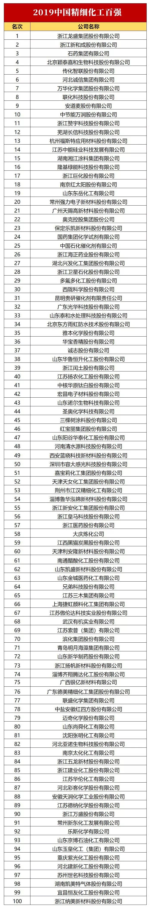

## 精细化工行业

精细化工是当今化学工业中最具活力的新兴领域之一，是新材料的重要组成部分。精细化工产品种类多、附加值高、用途广、产业关联度大，直接服务于国民经济的诸多行业和高新技术产业的各个领域。大力发展精细化工己成为世界各国调整化学工业结构、提升一化学工业产业能级和扩大经济效益的战略重点。国家适时出台相关政策，构建产学研相结合的新型技术创新组织--国家精细化工产业技术创新战略联盟，以此来促进国家精细化工产业结构优化升级和提升行业整体竞争力。精细化工率(精细化工产值占化工总产值的比例)的高低己经成为衡量一个国家或地区化学工业发达程度和化工科技水平高低的重要标志。

精细化学品这个名词，沿用已久，原指产量小、[纯度](https://baike.baidu.com/item/纯度)高、价格贵的化工产品，如医药、染料、涂料等。但是，这个含义还没有充分揭示精细化学品的本质。近年来，各国专家对精细化学品的定义有了一些新的见解，欧美一些国家把产量小、按不同[化学结构](https://baike.baidu.com/item/化学结构)进行生产和销售的化学物质，称为[精细化学品](https://baike.baidu.com/item/精细化学品/1910521)(fine chemicals)；把产量小、经过加工配制、具有专门功能或最终使用性能的产品,称为[专用化学品](https://baike.baidu.com/item/专用化学品)(specialty chemicals)。中国、日本等则把这两类产品统称为精细化学品。

## 竞争壁垒

精细化工产品种类繁多，更新速度快，专一性强，生产工艺复杂，决定了进入行业的主要障碍是技术研发壁垒，环保安全壁垒，营销渠道壁垒和资本投资壁垒。

1.技术研发壁垒

实践细除了高端技术人才和具有专业学术背景化工中间体，也是多年的研究和生产经验的积累。多种精细化工中间体，更新快，在根据需要不断地下游农药，染料，医药等行业需要时间来调整和更新产品品种。这就需要企业拥有雄厚的R＆d能力和新技术，新品种的储备。

精细化工技术的研究集中在选择的化学反应过程路径选择的控制下，该催化剂的选择以及温度，压力，时间和其它工艺产品的新品种，不同的研究路径和过程选项的产品成本，纯度，质量，和随后的扩张上的巨大分歧。

因此，一个庞大而成熟的高端专业技术人才，这是对公司的持续发展极为重要。**精细化工**行业结晶分离，蒸馏提纯技术，层析检测技术，安全技术和操作污染物和其他要求的待遇都非常高，与公司专业生产技术工人的需要相应。

综上，精细化工企业要进入市场和长期发展必须具备较强的产品研发能力和长期的生产技术积累，这些方面构成了行业的技术壁垒。

2.环保与安全壁垒

在生产过程中会产生废水，废气，固体废弃物等有害物质精细化工，企业需要在网上投入大量资金用于这些有害物质的管理，使生产符合国家环保标准。随着国家环保标准的日益提高，企业要继续加大污染治理技术的研究和开发，环保设施投资和处置力度污染物。

同时，生产过程中使用的部分原料和中间产品为易燃，易爆，有毒等危险化学品，生产过程中化学反应存在泄漏，易燃，易爆等安全隐患，员工违反安全操作规程。

造成反应路径，温度，浓度，压力等变化超过安全标准，或设备严重老化，失修，可能发生爆炸，泄漏，火灾等安全事故，造成公司人员伤亡和财产损失，公司需要持续投入安全生产加工技术和安全防护。

综上所述，环境保护和安全要求的不断加强，企业环境保护和安全投入的不断增加，构成了精细化工行业的环境保护和安全壁垒。

3.销售渠道壁垒

精细化工中间体具体和迫切需要制定具体的销售渠道，与客户保持长期的业务合作的能力，对日常业务运营和长期发展的一个显著的影响。

精细化工中间体直接影响最终产品的性能和品质的质量和纯度，集成如巴斯夫集团，韩国科隆公司的生产规模等供应商，产品质量，持续经营能力的跨国化工企业等方面都有非常严格的要求。

一般经过相关中间体制造商进行的R＆d生产能力，产品质量，环境和职业健康措施，各方面的全面调查和评估，以确定某种一方或某些类型的中间体的主要供应商，并定期检讨评级/审计。

因此，精细化工中间体企业一旦被选择为供应商后，通常会与下游大型客户形成稳定的合作关系。特定的销售渠道和严格的资质要求，对新进入者构成强大的销售渠道壁垒。

4.资金投入壁垒

随着我国环保政策、安全生产政策和员工福利政策的完善，以及美国、欧洲等发达国家对精细化工中间体进口标准的日益严格，**精细化工**中间体行业的准入门槛越来越高。

所有这些都要求精细化工中间体的制造商在环保、安全、产品研发和经营规模等方面加大投入，导致初期投入不断增加。不具备规模优势和技术优势的小型精细化工企业将被市场淘汰。

因此，固定资产投资和资本需求增加R＆d投资构成对进入该行业的壁垒。

## 产业链

## 精细化工现状

多年来，我国重视精细化工行业的发展，把精细化工作为化学工业发展的战略重点之一，列入多项国家发展计划，从政策和资金上予以倾斜支持。随着科研力量及产能的提升，我国精细化工行业已得到迅速发展，精细化率不断提升。

目前精细化工细分品种与日俱增，其产能、产量、品种和生产厂家仍在不断增长。尽管如此，与化学工业发展历史更加悠久的发达国家相比，我国精细化工产品的整体技术水平仍然偏低，精细化工行业的核心技术与国际先进水平还存在一定差距，高性能、功能化和高附加值的精细化学品进口依存度仍然较高。

相比发达国家的精细化率水平，我国的精细化工行业仍具有较大的提升空间。我国精细化工行业尚未形成完整的行业体系，精细化率较低。**目前发达国家的精细化率基本上在60%~70%，而我国大概只有其一半的水准。**

我国精细化工产品品种也较少，目前全球精细化工产品大概有10万种，而我国大概有2万种，仅为全球品种的20%左右。总量不足，质量也不稳定，专业化、功能化、高性能的产品欠缺，难以满足各个市场领域的需要，也制约了下游行业尤其是战略性新兴产业的发展。例如高端电子化学品领域，几乎全部被国外产品垄断。产业链前端的一些产品我们已经做到了世界第一，但越往下游走，品种少，总量不足。**连“量”都达不到领先，更谈不上“质”的问题了。**

## 行业发展趋势分析

精细化工行业今后发展的总体思路是：

- 针对产业面临的安全、环保、高效、高端化发展的重大课题，从构建新型高效技术体系、实现源头创新入手，整合产业技术创新资源，引领科技资源向优势企业聚集；
- 加大典型化工产品及清洁生产成套工艺的创新开发力度；
- 建立以企业为主体、市场为导向、产学研用紧密结合的创新体系，全面提升技术创新能力；
- 推动产业结构调整及产品升级换代，促进我国精细化工产业由大国向强国迈进。

**其中，产业发展的近期主要目标有**：

- 2021年总产值突破5万亿元，年均增长率超过15%，精细化率超过50%；
- 培育10家年产值超过100亿元的细分行业龙头企业；
- 行业出口总额年均增长率超过20%；
- 升级改造精细化工园区2~3个；
- 成立新领域精细化工技术中心10家，为行业升级提供技术支撑。

据中研研究院《2020-2025年中国精细化工行业深度发展研究与“十四五”企业投资战略规划报告》统计分析显示：

***1、***精细化工市场规模现状

过去十余年，中国化工品市场快速成长，2016年中国化工品销售额达到13310亿欧元，在全球市场达到40%。2006年全球化工品合计销售额18030亿欧元，2016年达到33600亿欧元，增幅达到86.3%，而中国贡献了其中70.2%的增量。

全球化工行业由粗放式的生产向着精细化的转变就是由于市场的激烈竞争所造成的。欧美国家的精细化率较高，推动了全球精细化工行业的快速增长，2018年全球精细化工行业市场规模达到15457亿欧元。

**图表：2015-2018年全球精细化工行业销售额**

**数据来源：Bloomberg，中研普华**

***2、***精细化工需求结构分析

中间体是精细化工产品当中非常重要的一个类型，其实质是一类“半成品”，下游涉及行业主要集中在医药、农药、染料等。据统计，2014年全球精细化工市场中，医药及其中间体、农药及其中间体是精细化工行业的前两大子行业，分别占比69%、10%。

**图表：全球精细化工行业的重要组成部分**

**数据来源：Jan Ramakers Fine Chemical Consulting Group**

## 行业特点

## 相关龙头企业

1. 新和成(002001)

2. 蓝晓股份

3. 青松股份

   https://www.vzkoo.com/news/4301.html

4. 浙江龙盛

5. 扬农化工

6. 泰和新材

7. 光威复材

8. 濮阳惠成(300481)

9. 百傲化学

   

## 2019年精细化工百强

## 参考资料

https://baike.baidu.com/item/%E7%B2%BE%E7%BB%86%E5%8C%96%E5%B7%A5/1911653

https://www.juhecat.com/40038.html

http://pdf.dfcfw.com/pdf/H3_AP201907031337146869_1.PDF

https://www.hotbak.net/key/%E7%B2%BE%E7%BB%86%E5%8C%96%E5%B7%A5%E9%BE%99%E5%A4%B4%E4%BC%81%E4%B8%9A.html