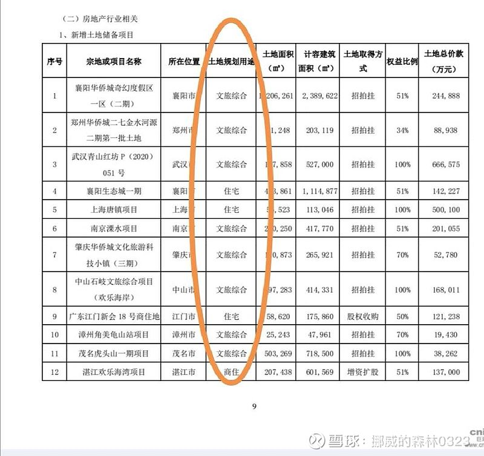
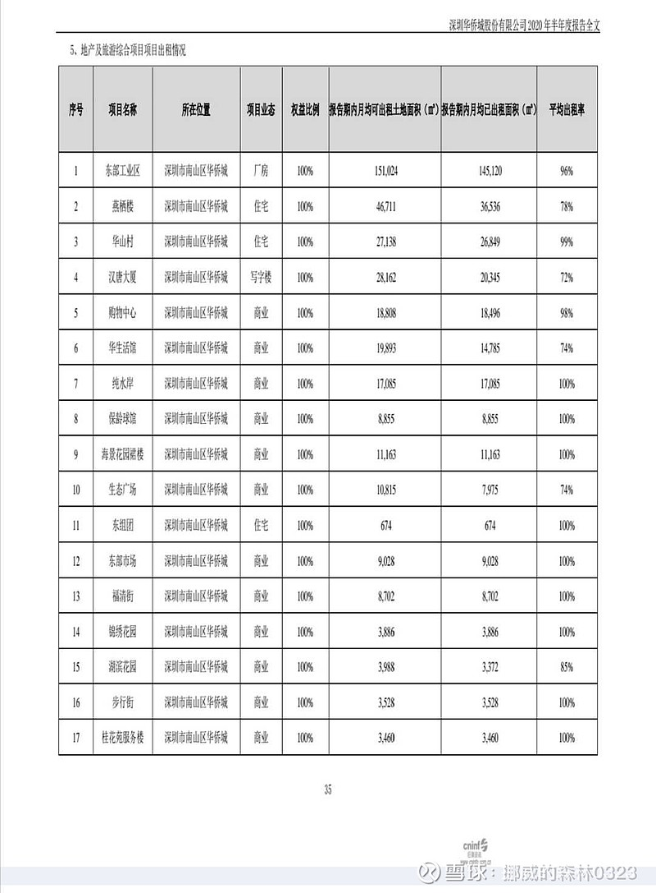
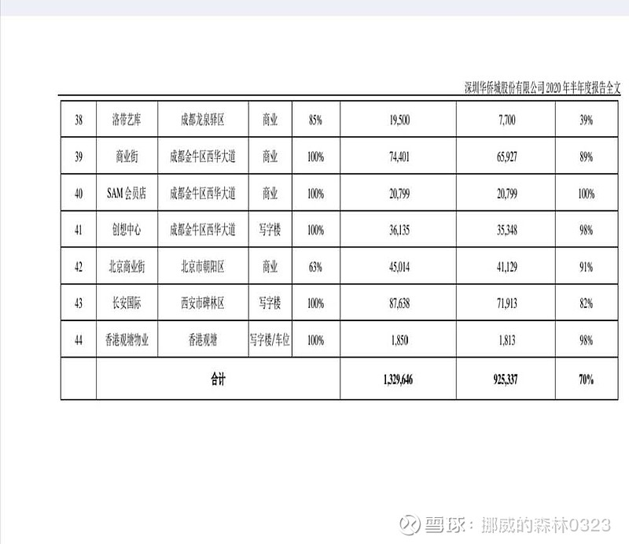

关于华侨城，尤其是对于新关注和投资它的股民来说，存在一些比较共性的误区或者说困惑的点，下面我暂总结了5条，供大家参考，文章比较长，感兴趣者不妨耐心读完。但比较了解华侨城的朋友就不用看了，好多也是重复说过的内容。

（1）华侨城文旅综合业务收入和地产业务收入的划分

华侨城的文旅综合业务也包含旅游地产收入，关于这一点很多人也了解了，但一直都有人问到底哪些开发项目会归于文旅综合，哪些是地产业务，两者如何划分？

其实也不复杂，一般在拿地环节就已经区分开来了。文旅综合项目，顾名思义，首先要包含文旅开发，然后地块是属于综合性质，也就是既包含娱乐服务用地，也包含住宅，商业开发用地。对于华侨城来说，欢乐谷和欢乐海岸模式的大型文旅项目拿地都是此类性质，在土地出让时这类挂牌地块的土地开发性质和对地块开发的具体要求都会体现这些特点。

另外，现在华侨城的财务报表关于新增土储的表格当中其实对地块性质也有明确表述。

（2）华侨城为什么不提供文旅的收入和利润率数据？

首先，我也认为文旅经营数据应该定期公布，包括各地主题乐园入园人次，门票收入，酒店客房入住率，酒店总收入，自持商业的租金收入等。这方面华侨城信息披露确实存在很大的不足，需要在将来做出改进。

至于文旅成本和利润率的问题，我认为不公布可以理解，原因有两点，一是文旅项目性质决定的，拿地的时候文旅和住宅商业用地就是捆绑出让的，而且地方政府对文旅投入的要求，通过在地块楼面价上的折让做出补贴。因而将住宅商业和纯文旅建设的成本隔裂开来衡量利润率是不科学的，也无法反映各自真实的成本。其实，包括华润新城等商业综合体项目，你也很难给出综合体的利润率到底是多少，一样的道理。但是文旅也好，商业也罢，经营收入数据是应该提供的，这点华侨城做得比较差。

二是文旅项目一般都存在和地方政府的谈判，成本利润回报问题会是双方谈判的一个要点，所以作为商业谈判的底牌之一，其文旅利润率在报表等公开信息上会存在有意不透明的主观意愿，这个现象在其他文旅企业甚至包括大型商业综合体也都存在。

（3）媒体经常提到的项目股权转让问题

华侨城每年都存在一定数量的项目股权公开转让，每年少则六七例，多则十余例，时有见诸报端，而且被某些别有用心的自媒体翻来覆去的讲，并冠以“债务压顶，被迫出售资产”“卖地求生”等标题，那么真实的情况是怎样的呢？

如果对地产行业具有基本了解的股民都应该知道，房企的开发项目以合作，也就是合营联营方式进行开发，越来越普遍，占比也越来越高，很多房企合作项目都占所有开发项目数量的一大半，主流房企的权益占比近些年几乎逐年下降，权益在60～68%区间的应该是多数。

很多房企喜欢联合拿地，也就是在参与土拍的时候就以联合体的方式竞拍，或在拿地后立刻引入合作方以合资公司方式进行开发，这非常普遍。华侨城这几年在项目开发上引入合作也比较多，但和前者不同的是，华侨城习惯于独立拿地和前期开发，然后每年根据自身财务安排的需要，再有选择的在部分项目中引入合作方，在形式上就体现为挂牌出让部分项目股权，为什么一定要公开挂牌出让呢？因为这是国资性质公司股权转让的要求，必须公开透明。这也是为什么华侨城的项目股权转让多会比较“招眼”，但本质上，这主要就是项目引入合作方，凡是部分项目股权转让都是属于正常的引入合作，华侨城过去几年涉及的数十例股权转让当中属于项目全部转让的应该只有数例而已，其他绝大多数都是正常的引入合作，和其他房企采取联合拿地等方式其实没有任何不同。

华侨城资产负债表当中的少数股东权益目前也只有68%左右，既说明合作开发对它来说也是主要方式之一，另外也说明每年的多起股权转让并没有让它的权益占比下降得很过分，在主流房企当中还算是权益占比中高水平。

此外每年媒体报道的华侨城股权转让信息还有一部分是集团旗下，非华侨城上市公司所有，也应区分。

（4）华侨城的沉淀资产究竟是宝藏还是价值毁灭？

其实这个问题根本无需疑惑，我们简单看看几个基本数据就清楚了，华侨城过去20年的报表利润合计约684亿，而我们看看它自持物业的成色：2020中报自持商业物业合计133万平米，会记计量方法是以成本入账并计提折旧，账面价值仅为131亿，也就是说账面成本约1万/平米。稍微深入看一下这些物业具体明细就知道，绝大多数分布在深圳上海等一线城市核心区域和武汉成都等准一线城市和部分省会城市，尤其是深圳大本营占了很大份额，这些物业的市场保守评估均价至少在6万/平米以上，也就是说自持物业公允价值在八百亿以上。此外我们完全没有把华侨城在一二线城市的主题乐园海量土地再利用价值考虑在内。还有这几年土地储备的大幅增加。

所以，华侨城确实在过去二十多年的经营中将利润逐步沉淀到了自持商业物业和文旅土地当中，但显而易见，这些沉淀资产的价值已经明显超过累计利润，而且尚未包括文旅用地和目前土地储备的土地价值。这些自持物业都是无出售限制可以兑现的。虽然作为股东而言，公司如果不在股息分配上提高，这些资产的价值并不能直接由股东分享，但对于前面那个问题，这些沉淀资产到底是宝藏还是价值毁灭，我想是无需争论的。

（5）华侨城文旅方面的优势在哪里？和融创万达恒大这些后来的竞争对手比较起来，文旅内容和能力到底有什么区别？是不是地产大佬们只要有钱砸进来就一样也能做好文旅？

华侨城集团从成立之初就是以文旅为主业的，这和其他房企跨界者不同，文旅基因和底蕴不同。

而且我们应该了解旅游本身是包含丰富内容的，并不止是主题乐园。很多人不知道的是，华侨城集团除了是亚洲第一，全球第三的主题乐园运营商，也是全国运营高A景区数量最多的旅游集团，集团旗下托管运营全国知名景区已达29家（大多数是5A和4A景区），其中包括平遥古城、大理古城、云南昆明世博园、河北山海关，甘肃麦积山、河北西柏坡、四川剑门关，赤壁古战场、江西龙虎山、黄河口生态旅游区、江苏茅山、安徽天柱山、吉林查干湖等一大批全国著名风景区，而且近两年这个名单还在不断延伸扩展。

全球主题乐园流量排名第三，OCT华侨城

除华侨城外几乎没有其他旅游企业有能力在全国多个省同时运营多家知名自然景区和主题乐园。华侨城也是国内主题乐园标准的起草者，历任董事长几乎都担任中国旅游协会副会长，现任集团总经理姚军同时是中国旅游景区协会会长和中国游艺机游乐园协会的会长。

华侨城集团做旅游是专业的领先的企业，不止是主题乐园和人造景观的建设，而且还擅长对自然景区的设施和管理运营进行升级，古城，运河，遗址等的修缮保护，并提升人居环境和旅游属性，此外还长期从事有关湿地公园，生态公园的保护和管理等等。

华侨城在文化旅游设施的建设和运营上几乎是全能型，而且有非常强的因地制宜和规划能力，所以说华侨城在各地方政府需要打造文旅项目，尤其是提升有关的片区综合人居环境的文化旅游项目方面，基本上都是首选企业。

本质上，华侨城目前做的业务是城市升级和城市更新，并且是以文化旅游和人居环境改善为核心。欢乐海岸PLUS模式已经取代欢乐谷模式而成为项目拓展的重点。

华侨城的文旅综合能力不是融创万达恒大这些企业目前具备的，它们只是聚焦在学习复制国内外先进的主题乐园，而且在城市布局和核心位置占领上已经落后了一步

## 来源

https://xueqiu.com/5971234415/163323436
