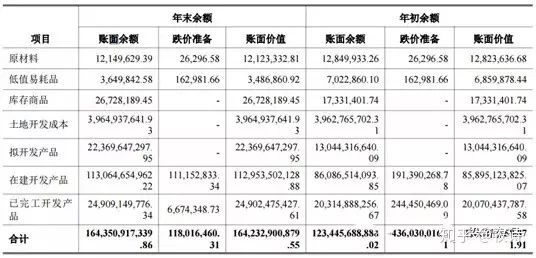
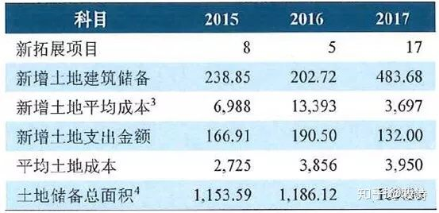

## 地产：没有什么比存货更重要

房地产属于高负债、高流动性的行业，存货科目决定了房地产企业的资产变现能力、盈利能力和偿债能力。从地产企业报表中存货所占比重可见其重要性。截至2018年12月底，存货在资产总额中的比重达到了54.31%，位列所有行业首位，远高于第二名综合行业的30.41%。

因此，对于房企报表分析，如果只能看一个科目，那我选存货。

## 地产存货：核算哪些内容？

对于地产企业而言，根据所涉及的业务，存货可以分为房地产存货和非房地产存货。

房地产存货中最重要的是开发成本和开发产品。开发成本包括拟开发产品和在建开发产品。拟开发产品是指已经购入的、决定用来开发为已完工开发产品的土地；在建开发产品是指尚未建成，以出售为目的的物业。

如果一个项目是整体开发，那么拟开发产品全部转入在建开发产品；如果是分期开发，那么就将分期开发所用土地转入在建开发产品，后期还没开发的土地仍留在拟开发产品。

在购买土地的时候，土地出让款项一般是分期支付的，如果钱已经付了但土地证尚未办理，则是借记预付账款，贷记银行存款，待办理完土地证后借记存货-拟开发产品，贷记预付账款；

如果是已经办理土地证但尚未支付土地款，则借记存货-拟开发产品，贷记应付账款，付完钱后则借记应付账款，贷记银行存款。一般来说，对于未支付的土地出让金在财务报表附注中作为承诺事项进行披露。

上面是一些书面的会计语言的解释。

其实开发成本说白了就是用来核算买来的地（拟开发产品）、把土地变成房子所要的开支以及在建造房子过程中产生的借贷利息（在建开发产品）。

开发产品说白了就是已经造好可以交付的房子的成本，这部分马上会转为收入。

以荣盛发展为例，其披露较为笼统，未将开发成本进行拆分。2017年年报显示，开发成本1037.59亿元，占比86.96%；开发产品137.76亿元，占比11.55%。二者合计占存货的比重为98.51%。

招商蛇口的存货披露则更为详细，将开发成本分成了拟开发产品和在建开发产品（土地开发成本是招商蛇口的一级土地开发业务，用来核算取得土地并将其平整改造达到出让条件所发生的支出）。

根据2017年年报，拟开发产品（土地）223.70亿元，占比13.61%；在建开发产品1130.65亿元，占比68.79%；已完工开发产品249.09亿，占比15.16%。三者合计占比97.56%。

## 地产存货，相关财务指标的运用

（1）营运效率

通常我们使用存货周转率来衡量企业的运营效率，该指标反应企业将存货转变为销售收入的速度。一般企业的存货主要是产成品，只要完成销售符合收入确认条件就可以结转确认收入。

但是对于地产企业而言，由于存在预售制度，企业在房子还没盖好的情况下（在建开发产品）就可以进行销售，销售出去的金额进入企业负债中的预收账款科目，预收账款是已经卖掉但尚未结转成销售收入的金额，这部分预售款需要等到房子造好验收合格交付客户后才能转化为地产企业的收入。

因而用传统的存货周转率会低估企业的运营效率。可以用存货/平均预收账款来似衡量企业的存货的去化速度。

（2）偿债能力

对于房地产企业而言，存货主要就是买来的地、正在盖的房子和已经盖好的房子，是最具流动性和变现价值的资产，其流动性远远高于一般企业的存货。

企业通过预售制度将还未造好的房子进行销售，回笼资金，用于偿还债务或者是继续拿地造房子。因此可以用存货来构建偿债指标，地产企业的长期偿债能力除了传统企业的衡量指标外，我觉得也可以用如下指标来进行衡量，即（存货+货币资金-预收账款）/总债务。

总债务是企业总的有息债务，包括短期借款+应付票据+应付短期融资券+其他流动负债+一年内到期的非流动负债+长期借款+应付债券。这个指标的意思就是把还未预售的存货（包括土地）变现后加上账上货币资金对企业全部有息债务的覆盖程度。指标越高说明偿债能力越强。

## 地产存货：需要关注哪些方面？

关于存货分析的重点，这里在做进一步说明。在债券募集说明书或者企业年报里面都会披露存货的明细，包括开发成本和开发产品的明细，会具体到每一个房产项目。

（1）存货的分布

土地储备的分布是决定存货变现能力的最重要因素，所谓买房的要诀“地段、地段还是地段”就是这个道理。

中国未来的经济发展将是围绕着都市圈展开，因此对于土地储备的分布我们不必拘泥于传统的一二三线城市的划分方法，更多的是关注是否分布在都市圈里面，是否能受到都市圈内核心城市的辐射。

比较有发展潜力的都市圈包括京津冀、长三角、珠三角、长江中游城市群和成渝都市圈。都市圈往往具备便捷的交通、完善的产业基础、持续的人口流入、公平的市场环境，为房地产市场的发展奠定了重要基础。因此，我们应当通过财务报表附注披露的开发成本和开发产品明细，分析企业存货在几大都市圈的分布情况以及在都市圈内不同能级城市所占的比重。

企业重仓的城市需要进行更细致的研究，包括市场情况、竞争对手、房价走势等。尤其是在债券存续期内，企业重点推货的城市分布。

（2）存货的成本

主要是指要考察取得土地的价格，土地不仅要位置好，还要以合适的价格买入。一个好地块，如果是高价买入的，往往会导致企业最终低利润甚至亏损，对企业资金形成占用。尤其是中小型房企，如果在不合适的时点以高价拿地，那么会给企业现金流造成很大压力，甚至影响企业的生存。

对于土地价格，可以看新增土地楼面价/当年销售均价或者存量土地楼面价/近三年平均销售价格等指标来考察，既可以从整体层面考察，也可以从区域角度进行分析。

如果这个比值比较低，说明地价占售价的比重较低，公司有较高的安全边际，或者说盈利空间比较大，有足够的空间能够应对政策或市场的波动。因为建安成本是比较固定的，土地成本是很大的变量，谁的土地成本较低，谁就更具有优势。

地价高低不仅与企业对市场的判断有关，还与拿地方式有关。招拍挂是一种公开竞争的方式，过去土地市场好的时候，溢价率非常高，如今限价政策使得土地市场趋于理性，合作拿地的方式也更加普遍；旧城改造、收并购等方式拿地成本相对较低，但其周期较长，可能有较为复杂的法律、政策等方面的风险.

这是某个房企评级报告披露的信息。

（3）存货的规模

存货规模过大或者过小都不合适。存货规模过小，地产企业可能由于土地储备不足而出现被动补库存的情况；如果存货规模增长过快，企业可能会由于过于激进的拿地政策导致债务攀升过快，后续若销售不畅或者遭遇政策收紧，可能导致现金流吃紧的风险。

那么，如何判断企业的存货规模是否合适呢？

▲是看存货和销售的比值。

一般企业储备的土地要足够其3年左右的开发，否则过少的土地资源意味着企业发展后劲不足，可能面临着被动补库存的情况，这样其就会被动去拿地；

▲是看存货的增长速度及其占总资产的比重。

如果拿地比较多，企业的存货就会显著增长。需要看企业增加土地储备的原因，是否是在合适的时候进行了扩张；

▲是看存货的构成。

房企存货主要就是土地（拟建开发产品）、在建的房子（在建开发产品）和建好的房子（开发产品），需要看这三者的比重。如果开发产品占比过高，需要关注具体的原因，是否是由于销售不畅所致（因为开发产品占比一般不会过高，因为都是预售制度，如果这一比例突然上升，需要了解具体原因）。

（4）存货的受限

存货往往被企业用于开发贷等融资的抵质押资产，因此普遍存在受限情况，需要分析企业存货的受限程度及其对企业再融资的影响。

（5）存货的减值

存货每年需要进行减值测试，当可变现净值小于账面价值的时候，就要计提减值准备。当减值情况消失的时候，减值准备是可以转回的。

由于过去房地产价格呈现单边上涨的趋势，因此地产企业的存货减值占比并不高，并不需要重点关注。后续随着不同区域和城市房价的波动，房地产企业的存货减值可能会呈现增多的趋势，需要予以关注。

同时，过多的存货减值有可能说明企业在土地投资策略、市场判断等方面存在问题，需要综合分析判断。

## 参考资料

https://zhuanlan.zhihu.com/p/62718891

[行业整体研究报告1](assets/1532921165112.pdf)

[房地产行业研究框架报告](assets/1625d21283225d353feb2bae.pdf)

