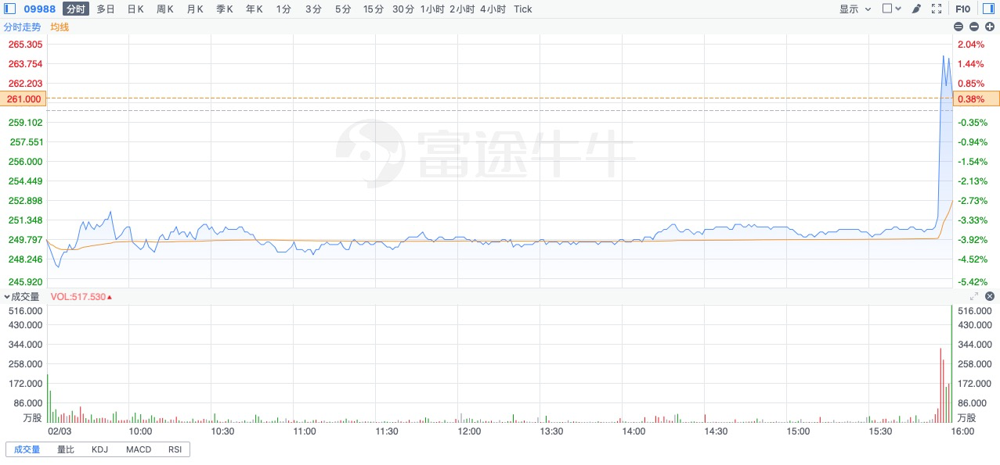

## 当日总结和展望

今天港股阿里巴巴走势非常奇怪，在收盘前最后5分钟突然暴力拉升，5分钟被大幅购买了30亿，难道是乌龙指？我甚至想是不是马云在3：55分露了个面？哈哈

坊间还有一种传闻是说因为蚂蚁金服整改方案已和监管机构达成一致。

新鲜事说完了，回到主题，还是说说组合吧。

今天上海机场开板并放出巨量，我们也果断加入战斗买入了一小批，后续还会择机增加仓位。

总体大方向上感觉还是正确的，即控制总体仓位的同时，坚持加大低估的个股，卖出高估个股，同时减少持有股票的个数。

## TODO

- [ ] 确定需要卖出的个股
- [ ] 完成医药行业检查清单
- [ ] 完成个股的检查清单、相关行业的检查清单、监控清单

## 持仓仓位配置表

整体仓位：87.01%

整体目标仓位：80%以下

| 股票符号 | 公司         | 总回报%(当前货币) | 平均成本 | 行业             | 自定义行业           | 成长预测      | 持仓占比 | 估值 | 策略 | 目标仓位 |
| -------- | ------------ | ----------------- | -------- | ---------------- | -------------------- | ------------- | -------- | ---- | ---- | -------- |
| 601012   | 隆基股份     | 145.11            | 44.39    | 半导体仪器和材料 | 光伏                 | 快速成长      | 10.58%   | 合理 | 保持 | 10.00%   |
| BILI     | 哔哩哔哩     | 34.72             | 96.48    | 电子游戏和多媒体 | 互联网新巨头         | 快速成长      | 2.46%    | 高估 | 观望 | 2.46%    |
| 6098     | 碧桂园服务   | 39.78             | 46.37    | 房地产服务       | 物业服务             | 快速成长      | 3.37%    | 高估 | 保持 | 3.37%    |
| 300059   | 东方财富     | -4.73             | 37.09    | 互联网和相关服务 | 互联网券商           | 快速成长      | 0.54%    | 合理 | 观望 | 0.54%    |
| 2714     | 牧原股份     | 39.19             | 76.89    | 农产品           | 养猪及买猪肉         | 快速成长      | 5.77%    | 低估 | 加仓 | 5.77%    |
| 603666   | 亿嘉和       | -15.43            | 95.65    | 特种工业机械     | 特种工业机器人       | 快速成长      | 1.49%    | 合理 | 保持 | 1.49%    |
| 6618     | 京东健康     | 123.34            | 70.58    | 医疗机构         | 互联网医疗           | 快速成长      | 0.68%    | 高估 | 卖出 | 0.00%    |
|          |              |                   |          |                  |                      | 快速成长 汇总 | 24.89%   |      |      | 23.62%   |
| 300750   | 宁德时代     | 298.83            | 86.15    | 电子器械和零件   | 动力电池             | 稳定成长      | 4.41%    | 高估 | 减持 | 4.41%    |
| 2382     | 舜宇光学科技 | 40.83             | 160.48   | 电子元件         | 光学镜头             | 稳定成长      | 5.52%    | 合理 | 保持 | 5.52%    |
| 700      | 腾讯控股     | 47.62             | 476.14   | 互联网和相关服务 | 互联网平台巨头       | 稳定成长      | 3.83%    | 合理 | 保持 | 3.83%    |
| 1093     | 石药集团     | 4.88              | 8.13     | 通用医药制造     | 制药                 | 稳定成长      | 1.57%    | 低估 | 保持 | 1.57%    |
| 9988     | 阿里巴巴     | 20.31             | 219.44   | 网络零售         | 互联网平台巨头       | 稳定成长      | 2.01%    | 低估 | 加仓 | 3.00%    |
| AMZN     | 亚马逊       | 66.13             | 1923.05  | 网络零售         | 互联网平台巨头       | 稳定成长      | 0.96%    | 合理 | 观望 | 0.96%    |
| 300760   | 迈瑞医疗     | 72.41             | 226.3    | 医疗设备         | 医疗设备             | 稳定成长      | 7.33%    | 高估 | 保持 | 7.33%    |
|          |              |                   |          |                  |                      | 稳定成长 汇总 | 25.62%   |      |      | 26.60%   |
| 1658     | 邮储银行     | 15.44             | 4.27     | 区域性银行       | 银行                 | 稳定收息      | 1.52%    | 低估 | 加仓 | 3.00%    |
| 2007     | 碧桂园       | -9.79             | 10.32    | 房地产开发       | 房地产开发           | 稳定收息      | 1.31%    | 低估 | 保持 | 1.31%    |
| 586      | 海螺创业     | -4.35             | 38.53    | 环境治理         | 垃圾处理及发电       | 稳定收息      | 1.85%    | 合理 | 保持 | 1.85%    |
| 600009   | 上海机场     | -14.6             | 69.44    | 机场和航空服务   | 机场免税店           | 稳定收息      | 4.27%    | 合理 | 保持 | 6.00%    |
| 895      | 双汇发展     | -7.44             | 52.22    | 加工食品         | 猪肉生产及火腿肠销售 | 稳定收息      | 3.27%    | 合理 | 保持 | 3.27%    |
| 600585   | 海螺水泥     | 15.17             | 43.13    | 建筑材料         | 水泥                 | 稳定收息      | 4.49%    | 合理 | 保持 | 4.49%    |
| 257      | 光大环境     | -1.49             | 4.61     | 垃圾处理         | 垃圾处理及发电       | 稳定收息      | 4.79%    | 低估 | 保持 | 4.79%    |
| 601318   | 中国平安     | 5.43              | 72.6     | 人身保险         | 保险                 | 稳定收息      | 6.20%    | 低估 | 保持 | 6.20%    |
|          |              |                   |          |                  |                      | 稳定收息 汇总 | 27.70%   |      |      | 30.91%   |
|          |              |                   |          |                  |                      | 总计          | 78.20%   |      |      | 81.14%   |

| 资产类型     | 资产占比     |
| ------------ | ------------ |
| 稳定型资产   | 48.41%       |
| 成长性资产   | 50.50%       |
|              |              |
| **资产类型** | **资产占比** |
| 人民币资产   | 48.34%       |
| 港币资产     | 26.44%       |
| 美元资产     | 3.42%        |

## 风控原则

1. A股和美股市场采取市值总量控制，（1）不可以再增加现金，（2）如果涨了，把涨的市值卖出变成现金拿在手中。
2. 港股市场对于估值比较高的科技和互联网采取上述总量控制。
3. 重新梳理整个账户，和行业，对于低估值的和高估值的进行分类。

## 关注的行业（能力圈）

1. 银行
2. 房地产
3. 消费
4. 互联网
5. 光伏
6. 动力电池

## 股票池

### 考虑买

* 美亚光电
  * 考虑理由：老牌色选机龙头，口腔CT机将成为第二增长点。
  * 问题：目前不算低估。且色选机增长将变缓，而口腔CT这块能否做起来还需观察。
* 友邦保险
  * 考虑理由：寿险龙头，亚洲地区发展好。
  * 问题：已经涨了很多，估值不低。

## 工作日志

### 盘中操作

1. 卖出京东健康100股
2. 卖出宁德时代200股
3. 卖出隆基股份1000股
4. 买入上海机场3200股

### 研究工作

1. 重新搭建windows环境，用于导出对账单和自动化交易

## 基金购买建议

### 长期建议

总体看，金牛智道一号净值表现平稳，值得继续持有。

### 短期建议

不过昨天把港股纳入了金牛智道一号的净值计算后，总体上金牛智道一号还是更加稳健更加平衡。其中上海机场这个雷，今天开板了（本以为还得再来几个跌停），雷也爆的差不多了。

所以，原来是说春节后再决定短期买入时点较为稳妥，现在改为可以考虑春节前买入了。

**以上不构成投资建议，纯属个人娱乐，不喜勿喷。**

