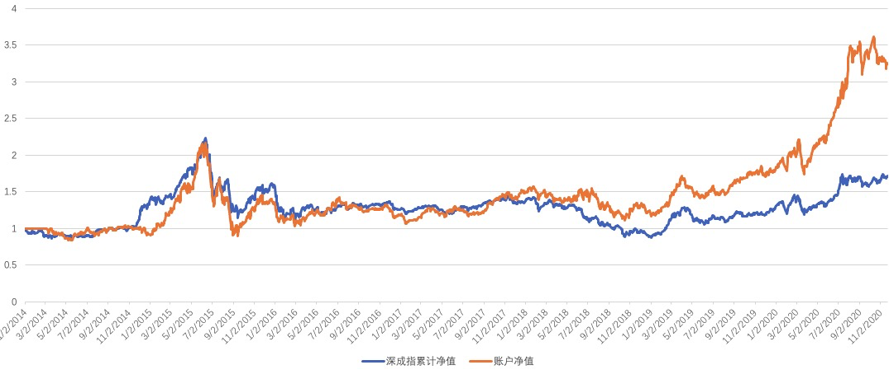

## 当日总结和展望

无

## TODO

- [x] 择机按照设计的仓位调仓
- [x] 买入爱朋医疗
- [ ] 创建持仓个股的检查(研究)清单
- [ ] 完成港股账户创建
- [ ] 开通科创板
- [ ] 谈降佣金

## 工作日志

### 盘中操作

卖出蓝晓科技，买入爱朋医疗底仓

### 仓位控制表格

| 股票名称 | 仓位 |
| -------- | ---- |
| 伟明环保 | 20   |
| 帝尔激光 | 15   |
| 亿嘉和   | 15   |
| 爱朋医疗 | 10   |

### 投资框架v1.1.7定稿，进入试运行阶段，时间半年

主要是调试了成长股选股，效果还是比较满意的，上图：

框架具体内容[点此](/{{config.base_url}}/投资框架/成长价值投资一号/framework/)

