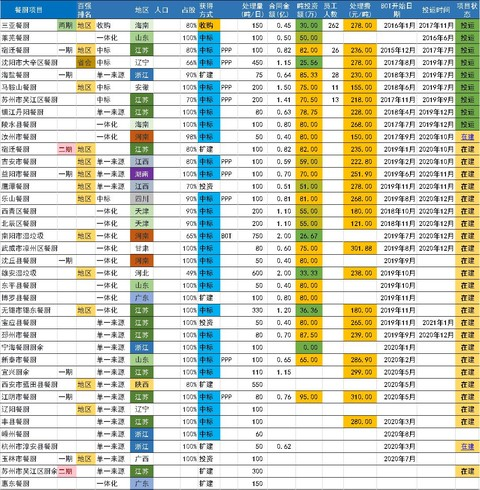

政策端：国补拖欠有望解决，“十四五”市场空间打开。中国光大国际作为国内垃圾焚烧龙头企业，产能投运进度行业领先，同时也承担了拖欠国补问题所带来的重要负担；截至2019 年底，公司被拖欠的国补金额已达41.8 亿港元。近期，在全球大宽松状态及中央“六保、六稳”政策下，通过国家电网发债来解决存量项目国补拖欠问题受到广泛关注，未来如果国家电网发行ABS解决存量项目国补问题方案落地，将会显著改善公司国补拖欠负担。

　　此外，《城镇生活垃圾分类和处理设施补短板强弱项实施方案》出台，提出到2023 年全国生活垃圾焚烧处理能力大幅提升的目标，同时明确应因地制宜推进厨余垃圾处理设施建设，且部分地区厨余垃圾可纳入现有焚烧设施统筹处理。在此背景下，我们认为“十四五”期间垃圾焚烧市场有望保持健康发展态势，同时不必过于担忧“十四五”垃圾焚烧项目的入场垃圾量问题。

　　公司端：更重视现金流&回报，无废城市布局初成，未来需关注融资情况。

　　公司在行业发展及政策支持有较多不确定性之际果断调整市场开拓战略，一改前几年高速拓展市场的发展态势，今年的项目拓展更重视现金流和项目回报，在确保项目底线IRR 达到10%的基础上，秉承“3 个优先，1 个明确”

　　要求，截至2020 年6 月底公司新签垃圾焚烧项目5 个共6750 吨/日，均可保障较好的现金流和收益水平。此外，公司已初步实现了固废产业链横向和纵向的全面一体化，也为公司未来实现“无废城市”建设打下了坚实的基础。

　　未来的关注重点在公司如何通过解决在手项目全部投运的资金需求（共需约300 亿元，其中已包含计划21 年投运的在建项目；2019 年底公司现金及现金等价物约100 亿元，资产负债率已达62.53%）。

　　维持“买入”评级。前期制约公司估值提升的两大核心因素有望实现显著改善：（1）未来国网有望作为主体发行ABS 解决国补拖欠给公司带来的应收账款负担（约41.8 亿港元）；（2）公司项目拓展更重视现金流和回报能力（质＞量），且有望通过多渠道融资方式解决在手项目的资金需求（约300 亿元），保障公司长期发展。

　　我们维持原盈利预测， 预计公司20-22 年归母净利润分别为59.48/68.33/76.57 亿港元，对应20-22 年EPS 分别为0.97/1.11/1.25 港元。

　　公司作为固废行业龙头，项目储备丰富、业绩增长确定性高，但受宏观形势影响目前公司估值被显著低估，未来随着垃圾焚烧政策明朗、国补拖欠问题解决、现金流情况改善后，公司估值有望迎来修复，维持“买入”评级。

## 参考文献

https://news.futunn.com/report/753564?src=2

https://xueqiu.com/5430940388/168330199

https://xueqiu.com/3093244593/158462018

https://xueqiu.com/3093244593/157285435