## 银行行业风险检查清单

### 国内的银行分类

1、央行

2、政策性银行（国家开发银行、中国进出口银行等）。

3、国有商业银行（工农中建交、邮政储蓄银行）。

4、股份制商业银行(招商、光大、民生、广发等）

5、城市商业银行（北京银行、广州银行、南昌银行等）

6、农村商业银行、农村合作银行

7、农村信用社

9、独立法人直销银行（前海微众、浙江网商、等）

### 邮储银行的独特之处

邮储银行则是唯一一家定位零售银行的国有商业银行。据了解，邮储银行拥有近4万个营业网点，服务个人客户超6亿户。截至今年6月末，邮储银行个人存款和个人贷款总数分别超过8.6万亿、3.04万亿，管理零售客户资产10.78亿元。上半年该行个人银行业务收入965.73亿元，同比增长11.19%，占当期营收的比例进一步提升至65.99%。

中国邮储银行比较特殊一些，其成立于2007年3月20日，最初只是中国邮政储蓄银行有限责任公司。邮政储蓄在刚成立的十几年间只存不贷，其吸收的存款资金转存央行享受无风险利差，直到2003年邮政储蓄新增资金不再转存央行，开始自主支配使用。**2007年邮储银行正式成立，成为全国唯一一家采用“自营+代理”管理模式的全牌照银行业机构。2012年1月21日变更为股份有限公司，因此在国有身份的基础上又加了一个股份制的角色。**

邮储银行的“身世”并不复杂，复杂的是它的发展模式。

**邮储银行特有的“自营+代理”管理模式**，有点像那种全国连锁品牌的自营店和加盟店，但一般某个品牌要么做自营模式，总部压力小，自营店管理弹性空间大；要么就做加盟模式，自己承担的风险较少，总部也能收点加盟费。但邮储银行这种的就是既有“自营店”，也有“加盟店”。

这样做的弊端显而易见：要么某些地方“双不管”，要么“一起管”。

**邮储银行代理网点的人事、财产、安保及网络安全等由邮政局管理，但更关键的网点市场准入及退出、人员培训和业务监督指导却由邮储银行负责。**这样一来就直接导致了重复管理的问题，增加了管理成本，降低了工作效率。

在人员方面，代理网点人员管理仍由邮政局负责，但邮政局大家也知道了，都是十几年前的产物，无论是人员素质还是服务意识，都没有现代银行这么强，业务办理合规性及严谨性也不高。

根据邮储银行官网显示，目前，邮储银行拥有近4万个营业网点，其中近3.2万个网点委托邮政集团代理，这些网点大多分布在县及县以下的乡镇地区，其中8000多个网点是银行自营网点，主要分布在县城及城市地区。

显然，这种模式好处之一在于其获得的资金成本会更多、更低。目前来看，国内银行网点最多的还是邮储银行（别看工行走到哪都是，那是因为在城市，但国内还是乡村居多）。**邮储通过“农村路线”，将网点洒满乡镇，有效地降低了资金成本和其他运营成本，很简单，农村的租金肯定比城市便宜。**

中国邮政储蓄银行董事长李国华甚至曾表示：个别商业银行找到邮政集团部分省分公司，希望邮政集团代理网点吸收的存款以2％费率转给它们，有的甚至出价3％，这说明，商业银行吸收存款成本远高于这一水平。这样看，邮储银行的资金成本是偏低的（最新年报显示，邮储银行的资金代理费用为1.5%），与同业相比有优势。

不过，这种“自营+代理”的模式对于如今很多混业经营的综合性金融集团来说会更加有效。综合性金融集团的一大优势在于多项业务可以同时服务于一名客户，但获客成本，资金成本较高，因为它的任何一项分业务至少都不能在相应行业内做到规模性。如果能把二者结合在一起，或许是未来金融业的又一大创新。

### 成长回报

邮储银行2018年净利润同比增长9.8%，稳居国有、股份制中大型上市银行第二位，仅次于招商银行!

从纵向来看，过去7年（2012年至2018年），邮储银行营收和净利润的复合增长率分别为12.8%和10.76%。

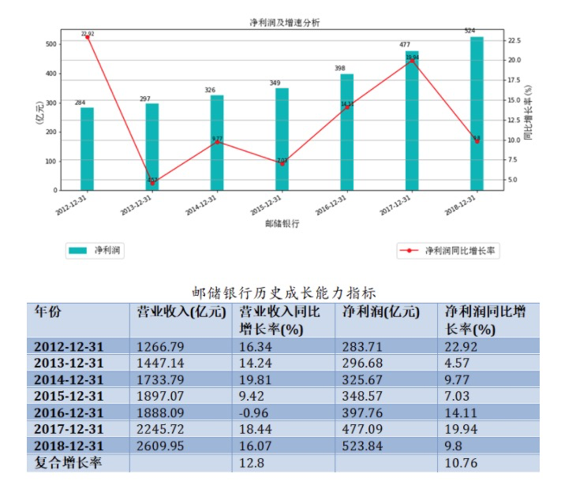

2019年前三季度净利润同比增长位居国有、股份制行榜首！

### 经营竞争力

前文已经跟大家初步探讨了邮储银行经营收益成长能力以及行业比较分析，相信大家对邮储银行经营结果有了初步基础印象，现在开始本研究最核心部分：是什么成就了邮储银行领先的成长能力？背后究竟有何种竞争力，使得邮储银行如此的强大？下文以衡量银行经营竞争力之指标——净息差与净利差，与及其拆解，进行展开讨论回答。

#### 净息差与净利差

净利差=生息资产收益率-计息负债成本率=利息收入/生息资产日均余额-利息支出/付息负债日均余额=净利息收入/生息资产日均余额+利息支出/生息资产日均余额-利息支出/付息负债日均余额=净息差+利息支出/生息资产日均余额-利息支出/付息负债日均余额

(1)当生息资产日均余额>付息负债日均余额，净息差>净利差;

(2)当生息资产日均余额

从纵向来看：当前邮储银行的净息差与净利差，处于历史平均水平。

从横向来看，邮储银行净息差与净利差均高于国有银行。

在股份制行中，邮储银行的领先优势更为凸显，甚至比招行还要高。与净息差最低的民生银行相比，差值距离分别超过94BP、100BP。

那么作为同样经营“钱”生意的企业，一个银行赚的比另外一个银行多，无非就是两个主要原因：(1)“卖钱”价格定得高且卖得出；(2)“买钱”价格定得低且买得到。

上文曾提到，净利差=生息资产收益率-计息负债成本率=净息差+利息支出/生息资产日均余额-利息支出/付息负债日均余额。净息差与净利差具有领先优势的邮储银行，究竟是“卖钱”价格定得高且卖得出，还是“买钱”价格定得低且买得到呢？下文继续展开计息负债成本率与生息资产收益率分析。

国有行当中，生息资产收益率均比邮储银行低，而且计息负债成本率均比邮储银行高。

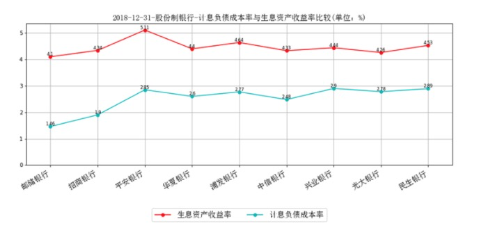

股份制银行当中，生息资产收益率最高的是平安银行5.11%。相比，邮储银行生息资产收益率属于行业内最低水平，但绝对劣势差距并不明显。然而计息负债成本率最低的却也是邮储银行1.46%，而且具有绝对的成本优势。因此，净息差与净利差具有领先优势的邮储银行，主要是“买钱”价格定得低且买得到。

不难发现：净息差最低的民生银行与邮储银行相比，“买钱”价格成本也即计息负债成本率2.89%，高出邮储银行97.95%，接近一倍！具有存款绝对成本优势的招商银行，计息负债成本率也高出邮储银行30.14%。

##### 计息负债成本率拆解

我们知道，计息负债类别可以概括为客户存款计息负债与非客户存款计息负债，其中客户存款计息负债包括个人定期存款、个人活期存款、公司定期存款、公司活期存款；非客户存款计息负债包括同业拆借、同业存款、发债借款、跟央妈借。

那么，作为同样经营“钱”无差异产品生意的企业，邮储银行为什么“买钱”价格定得低且买得到？又是如何做到的？

首先，分析计息负债类别结构：

股份制银行中客户存款计息负债占比自高到低前三名排序分别是：邮储银行96.63%、招商银行73.35%、中信银行67.89%；垫底三名排序分别是：浦发银行52.87%、兴业银行53.09%、民生银行55.92%。

也就是说，邮储银行高达96.63%计息负债来自客户存款，非客户存款计息负债占比极低。相反，浦发银行仅有52.87%计息负债来自客户存款。

其次，分析计息负债成本利率结构：

第一，股份制银行中客户存款占比最高的邮储银行平均成本利率只有1.42%，略微低于招行，也是所有披露的上市银行当中成本利率最低的。相比之下，上文提到净息差最小的民生银行客户存款占比仅有55.92%，然而客户存款平均成本利率却达到2.17%，超出邮储银行52.82%。

第二，邮储银行非客户存款计息负债成本利率2.75%，也是股份制银行当中最低的。净息差最小的民生银行非客户存款计息负债成本利率3.82%，超出邮储银行38.91%。

从上可以得出判断，也许正因为其他银行比邮储银行吸引储户的能力差，在他们存款资金紧张、需要用钱的时候，不得不跟同业拆借或者跟央妈借，自然而然非客户存款成本利率就高。其实道理也很简单，越是没有足够资产实力，那么信用就越差，借钱成本利率也就越高，典型的嫌贫爱富、趁火打劫。

那么，问题来了，为什么邮储银行能以全行业最低的成本吸收到全行业最高占比的客户存款呢？客户存款结构配置究竟是怎么样？下文继续展开分析。

从上图可以看出，邮储银行个人定期存款平均成本率2.03%，在行业内是最低的；个人活期存款平均成本率0.31%，在行业内中等偏高水平；公司定期存款平均成本率2.12%，在行业内最低；公司活期存款平均成本率0.99%，在行业内最高；。

然而，影响邮储银行客户存款总体成本利率最深层次的因素不是每种性质存款利率上的高低，而是邮储银行以行业内中等偏高的利率成本吸引占比高达29.96%的个人活期存款，无论是绝对金额还是占比招行还高，其占比是其他银行的3~4倍。另外以行业内是最低的成本率2.03%，开发出占比高达56%的个人定期存款。

相比其他银行，邮储银行公司存款竞争力明显落后。

从纵向来看：

第一：邮储银行客户存款计息负债绝对金额逐年增长；

第二：客户存款计息负债占比均稳定在90%以上；

第三：客户存款计息负债结构也比较稳定。

##### 生息资产收益率拆解

通过上文分析，我们找到净息差与净利差具有领先优势的邮储银行，根本原因主要是“买钱”价格定得低且买得到。

我们知道，生息资产类别可以概括为客户贷款生息资产与非客户贷款生息资产，其中客户贷款生息资产包括个人客户贷款、企业客户贷款；非客户贷款生息资产包括现金及存放中央银行款项、存放同业及其他金融机构款项、拆出资金，投资类资产。

不妨，我们继续从资产端探讨邮储银行生息资产优劣，对生息资产类别结构与生息资产收益率结构展开比较分析。

首先,分析生息资产类别结构：

客户贷款生息资产占比自高到低前三名排序分别是：中信银行63.11%；招商银行61.25%；浦发银行58.23%。垫底三名排序分别是：邮储银行45.48%；兴业银行45.52%；民生银行50.3%。

从中可见，邮储银行客户贷款生息资产占比排在行业末尾位置。

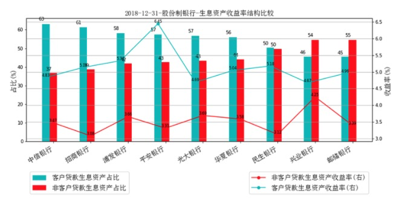

其次，分析生息资产收益率结构：

第一，总体上非客户贷款生息资产收益率大幅低于客户贷款生息资产收益率,这也很容易理解。

第二，客户贷款结构当中个人信用卡业务占比较高的平安银行，其客户贷款生息资产收益率较高。除此之外，其他银行的客户贷款生息资产收益率不相差上下。

第三，非客户贷款结构当中同业业务占比较高的兴业银行，其非客户贷款生息资产收益率较高。除此之外，其他银行的非客户贷款生息资产收益率不相差上下。

综合来看，邮储银行生息资产收益率属于行业内最低水平也是必然的结果。

邮储银行的客户贷款配置究竟又是怎么样？下文继续展开分析，进一步探讨其客户贷款类别结构、收益率结构。

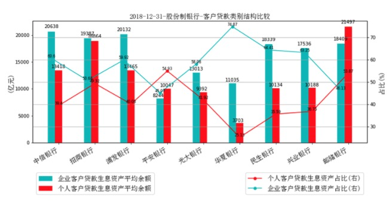

从上图可以看出：个人客户贷款生息资产占比最高的是平安银行54.93%，其次是邮储银行53.87%。企业客户贷款生息资产占比同行内最高的是华夏银行74.87%，其次是民生银行64.41%。

但是，从上图可以看出：个人客户贷款生息资产占比接近的平安银行与邮储银行，其个人客户贷款生息资产收益率却差距很大。

那么，造成如此大的差距，是什么原因？不烦接着分析个人客户贷款资产配置结构，展开对个人客户贷款中的个人住房贷款、信用卡业务比较。

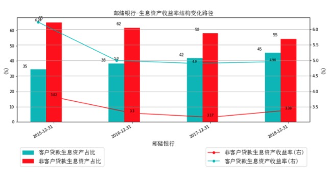

明显发现：邮储银行在住房贷款方面配置的资产规模与占比大幅领先同行。平安银行的信用卡应收账款配置甚至大幅超越其住房贷款规模，这也就是平安银行个人客户贷款收益率同行业最高的根本原因所在。

从纵向来看，邮储银行客户贷款生息资产与占比均逐年增长，这是邮储银行比较好的一面。

客户贷款生息资产当中，邮储银行企业客户贷款生息资产与个人客户贷款生息资产均逐年增长。2016年以前，邮储银行企业与个人客户贷款占比呈现平稳状态，2016年以后，个人客户贷款占比逐年上升。换句话说，邮储银行客户贷款占比提升主要贡献来自个人客户贷款的增长。

从上图可以看出，邮储银行在个人住房贷款业务发展速度较快，而且占个人客户贷款比例也是逐年提升。

#### 资产收益率

从纵向来看，邮储银行净资产收益率从2012年高点27.79%逐年下降，直至2018年的11.56%。

另外，我们知道：净利润/总资产=净利润/净资产*净资产/总资产=（净利润/净资产）/平均财务杠杆倍数。

那么，平均财务杠杆倍数=净资产收益率/总资产收益率，逐年降杠杆。

从横向来看，邮储银行净资产收益率依然位居所有国有、股份制上市银行中等位置！平均财务杠杆在所有上市行当中最高！

股份制行当中，净资产收益率后四名分别是：中信银行10.65%；平安银行10.74%；光大银行10.75%；华夏银行10.83%，均低于监管值11%；

甚至五大国有银行当中，净资产收益率最低的交通银行仅有10.75%，低于监管值11%。

### 资产质量

#### 拨贷比率

拨贷比=贷款减值准备/贷款余额=2.5%、拨备覆盖率=贷款减值准备/不良贷款=150%的监管要求，是2009-2010年期间设计、2011年正式公布的。

从纵向来看，邮储银行资产质量不断得到强化，逐年提高，从2012年的1.87%，提升到2018年的2.98%，处于监管值2.5%上方!

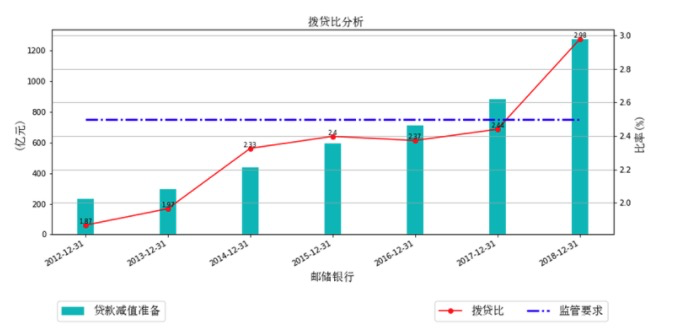

为什么银行会出现达不到监管部门要求的拨贷比监管指标2.5%呢？理论上，在经济下行周期,高拨贷比未必合理，在一定程度上和政府扩大信贷、刺激需求的的宏观经济调控相抵触。当经济下行，不良贷款率上升，如果拨备覆盖率、拨贷比作为强监管指标，银行必将提取更高的拨备，净利润受到压缩，进一步意味着银行资本无法得到补充，在资本充足率强约束下无法扩大信贷。因此，监管层采取根据情况适时调整监管力度的弹性做法。

当然，银行业根据宏观经济状况需要监管标准降低，然而降低监管标准埋下金融危机的伏笔，却是监管机构最担忧的。监管指标降与不降，动态博弈前行。

从横向来看，邮储银行拨贷比率稳居国有、股份制中大型上市银行中等偏高位置！国有行拨贷比率均符合监管要求，股份制银行拨贷比率除了民生银行也均符合监管要求。

#### 不良贷款比率

拨贷比=贷款减值准备/贷款余额=（贷款减值准备/不良贷款）*（不良贷款/贷款余额)=拨备覆盖率*不良贷款率

令：拨贷比=2.5%、拨备覆盖率=150%，则可推导出不良贷款率零界点=1.67%。进一步可推导：(1)当不良贷款率=1.67时，监管目标盯住拨备覆盖率150%。

从纵向来看，邮储银行不良贷款率曲线变动轨迹与五大国有行类似。

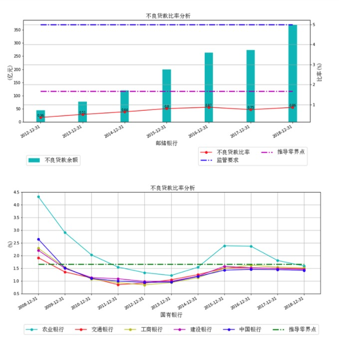

从横向来看，五大国有银行不良贷款率均小于推导零界点1.67%；股份制银行不良贷款率总体上大于推导零界点1.67%，仅有4家低于推导零界点，不良贷款率自低到高依次排序是：邮储银行0.86%、招商银行1.36%、兴业银行1.57%、光大银行1.59%。在所有国有行、股份制行当中，邮储银行不良贷款率依然是最低的。

##### 不良计提偏离度

从五级贷款的分类标准看，逾期90天以上贷款应该归入不良贷款，但不良贷款里还包括其他部分。正常来说，逾期90天以上贷款/不良贷款1，意味着有部分逾期90天以上的贷款并没有被划分为不良贷款，该银行的五级分类很可能存在不严谨，或是有意扭曲不良贷款率，降低拨备，净利润可信度大打折扣。

从2018年的数据来看，部分股份制银行和城商行未将逾期90天以上贷款全部计入不良贷款之中。按照《银行贷款损失准备计提指引》，银行可以参照以下比例按季计提专项准备：对于关注类贷款，计提比例为2%；对于次级类贷款，计提比例为25%。次级和可疑类贷款的损失准备，计提比例可以上下浮动20%。

从关注类贷款和次级贷款的损失准备计提比例差额来看，如果"逾期90天以上贷款/不良贷款">1的银行资产要重新分类，利润增长将面对巨大的压力。按照这一比例差额大约估计，反映在未来的利润数据上，甚至有可能相应的银行出现净利润增速下滑的情形。

从横向来看，五大国有银行"逾期90天以上贷款/不良贷款"均小于1。相比五大国有行，股份制银行不良认定尺度总体上不够严谨，甚至华夏银行"逾期90天以上贷款/不良贷款"=1.47，远远大于1，民生银行、平安银行均接近1。可以说,华夏银行有大量已经逾期90天以上不还的贷款，依然以正常贷款来认定，不良认定上尺度过松。

为什么突破理论红线？因为归入不良，就要计提拨备，计提拨备就意味着利润降低，甚至亏损，直接威胁到银监会净资产收益率要求。而且，各项资本充足率指标进一步降低，以至于威胁到公司的正常业务开展。

邮储银行不良认定尺度依然是股份制行当中最严谨的，"逾期90天以上贷款/不良贷款"仅有0.75，接近国有行平均值。

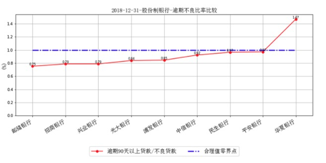

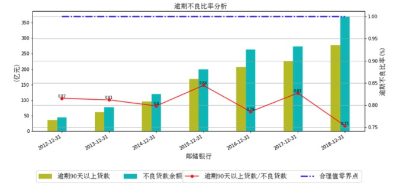

从纵向来看，邮储银行"逾期90天以上贷款/不良贷款"始终小于1。以2018年不良贷款数据为例，不仅所有逾期90天以上的贷款均已归为不良贷款，而且还有逾期90天以内甚至没逾期的贷款90.96亿元，也被认定为不良贷款。

3.2.2 风险迁徙类指标

(1)正常贷款迁徙率=期初正常贷款向下迁徙金额/(期初正常类贷款余额-期初正常类贷款期间减少金额)*100%

期初正常贷款向下迁徙金额，指的是期初正常贷款中，在期末重分类为关注、次级、可疑、损失类的贷款之和。

期间减少金额，指的是期间由于贷款正常收回、不良贷款处置、贷款核销等原因而较少的贷款。

(2)关注贷款迁徙率=期初关注类贷款向下迁徙金额/(期初关注类贷款余额-期初关注类贷款期间减少金额)*100%

(3)次级贷款迁徙率=期初次级类贷款向下迁徙金额/(期初次级类贷款余额-期初次级类贷款期间减少金额)*100%

(4)可疑贷款迁徙率=期初可疑类贷款向下迁徙金额/(期初可疑类贷款余额-期初可疑类贷款期间减少金额)*100%

按照贷款五级分类，关注类贷款不属于不良贷款，但是，比关注类贷款差一个等级的贷款类别就划为不良贷款，因此，在所有迁徙率指标当中，最重要的是关注贷款迁徙率。

总体上看，国有银行关注类贷款迁徙率低于股份制行关注类贷款迁徙率，意味着国有行五级分类标准比较严格，资产质量可信度更高。股份制行当中，值得关注的是民生银行与华夏银行，其关注类贷款迁徙率竟然还低于邮储银行、招商银行!真的如此吗？

先来说民生银行，2018年净利润增速为负，增长率-1.16%，更重要的是，如此的负增长还是建立在拨贷比2.33%、拨备覆盖率134.05%，均低于监管值的基础上。哪怕民生银行拨贷比与拨备覆盖率提升到监管要求，其利润增速就远远不止-1.16%了。同样的道理：如果民生银行关注类贷款迁徙类提高，那么就意味着其不良贷款增加，贷款减值准备也随之相应增加，最终减少利润。因此，民生银行不排除牺牲资产质量的可信度，来维持表面上的利润数据好看性。

再来说华夏银行，2018年"逾期90天以上贷款/不良贷款"高达1.47，不良认定尺度非常严谨，资产质量可信度低，关注类贷款迁徙率低也是意料之中了。

因此，剔除掉利润存在注水嫌疑的民生银行与华夏银行，邮储银行关注类贷款迁徙率依然是股份制行当中最低的，进一步证明其资产质量可信度高。其次是招商银行。

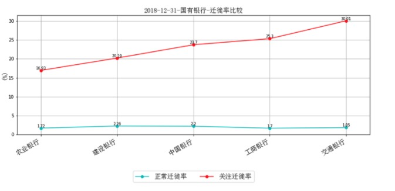

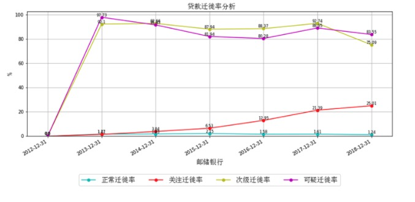

#### 拨备覆盖率

从横向来看，五大国有银行不良贷款拨备覆盖率均大于监管值要求。

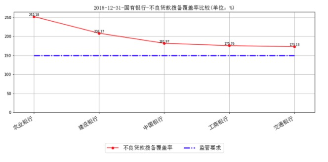

每家银行不良贷款拨备覆盖率不尽相同，而且差别很大，计提不良贷款就自然存在较大主观调节，如果银行之间直接比较的话，显然不科学。因此，为了能够更科学比较同行内的银行，假设一家银行首先按照行业最低不良计提偏离度进行不良贷款额度调整，并按照另一家银行相同的不良贷款拨备覆盖率来计提不良贷款减值值准备进行调整，如下表：

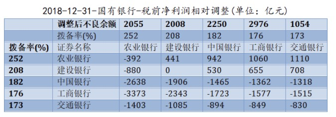

注：上表请按照横行比较，代表第二列银行假设分别按照后面五列银行的拨备率计算税前净利润的调整额度。例如1，农业银行按照国有行最低逾期不良计提偏离度来调整不良贷款余额，并且假设分别按照农业银行拨备率、建设银行拨备率、中国银行拨备率、工商银行拨备率、交通银行拨备率计算的话，税前净利润分别调整-392亿元、441亿元、942亿元、1060亿元、1110亿元；例如2，建设银行按照国有行最低逾期不良计提偏离度来调整不良贷款余额，并且假设分别按照农业银行拨备率、建设银行拨备率、中国银行拨备率、工商银行拨备率、交通银行拨备率计算的话，税前净利润分别调整-880亿元、0亿元、530亿元、655亿元、708亿元。

相比之下，股份制银行不良贷款拨备计提不够充分。除了靠前的三家：招商银行358.18%、邮储银行346.8%、兴业银行207.28%，均与监管红线保持一定安全距离。但是，其余靠后的五家均接近监管红线。不良贷款拨备覆盖率最低、计提最不充分的民生银行134.05%，甚至跌破监管红线。

邮储银行不良贷款计提拨备充分程度仅略微低于招商银行！

与国有银行之间税前净利润相对调整以达到可比性一样，股份制银行之间税前净利润相对调整如下表：

例如：招商银行按照股份制行最低逾期不良计提偏离度来调整不良贷款余额，并且假设分别按照招商银行拨备率、邮储银行拨备率、兴业银行拨备率、光大银行拨备率、华夏银行拨备率、中信银行拨备率、平安银行拨备率、浦发银行拨备率计算的话，税前净利润分别调整-90亿元、-29亿元、719亿元、886亿元、980亿元、984亿元、998亿元、1000亿元；邮储银行按照股份制行最低逾期不良计提偏离度来调整不良贷款余额，并且假设分别按照招商银行拨备率、邮储银行拨备率、兴业银行拨备率、光大银行拨备率、华夏银行拨备率、中信银行拨备率、平安银行拨备率、浦发银行拨备率计算的话，税前净利润分别调整-42亿元、0亿元、515亿元、629亿元、694亿元、697亿元、707亿元、708亿元。

当然上述的计算调整并不能归入一年经营，是历史多年积累。因此，只能作为净资产调整，而不能作为当年税前净利润调整。

不烦试计算一下：民生银行2018年净利润503亿元，如果民生银行不良计提偏离度、拨备覆盖率均按照招商银行的标准来计提资产减值准备的话，所得税按照25%计算，净利润将调减1643*0.75=1232亿元。如果净利润调减在一年内处理的话，2018年实际净利润将是503-1232=-729亿元！如果是5年内分摊的话，2018年实际净利润将是503-1232/5=256亿元！如果是10年内分摊的话，2018年实际净利润将是503-1232/10=380亿元！

因此，民生银行2018年年报披露的利润增速-1.16%，已经够低了。然而，一旦跟邮储银行比较，实际情况比这个更糟糕！

下图为：如果其它银行不良计提偏离度按照邮储银行、拨备覆盖率按照招商银行的标准来计提资产减值准备的话，所得税按照25%计算，净利润将调整值。不比不知道，一比吓一跳，招商银行、邮储银行盈利质量远甩其他竞争对手！如果其它行按照招行减值标准去计提不良减值准备，净利润将全部转为负值！其中，华夏银行的减值准备调整超6倍的净利润！因此，如果投资者仅仅拿利润表来研究比较，那实在没有多大意义！

从纵向来看，不良贷款拨备覆盖率总体上与前述不良贷款率呈现负相关。

但是，究竟是什么原因让两者之间存在如此的关系呢?不妨翻回不良贷款率一节的拨贷比计算公式，拨贷比=贷款减值准备/贷款余额=（贷款减值准备/不良贷款）*（不良贷款/贷款余额)=拨备覆盖率*不良贷款率。总体上，为了拨贷比达到监管要求，不良贷款率下降，拨备覆盖率上升；不良贷款率上升，拨备覆盖率下降。

#### 资本充足率

2012年6月8日，中国银监会发布《商业银行资本管理办法(试行)》，自2013年1月1日起实施新的资本充足率要求。该资本管理方法参考《巴塞尔协议3》。

(1)从2013年起，核心一级资本充足率、一级资本充足率、资本充足率指标强制提升到5.5%、6.5%、8.5%。

(2)以后每年增加0.4%的储备资本要求，直到2018年达标，分别为7.5%、8.5%、10.5%，系统重要银行额外加1%。目前我国系统重要银行一共六家：工商银行、建设银行、中国银行、农业银行、交通银行、邮储银行。

资本充足率是强监管指标，从横向来看：五大国有银行核心一级资本充足率均大于监管值8.5%，其中核心一级资本充足率最高的是建设银行，高达13.83%，超出系统银行监管要求5.33%；核心一级资本充足率最低的是交通银行11.16%，仅超出系统银行监管要求2.66%。

股份制银行核心一级资本充足率均大于监管值7.5%，但总体上接近监管值7.5%，其中核心一级资本充足率最高的是与五大国有行一同划分为系统重要银行的招商银行，高达11.78%，超出系统银行监管要求3.28%；核心一级资本充足率最低的是平安银行8.54%，仅超出非系统银行监管要求1.04%。

从纵向来看，邮储银行核心一级资本充足率、一级资本充足率、资本充足率分别从2013年的7.72%、7.72%、8.84%，提升到2018年的9.77%、10.88%、13.76%。

### 人力效率

#### 员工数量

都说这两年银行的日子不太好过，银行员工离职的也不少，从国有五大国有行员工变动数据来看，基本坐实了。

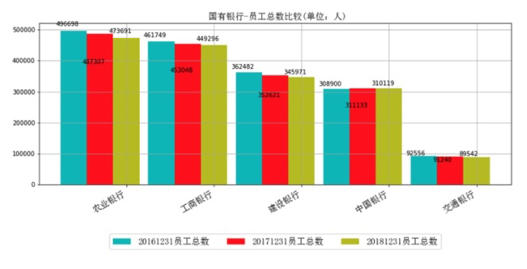

2017年,五大国有银行一共减少27036.0人，其中，减少人数最大的是建设银行，减少9861.0人；

2018年一共减少26730.0人，其中，减少人数最大的是农业银行，减少13616.0人

股份制行当中员工数量最多的是邮储银行高达17万人，从员工变动情况来看，2017年，增加人数最大的是兴业银行，增加5397人；2018年，增加人数最大的是平安银行，增加2540人，但是，2017年减少人数最多的也是平安银行，减少人数高达1825人。

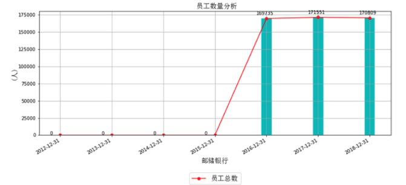

#### 员工效率

从员工激励指标来看，邮储银行人均薪酬位居股份制行末尾位置。但是，从纵向来看，邮储银行人均薪酬逐年提升，接近国有行。（2012-2015年数据缺失，用0代替，读者可以忽略）

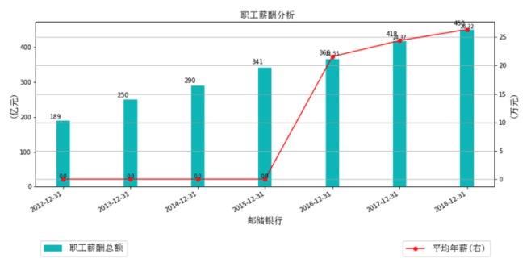

从员工效率指标来看，邮储银行单位员工创造净利润位居所有国有、股份制行末尾位置！

但是，从纵向来看，邮储银行单位员工创造净利润逐年提升。

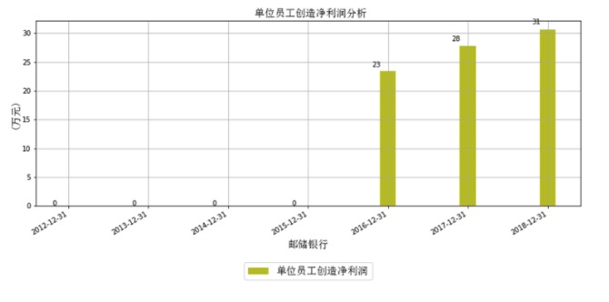

### 估值定价

前文已经指出，从纵向来看，邮储银行净资产收益率从2012年高点27.79%逐年下降，直至2018年的11.56%。

另外，自上市以来，截至2018-12-31，国有行、股份制行已实施累计现金分红比率区间大约在[10，30]

那么，合理假设邮储银行净资产收益率未来五年（2019-2023）依然保持年均11%左右，年度分红比率稳定在10-30%水平，五年末净资产溢价20%出售，WACC折现率=8%，基于DCF绝对估值法，每股内在价值区间[6.91,7.02]元。

假设持有五年期（2019-2023），要求复合回报率下限=WACC=8%，那么安全边际折扣

也就是说，

保守的投资者，如果邮储银行股价跌到5元左右就可以考虑逐步分批买进，越跌越买；如果邮储银行股价一旦涨到7元左右就可以考虑卖出。

当然，乐观一点的投资者，比如安全边际设为8折，那么当前（2019年12月10日）股价就是很好买入价位。

### 行业空间还有多大？

整个银行业处于繁荣的壮年期，只要中国经济保持高速发展，银行业一定是非常重要的支柱型产业，但鼎盛时期应该已经过了，后面虽然体量会越来越大，但是很难再走出翻10倍的行情。

### 是否拥有德才兼备的管理团队？  

国企管理团队没那么重要。

### 你会打心底里渴望股票在这个价位上再跌 30% 吗？  

是的。

### 对这个公司是否跟踪了足够长时间？ 

不长，才3个月左右。 

### 这支股票有没有可能会被大多数人看好？  

有可能。因为李录已买入。

### 其他  再寻找三条看空理由或者风险点 

1. 国企效率太低，服务太差，主要靠政策支持
2. 银行业已经利润占股市的一半了，很难再增长多少了。
3. 银行业整体竞争非常激烈。

### 说明最差的情况

1. 个人住房贷款由于国家监管，无法再扩张。
2. 发展其他中间业务能力不足。

### 参考文献

https://kuaibao.qq.com/s/20200120A0AFE800?refer=spider

https://xueqiu.com/9659937976/130606517

https://www.zhihu.com/question/23195809

https://xueqiu.com/4794528905/146262361

https://xueqiu.com/4794528905/145176619

https://xueqiu.com/4794528905/146644915

https://xueqiu.com/4794528905/148603134

https://www.youtube.com/watch?v=-G9Mznpj4bA

https://xueqiu.com/2682558230/169005537

https://xueqiu.com/2682558230/169057871

